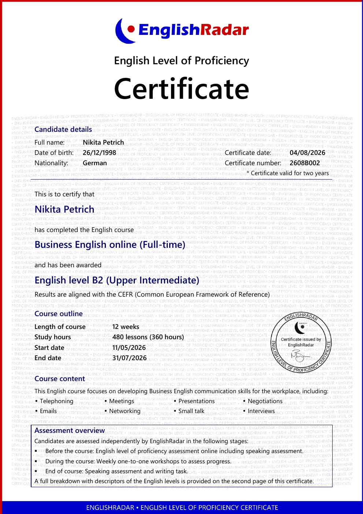
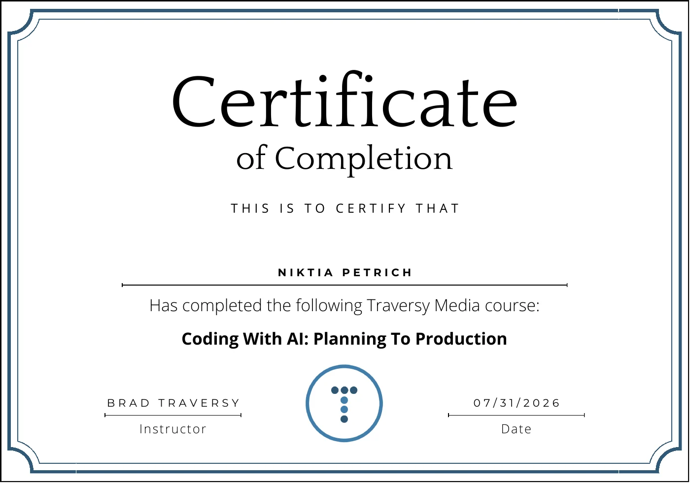
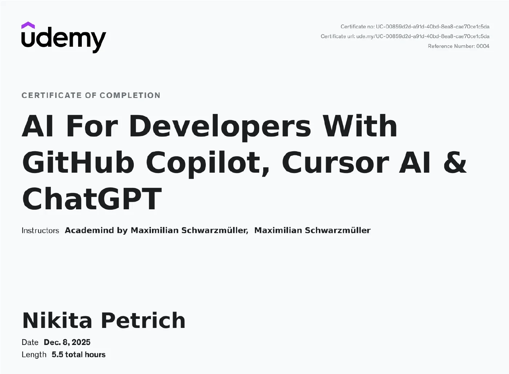
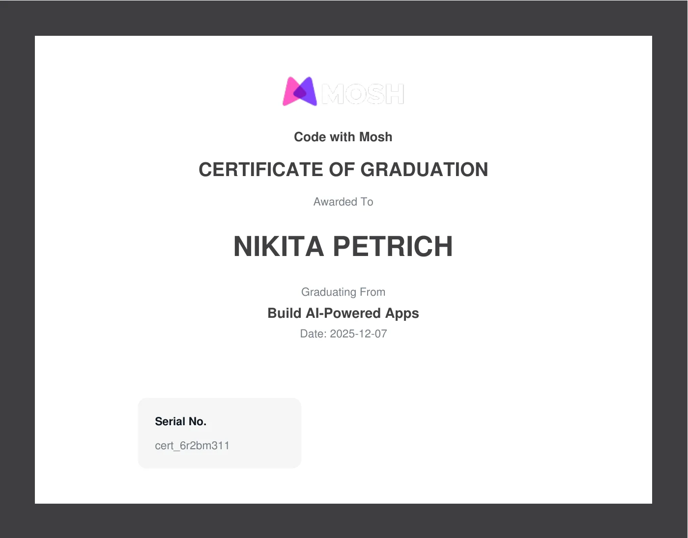
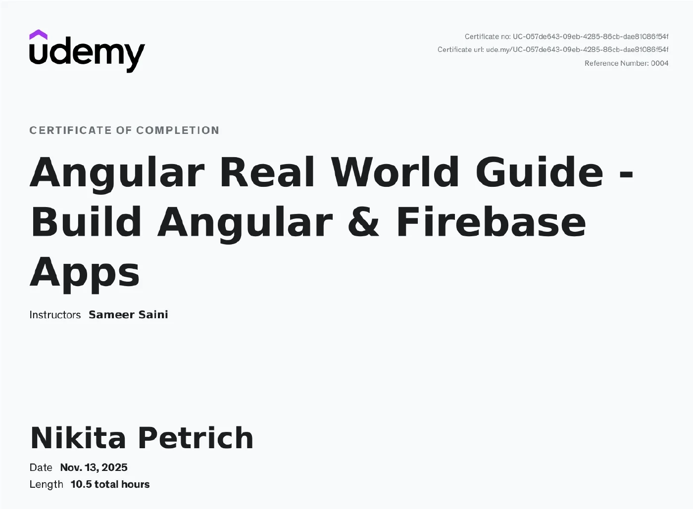
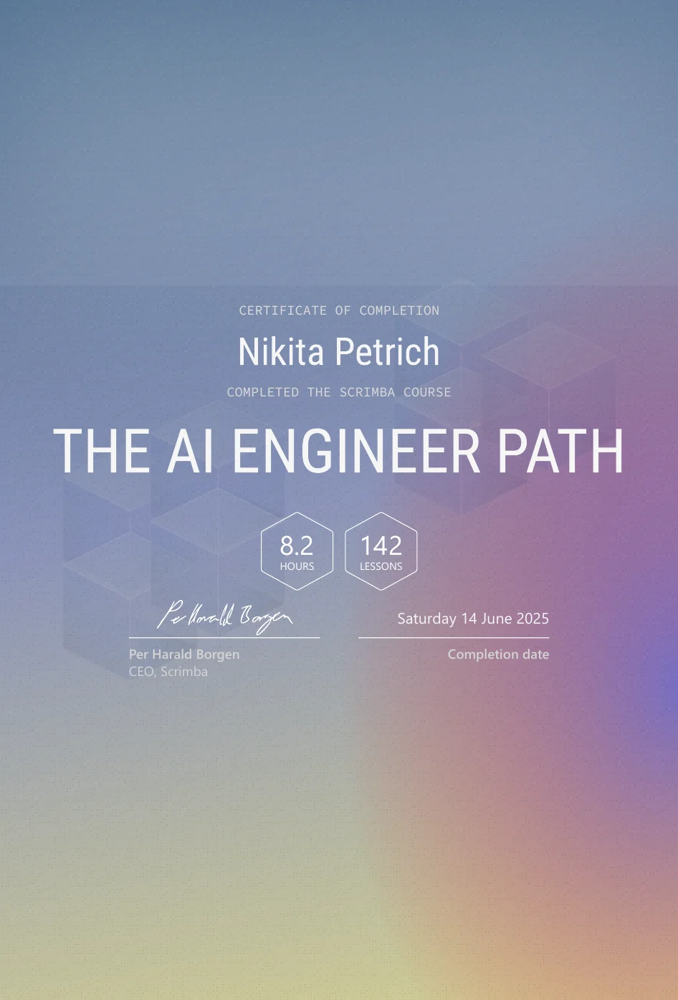
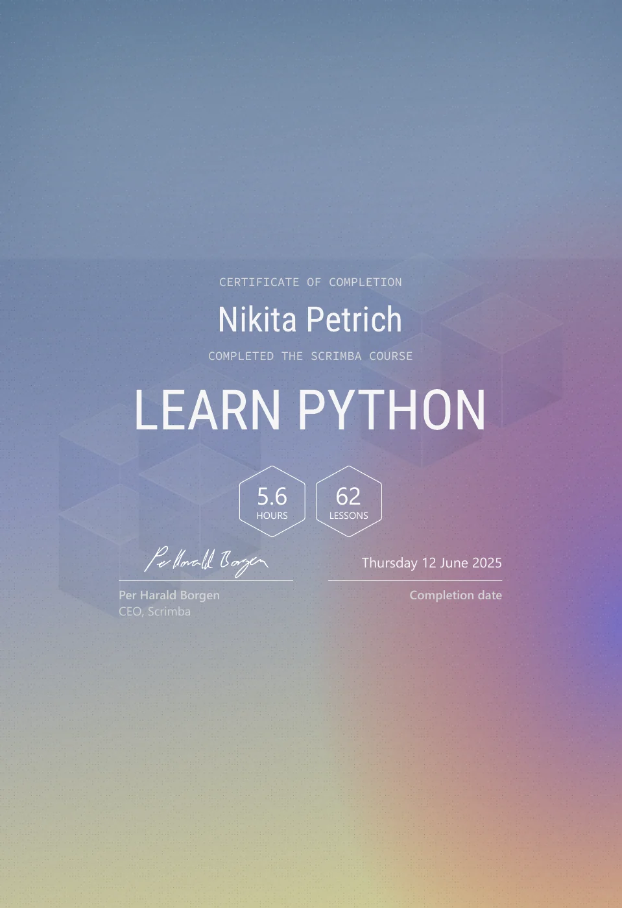
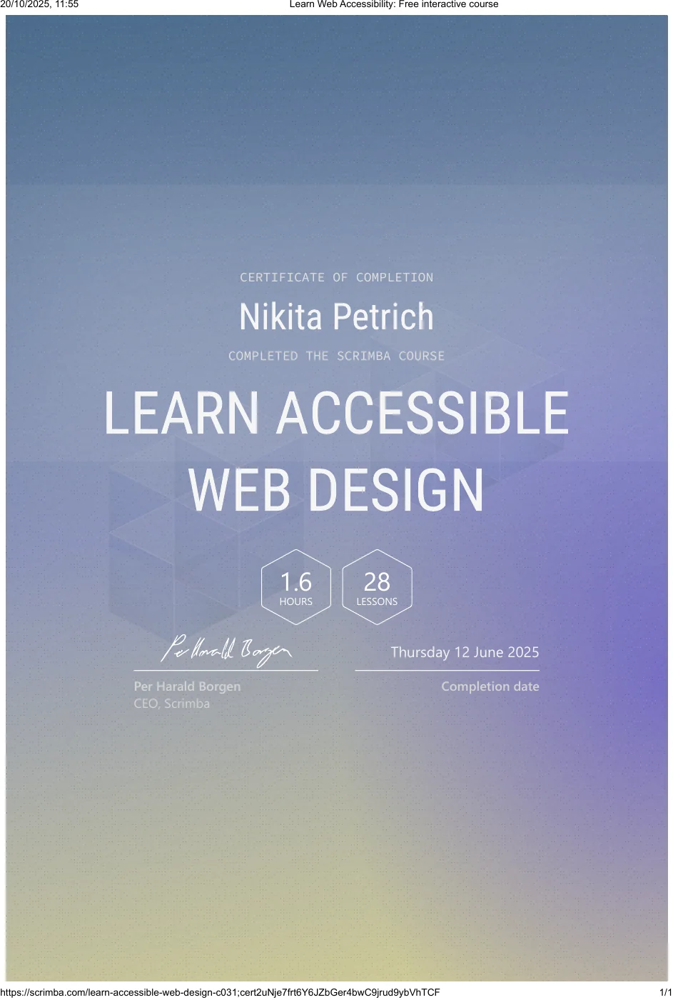
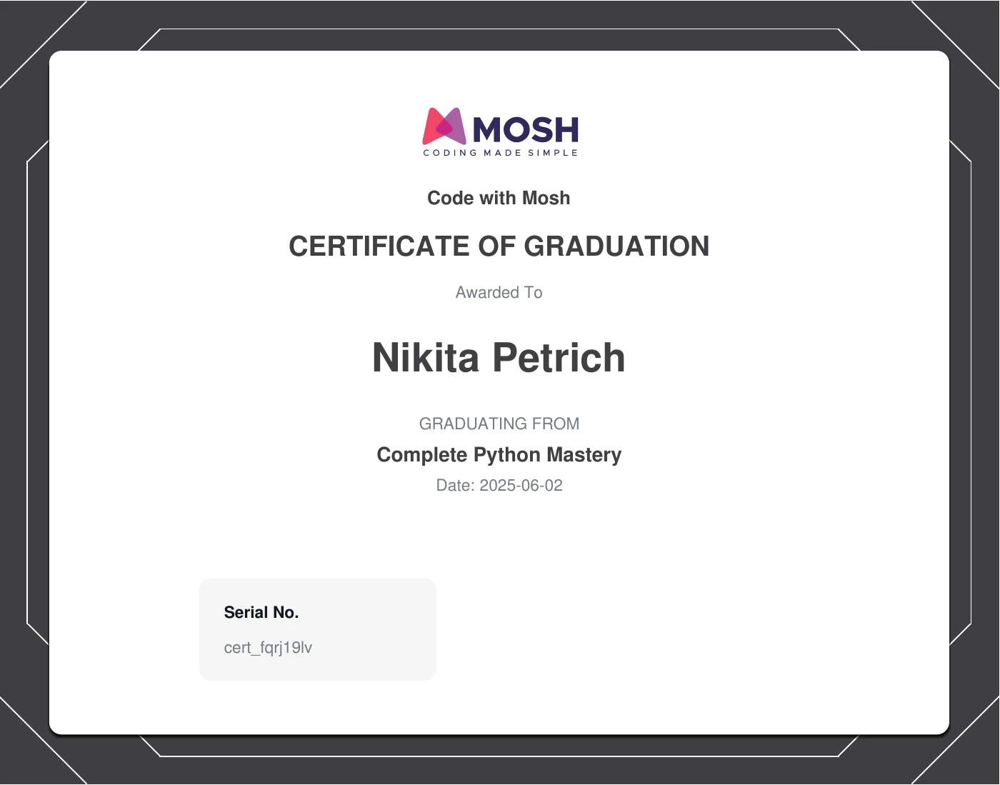

# Nikita Petrich — Senior Full-Stack & AI Engineer

Vollständiger Inhalt von https://sequenz.io als Markdown — auf Deutsch und auf Englisch, mit allen Links und allen Bildern im Ordner `images/`.

Full content of https://sequenz.io as Markdown — in German and English, with every link and every image in the `images/` folder.

- [Deutsch](#deutsch) — Freiberuflicher Senior Full-Stack & AI Engineer
- [English](#english) — Freelance Senior Full-Stack & AI Engineer

---

# Deutsch

## Nikita Petrich — Freiberuflicher Senior Full-Stack & AI Engineer

*„Was zweimal manuell passiert, wird automatisiert“*

Freiberuflicher Senior Full-Stack & AI Engineer mit Schwerpunkt LLM-Integration, RAG und KI-gestützter Automatisierung. Über 7 Jahre Erfahrung in LegalTech, HealthTech, E-Commerce, EdTech und Logistik.

LLM-Integration · RAG · KI-Engineering · Agentic Coding · TypeScript · Python · Backend (NestJS · Node.js · FastAPI) · Frontend (Next.js · React · Angular) · Clean Architecture · DSGVO-konform

Seite: https://sequenz.io/de

## Kontakt

- [+49 15679088678](tel:+4915679088678)
- [n.petrich@sequenz.io](mailto:n.petrich@sequenz.io)
- [https://sequenz.io](https://sequenz.io)
- Erstgespräch buchen: https://calendar.notion.so/meet/petrichnikita/erstgespraech-30-min

## Profile

- Website: https://sequenz.io
- LinkedIn: https://linkedin.com/in/nikita-petrich
- GitHub: https://github.com/nikita-petrich
- freelancermap: https://www.freelancermap.de/profil/nikita-petrich
- Malt: https://www.malt.de/profile/nikitapetrich

## Lebenslauf als PDF

-  [CV Deutsch](https://sequenz.io/cv/CV-German.pdf) — PDF · zum Weiterleiten
-  [CV Englisch](https://sequenz.io/cv/CV-English.pdf) — PDF · zum Weiterleiten

## Eckdaten

- **Erfahrung:** 7+ Jahre
- **Verfügbar:** ab sofort · Vollzeit
- **Stundensatz:** auf Anfrage
- **Qualifikation:** IHK-Fachinformatiker (Köln)
- **Einsatzort:** Remote (bevorzugt)
  - Vor Ort: München · 1–2 Tage/Woche
  - Fernreisen: 1–2 Tage/Monat (bei Bedarf)
- **Onboarding:** Anreise vor Ort (bei Bedarf)

## Sprachen

-  **Deutsch** — Nativ
-  **Englisch** — Business English · B2 zertifiziert · US-Projekt (https://sequenz.io/de/certificates/english-radar-business-english)

## Methodik

- Scrum
- Scrumban
- Kanban
- Requirements Engineering

## Arbeitsweise

- ergebnisorientiert
- eigenverantwortlich & zuverlässig
- autonome, asynchrone Arbeitsweise
- klare Kommunikation (DE/EN)

## Über mich

Ich bin **freiberuflicher Senior Full-Stack & AI Engineer** mit Schwerpunkt auf **KI: LLM-Integration, RAG und KI-gestützter Automatisierung** – von der Architektur bis zum **stabilen Produktivbetrieb**.

**Mein Leitsatz: Was zweimal manuell passiert, wird automatisiert.** Das gilt für die Prozesse meiner Kunden genauso wie für meine eigene Arbeit. In der **Logistik** spart ein von mir entwickeltes Tourverwaltungssystem bis zu **1.000 Stunden pro Mitarbeiter und Jahr** durch automatisierte Dokumentenprozesse, im **Handel** bis zu **40 Stunden Verwaltungsaufwand pro Monat**, im **Notariat** sinken telefonische Rückfragen der Mandanten um bis zu **70 %**.

Auch meine Entwicklung folgt diesem Prinzip: Ich arbeite mit **modernen Agentic-Coding- und AI-Engineering-Workflows** – **spezifikationsgetrieben, KI-gestützt und mit automatisierten Tests und Reviews**. Das ermöglicht **hohe Umsetzungsgeschwindigkeit bei gleichbleibender Qualität**, ohne Kompromisse bei **Wartbarkeit, Nachvollziehbarkeit und Stabilität**.

Ich arbeite **eigenverantwortlich, remote und asynchron**. Ein klares Ziel genügt – den Weg dorthin strukturiere ich selbst. **Entscheidungen dokumentiere ich, Code kommt getestet und review-fähig**, und technische Risiken spreche ich früh an. Kommunikation auf **Deutsch und Englisch**.

Über **7 Jahre Erfahrung** in **LegalTech, HealthTech, E-Commerce, EdTech und Logistik** – sowohl als Teil eines **20-köpfigen Engineering-Teams** an einer **KI-gestützten LegalTech-Plattform mit über 3.000 Kunden** als auch als **alleiniger Entwickler mit Verantwortung für Architektur, Betrieb und Weiterentwicklung**.

*Passt das zu Ihrem Vorhaben? Dann freue ich mich auf ein unverbindliches Erstgespräch.*

Kostenloses Erstgespräch buchen: https://calendar.notion.so/meet/petrichnikita/erstgespraech-30-min

## Schwerpunkt

- LLM-Integration
- RAG
- KI-gestützte Automatisierung
- Agentic Coding / AI-Engineering
- TypeScript
- Python
- Backend (NestJS · Node.js · FastAPI)
- Frontend (Next.js · React · Angular)
- PostgreSQL
- Clean Architecture
- Microservices
- CI/CD
- Docker
- DSGVO-konforme KI-Architektur

## Projekte (9)

### 01 — BESCHEIDKLAR: KI-gestützte LegalTech-SaaS-Plattform

*KI-Vorprüfung für Bescheide*

- Seite: https://sequenz.io/de/projects/bescheidklar
- Auftraggeber: [Eigenprodukt](https://bescheidklar.de)
- Kategorie: LegalTech / GovTech
- Rolle: Gründer & CTO
- Zeitraum: 04/2025 – heute
- Tags: LegalTech · KI · RAG

Zweiseitige LegalTech-SaaS-Plattform, die KI-gestützte Dokumentenanalyse (Azure OpenAI) mit einem regionalen Lizenzmodell für Anwaltskanzleien verbindet.

| Feld | Wert |
| --- | --- |
| Rolle | Gründer & CTO |
| Team | Solo · Eigenprodukt (nebenberuflich) |
| Standort | Niedersachsen, DE · Remote |
| Sprache | Deutsch |
| Website | bescheidklar.de |
| Methodik | Direkte Produktverantwortung |

#### Aufgaben

- Aufbau einer modularen, service-orientierten Architektur für Betroffenen-Frontend, Kanzlei-Bereich und das regionale Lizenzmodell (Stripe).
- KI-Vorprüfungs-Pipeline für Bescheide und Kündigungen (in Umsetzung): Extraktion → Fristprüfung → Plausibilitäts- und Erfolgseinschätzung mit strukturierter Aufbereitung des Falls.
- Automatisierte, DSGVO-konforme Übergabe qualifizierter Leads inkl. hochgeladener Dokumente an passende Spezialisten (Rechtsanwälte, Law Clinics).
- RAG-basierter Ratgeber-Bereich mit Artikeln und Handlungsempfehlungen für Betroffene.
- Abdeckung mehrerer Rechtsbereiche (Rechts-, Sozial- und Arbeitswesen) über eine erweiterbare, mehrsprachige und barrierearme Weboberfläche.
- Gesamtverantwortung für Tech-Stack, Hosting auf EU-Infrastruktur und ein Secure-by-Design-Compliance-Konzept (EU AI Act, DSGVO, RDG).
- Aufbau typsicherer End-to-End-Datenflüsse (TypeScript, DTOs, Zod) mit automatisierter CI/CD-Auslieferung (GitHub Actions, Docker), Monitoring/Fehler-Tracking (Datadog) und Test-Abdeckung (Vitest, Jest, Playwright).
- Enge Zusammenarbeit in Code-Reviews und Einsatz KI-gestützter Werkzeuge (Claude Code, Cursor AI, Code Rabbit) zur Sicherung von Qualität und Entwicklungstempo.

#### Ergebnis

- MVP in Eigenregie umgesetzt – Architektur, Plattform und Betrieb auf EU-Infrastruktur aus einer Hand. Der weitere Funktionsumfang ist in Arbeit.
- Compliance im Produktdesign verankert statt nachgerüstet: EU AI Act, DSGVO und die Grenzen des RDG von Beginn an eingeplant.
- Auslieferung vollständig automatisiert: Tests, Build und Container-Deployment laufen über GitHub Actions, Fehler im Betrieb melden sich über Datadog – Releases ohne manuellen Eingriff, auch als Ein-Personen-Team.

#### Zielbild

- Bis zu 10.000 automatisierte Vorprüfungen pro Monat und bis zu 80 % weniger manuelle Fallannahme.
- Planbarer Zustrom vorqualifizierter Mandate für angebundene Kanzleien statt aufwändiger manueller Ersteinschätzung.

#### Technologien (130)

TypeScript · JavaScript · Python · SQL · Bash · HTML · CSS · JSON · YAML · UML · Next.js · React · Server-Side Rendering (SSR) · FastAPI · Backend-Entwicklung · Frontend-Entwicklung · Web-Entwicklung · Künstliche Intelligenz · GenAI · AI Engineering · LLM-Integration · OpenAI API · Azure OpenAI · RAG (Retrieval Augmented Generation) · Prompt Engineering · Embeddings · Vektordatenbanken · pgvector · Semantische Suche · OCR · Dokumentenanalyse · LangChain · KI-Agenten · Multi-Agent-Workflows · KI-gestützte Automatisierung · KI-gestützte Testgenerierung · DSGVO-konforme KI-Architektur · Claude Code · Claude Code Hooks · Slash Commands · Agent Skills · Subagenten · ChatGPT · v0 · Agentic Coding · Agentic Software Engineering · Context Engineering · Spec-Driven Development · PostgreSQL · Redis · Datenarchitektur · Tailwind CSS · shadcn/ui · Komponentenbibliotheken · Storybook · Design Tokens · Wireframing · Internationalisierung (i18n) · Barrierefreiheit (WCAG) · Barrierefreiheitsstärkungsgesetz (BFSG) · European Accessibility Act (EAA) · Stripe · Zahlungsabwicklung · SEPA · JWT · OAuth 2.0 · Secure by Design · IT-Sicherheit · Ende-zu-Ende-Verschlüsselung · Docker · GitHub Actions · CI/CD · Continuous Integration · DevOps · Hetzner · IONOS · EU-Hosting · Linux · Ubuntu · Datadog · Monitoring · Observability · Vitest · Jest · Playwright · Unit Testing · Integrationstests · End-to-End-Tests · API-Testing · Postman · Testautomatisierung · Zod · DTOs · Slack · Husky · pnpm · CLI (Command Line Interface) · Software-Architektur · API-First · Middleware · Design Patterns · Domain-Driven Design · Microservices · Skalierbare Architektur · Clean Code · SOLID · Clean Architecture · MVP-Entwicklung · SaaS · Kanzleisoftware · Prozessdigitalisierung · EU AI Act · AI Governance · DSGVO · Privacy by Design · Datenminimierung · Auftragsverarbeitungsvertrag (AVV) · Digitale Souveränität · Kanban · Projektmanagement · IT-Strategie · Digitalstrategie · Digitale Transformation · Softwareentwicklung · Produktverantwortung · Entrepreneurship · Schnittstellenentwicklung · API-Integration · LegalTech · GovTech

### 02 — Manifest OS: KI-gestützte Einwanderungsplattform

*B2X-Portal — Fallübersicht*

- Seite: https://sequenz.io/de/projects/manifest-os
- Auftraggeber: [Manifest Law](https://manifestlaw.com)
- Kategorie: LegalTech / Immigration
- Rolle: Senior Full-Stack Engineer (KI-Feature-Integration)
- Zeitraum: 12/2025 – 04/2026 · ~5 Monate
- Tags: LegalTech · KI-Features

Produktive KI-Features (Lead-Anreicherung, Dokumentenklassifikation) und die Zusammenführung von vier Portalen in einer etablierten US-Einwanderungsplattform mit über 3.000 Kunden und über 100 Anwältinnen und Anwälten.

| Feld | Wert |
| --- | --- |
| Rolle | Senior Full-Stack Engineer |
| Team | ~20 Engineers in 4 Teams · Platform, AI, Fullstack |
| Standort | New York, USA · Remote |
| Sprache | Englisch · EU & US |
| Website | manifestlaw.com |
| Methodik | Scrum · autonom · mit PM und Design |

#### Aufgaben

- Produktive KI-Anreicherung anwaltlicher Erstgespräch-Leads (HubSpot, Cal.com, Bluedot): Aufzeichnungen werden transkribiert, über Webhook und BullMQ-Queue an die OpenAI-Integration übergeben und strukturiert in die Kernsysteme zurückgeschrieben – als Grundlage für eine effizientere Fallbearbeitung.
- KI-gestützte Evidence-Verarbeitung: hochgeladene Falldokumente werden automatisiert analysiert, klassifiziert und einheitlich benannt.
- Konsolidierung von vier Portalen (B2B, B2C, Lawyer, Ops) in ein einheitliches „B2X“-Portal – im Team aus vier Engineers, mit Schwerpunkt auf der Fullstack-Migration der B2B- und Ops-Bereiche.
- Einführung eines anwendungsweiten Event-Trackings (Amplitude) als Datengrundlage für Produkt- und Data-Analytics.
- Resilienz der ereignisgetriebenen Services (NestJS, BullMQ): Retry-Strategien, Idempotenz und definiertes Verhalten bei Ausfällen der KI- und Transkriptions-Dienste.
- Umsetzung im Monorepo mit klar abgegrenzten Feature-Modulen für eine zukünftig möglichst schnelle Aufteilung in Microservices, mit typsicheren Schnittstellen (TypeScript, DTOs) sowie automatisierten Tests (Jest, Playwright) im CI/CD-Prozess.
- Enge Zusammenarbeit in Code-Reviews und Einsatz KI-gestützter Werkzeuge (Claude Code, Cursor AI, Code Rabbit) zur Sicherung von Qualität und Entwicklungstempo.

#### Ergebnis

- KI-Features im Produktivbetrieb: Erstgespräch-Leads werden ohne manuelle Nacharbeit angereichert – Zusammenfassung, nächste Schritte und Zuständigkeit stehen direkt am Fall im System.
- Anwendungsweites Event-Tracking als gemeinsame Datengrundlage für Produkt- und Data-Analytics etabliert.
- Refactoring-Initiativen in den migrierten B2B- und Ops-Bereichen: bestehende Strukturen vereinfacht und auf bessere Wartbarkeit ausgerichtet.
- Laut Anbieter über 3.000 Kunden, 150+ Corporate-Programme und bis zu 15 % höhere Genehmigungsraten gegenüber dem USCIS-Durchschnitt (Team-Ergebnis).

#### Referenzen

- Aslan Aiaev (Senior Software Engineer, Manifest Law) — https://sequenz.io/de/references/aslan-aiaev
- Artem Puliavin (Tech Lead B2C, Manifest Law) — https://sequenz.io/de/references/artem-puliavin
- Sagar Anne (Product Manager, Manifest Law) — https://sequenz.io/de/references/sagar-anne
- Nikita Herndlhofer (Tech Lead Platform, Manifest Law) — https://sequenz.io/de/references/nikita-herndlhofer

#### Technologien (89)

TypeScript · JavaScript · SQL · HTML · CSS · JSON · YAML · Next.js · React · Server-Side Rendering (SSR) · NestJS · Node.js · Fastify · Express.js · Dependency Injection · REST API · Webhooks · DTOs · BullMQ · RabbitMQ · Caching · Backend-Entwicklung · Frontend-Entwicklung · Web-Entwicklung · Künstliche Intelligenz · GenAI · AI Engineering · LLM-Integration · OpenAI API · Anthropic Claude API · Model Context Protocol (MCP) · Bluedot · HubSpot · CRM · Cal.com · Amplitude · Product Analytics · PostgreSQL · Redis · MikroORM · Drizzle ORM · TanStack Query · better-auth · JWT · Docker · Linux · Ubuntu · Google Cloud Platform (GCP) · Vercel · GitHub Actions · CI/CD · Continuous Integration · Datadog · Monitoring · Observability · Jest · Playwright · End-to-End-Tests · Claude Code · Cursor AI · Code Rabbit · Agentic Coding · Agentische Pull-Request-Workflows · Code Reviews · Linear · Figma · Slack · Husky · CLI (Command Line Interface) · Google Calendar · Google Workspace (Meet, APIs) · Monorepo · Turborepo · Microservices · Domain-Driven Design · Skalierbare Architektur · Event-Driven Architecture · Idempotenz · Clean Architecture · Agile Methoden · Digitale Transformation · Softwareentwicklung · Schnittstellenentwicklung · API-Integration · Drittsystem-Anbindung · Refactoring · Legacy-Modernisierung · LegalTech · Scrum

### 03 — RateUp: Bewertungs-App für Web, iOS und Android

*Cross-Platform-App für Web, iOS und Android*

- Seite: https://sequenz.io/de/projects/rate-up
- Auftraggeber: [Krutzfeld Tech GmbH](https://krutzfeld.tech)
- Kategorie: Social Media / Mobile App
- Rolle: Sole Developer · Full-Stack
- Zeitraum: 11/2025 – 12/2025 · ~2 Monate
- Tags: Social Media · Cross-Platform

Cross-Platform-App im Social-Media-Umfeld: Bewertungen, Feed und Profile aus einer Ionic-/Angular-Codebasis für Web, iOS und Android – Backend vollständig auf Firebase.

| Feld | Wert |
| --- | --- |
| Rolle | Sole Developer · Full-Stack |
| Team | Solo · Kundenprojekt |
| Standort | Zürich, CH · Remote |
| Sprache | Deutsch |
| Website | krutzfeld.tech |
| Methodik | Eigenverantwortlich |

#### Aufgaben

- Bewertungs-App im Social-Media-Umfeld aus einer einzigen Ionic-/Angular-Codebasis – im Web und als native Builds für iOS und Android.
- Registrierung, Login und Onboarding inklusive Profilerstellung (Firebase Authentication), abgesichert über Firebase Security Rules.
- Social-Media-Feed mit Filtern, eigenen Beiträgen und Media-Upload (Cloud Firestore, Cloud Storage).
- Auslieferung der Web-Fassung über Firebase Hosting mit CI/CD-Pipeline (GitHub Actions).
- Wartbare Codebasis für die Übergabe: klar geschichtete Struktur, wiederverwendbare Komponenten, typsichere Modelle und durchgängiger Clean-Code-Stil (SOLID).

#### Ergebnis

- Fertiges Produkt an den Kunden übergeben – lauffähig als Cross-Platform-App im Web und als native App auf iOS und Android aus einer gemeinsamen Codebasis.
- Vollständig auf Firebase aufgesetzt: Authentifizierung, Datenhaltung, Media-Storage und Auslieferung – der Zugriff läuft direkt über das Firebase-SDK, ohne eigene Serverschicht.
- Übergabefähige Codebasis: einheitliche Struktur, wiederverwendbare Komponenten und durchgängige Typsicherheit – das Kundenteam kann ohne Einarbeitungshürde weiterarbeiten.
- Ein Stand, drei Plattformen: Web-Deployment über Firebase Hosting, iOS- und Android-Builds aus derselben Codebasis.
- Auf einem bestehenden klickbaren Prototyp aufgesetzt und in rund zwei Monaten zum übergabefähigen Produkt gebracht.

#### Technologien (52)

TypeScript · JavaScript · HTML · CSS · JSON · YAML · Angular · Ionic · RxJS · Komponentenbibliotheken · Cross-Platform-Entwicklung · iOS · Android · Mobile First · Responsive Design · UI-Implementierung · Nutzerführung · Onboarding-Flows · Frontend-Entwicklung · Web-Entwicklung · Firebase · Firebase Authentication · Firebase Security Rules · Cloud Firestore · NoSQL · Datenmodellierung · Cloud Storage · Firebase Hosting · Authentifizierung · IT-Sicherheit · Social Media · Typsicherheit · Clean Code · SOLID · Separation of Concerns · Clean Architecture · Domain-Driven Design · Skalierbare Architektur · MVP-Entwicklung · Git · GitHub · npm · CLI (Command Line Interface) · Trello · GitHub Actions · CI/CD · Continuous Integration · Linux · Digitale Transformation · Softwareentwicklung · Schnittstellenentwicklung · API-Integration

### 04 — AITOI: Interaktives IoT-Spielzeug (MVP)

*PWA WLAN-Onboarding Flow*

- Seite: https://sequenz.io/de/projects/aitoi
- Auftraggeber: AITOI
- Kategorie: IoT / Consumer Electronics
- Rolle: Frontend Engineer
- Zeitraum: 08/2025 – 09/2025 · ~2 Monate
- Tags: IoT · PWA

PWA-Frontend für ein vernetztes KI-Spielzeug: WLAN-Onboarding per QR-Code-Scan, Gerätekopplung und Echtzeit-Synchronisation.

| Feld | Wert |
| --- | --- |
| Rolle | Frontend Engineer |
| Team | 3 Personen · Frontend, Embedded/Hardware, Lead |
| Standort | Frankfurt, DE · Remote |
| Sprache | Deutsch & Englisch |
| Sichtbarkeit | Internes System |
| Methodik | Eigenverantwortlich |

#### Aufgaben

- Setup-App für die Erst-Einrichtung neuer Geräte: WLAN-Onboarding per QR-Code-Scan mit geführtem Flow, Gerätekopplung und robuster Fehlerbehandlung.
- PWA-Dashboard für Eltern: Spielsessions der Kinder nachverfolgen, filtern und auswerten.
- Nachträgliche Konfiguration gekoppelter Geräte über dieselbe plattformunabhängige PWA.
- Anbindung von Supabase für Authentifizierung, Datenhaltung und Echtzeit-Synchronisation (inkl. Row Level Security).
- Performante PWA-Architektur (Next.js) mit responsivem UI.
- CI-Pipeline (GitHub Actions) auf Basis containerisierter Builds (Docker): Unit-Tests (Vitest) und Build liefen bei jeder Änderung automatisch, ausgeliefert wurde manuell.
- Definition und Umsetzung typsicherer Datenmodelle und API-Schnittstellen (TypeScript, DTOs, Zod).
- Enge, englischsprachige Abstimmung mit dem Hardware-Team zur Definition der Geräte-App-Kommunikation und der Setup-Protokolle.
- Beratung und Navigation des Kunden von der ersten Idee bis zum umsetzbaren MVP-Konzept.

#### Ergebnis

- Voll funktionsfähiges MVP-Frontend in ~2–3 Wochen reiner Arbeitszeit – eigenständig von Konzept über Kundenabstimmung bis zur Demo.
- Setup-App und Eltern-Dashboard als eine plattformunabhängige PWA, in Echtzeit mit dem IoT-Gerät synchronisiert.
- Skalierbare, dokumentierte Architektur als tragfähige Grundlage für den Produktlaunch.
- Vertrauensvolle, funktionsübergreifende Zusammenarbeit mit dem Hardware-Team über die gesamte Projektlaufzeit – trotz kurzer Taktung ohne Reibungsverluste an der Geräte-App-Schnittstelle.
- CI/CD-Pipelines und Unit-Tests vom Kunden in der Referenz ausdrücklich als Beitrag zu Qualität, Sicherheit und Zuverlässigkeit hervorgehoben.

#### Referenzen

- Suraj Kakar (Executive Director, Private Markets Distribution & Capital Raising, AITOI) — https://sequenz.io/de/references/suraj-kakar

#### Technologien (61)

TypeScript · JavaScript · HTML · CSS · SQL · JSON · YAML · Next.js · React · Server-Side Rendering (SSR) · Progressive Web App (PWA) · Mobile First · Responsive Design · Design System · Komponentenbibliotheken · UI/UX Design · Usability · Prototyping · React Hook Form · DTOs · Frontend-Entwicklung · Backend-Entwicklung · Web-Entwicklung · Device Pairing · Supabase · Supabase Realtime · Supabase Edge Functions · Row Level Security · PostgreSQL · Datenmodellierung · Tailwind CSS · shadcn/ui · JWT · Authentifizierung · IT-Sicherheit · Docker · Linux · Ubuntu · Vercel · CI/CD · GitHub Actions · Continuous Integration · Vitest · Unit Testing · npm · CLI (Command Line Interface) · Cursor AI · Model Context Protocol (MCP) · Agentic Coding · MVP-Entwicklung · Clean Code · SOLID · Clean Architecture · Domain-Driven Design · Digitale Transformation · Softwareentwicklung · Schnittstellenentwicklung · API-Integration · Drittsystem-Anbindung · IoT · Consumer Electronics

### 05 — DiNo: Digitales Notariat

*Mandantenportal — Vorgangsübersicht*

- Seite: https://sequenz.io/de/projects/dino
- Auftraggeber: [LeXtorByte UG](https://digitales-notariat.de)
- Kategorie: LegalTech / Notariat
- Rolle: Frontend Engineer
- Zeitraum: 01/2025 – 05/2025 · ~5 Monate
- Tags: LegalTech · Frontend

Frontend zur Digitalisierung von Notarprozessen mit Fokus auf klare, nachvollziehbare Nutzerführung – mehrere Portale für Notariat und Mandanten.

| Feld | Wert |
| --- | --- |
| Rolle | Frontend Engineer |
| Team | 2–4 Personen |
| Standort | Oranienburg, DE · Remote |
| Sprache | Deutsch |
| Website | digitales-notariat.de |
| Methodik | Scrumban |

#### Aufgaben

- Digitale Vorgangsverwaltung über mehrere Portale hinweg: strukturierte Datenerfassung, digitale Verfahrensakten und nahtlose interne Ablage.
- Statusverfolgung im Mandantenportal (anteilig).
- Nutzerführung für erklärungsbedürftige Notarprozesse – jeder Schritt nachvollziehbar auch ohne juristische Vorkenntnisse.
- Oberflächen für Notariats- und Mandantenportal mit React und Material UI.
- Eigeninitiative in der Codebasis: wiederverwendbare Komponenten eingeführt, bestehenden Code refactored und Altfehler behoben – ausgerichtet auf langfristig tragfähige Lösungen.
- Einheitliche Formular-Validierung (React Hook Form) zur Beschleunigung der Feature-Entwicklung im gesamten Team.
- Enge Abstimmung mit Design und Backend im Scrumban-Rhythmus, um neue Anforderungen zügig in nutzbare Oberflächen zu übersetzen.

#### Ergebnis

- Laut Anbieter bis zu 70 % weniger telefonische Rückfragen der Mandanten.
- Laut Anbieter werden Rechnungen bis zu 30 Tage früher bezahlt.
- Laut Anbieter spürbar reduzierter Verwaltungsaufwand durch durchgängig digitale Prozesse.
- Konsistentes, modernes UI über Mandanten- und Notarportal hinweg, das Vertrauen bei Mandanten und Effizienz im Notariat gleichermaßen stärkt.

#### Referenzen

- Daniel Kmiotek (Geschäftsführer, LeXtorByte UG (haftungsbeschränkt)) — https://sequenz.io/de/references/daniel-kmiotek

#### Technologien (57)

TypeScript · JavaScript · Python · SQL · HTML · CSS · JSON · React · Flask · REST API · OpenAPI · DTOs · MariaDB · MySQL · Redux · React Router · React Hook Form · Material UI (MUI) · Komponentenbibliotheken · Single Page Application (SPA) · UI/UX Design · Usability · Nutzerführung · Frontend-Entwicklung · Backend-Entwicklung · Web-Entwicklung · Mandantenportal · Dokumentenmanagement · Digitale Archivführung · Prozessdigitalisierung · Digitale Transformation · JWT · OAuth 2.0 · Role-Based Access Control (RBAC) · DSGVO · Docker · Nginx · Linux · Ubuntu · GitLab · GitLab CI · npm · CLI (Command Line Interface) · Slack · Confluence · Clean Architecture · Domain-Driven Design · Code Reviews · Requirements Engineering · Agile Methoden · Softwareentwicklung · Refactoring · Legacy-Modernisierung · Anforderungsanalyse · LegalTech · Notariat · Scrumban

### 06 — Accounting OS: GoBD-konformes Buchhaltungs- & Lagersystem

*Lagerverwaltung & Rechnungsmodul*

- Seite: https://sequenz.io/de/projects/accounting-os
- Auftraggeber: HD Autoservice
- Kategorie: Handel & Kfz-Gewerbe
- Rolle: Sole Developer · Full-Stack & AI
- Zeitraum: 01/2024 – 12/2024 · ~12 Monate · lfd. Wartung (nebenberuflich)
- Tags: Warenwirtschaft · Full-Stack

GoBD-konformes Buchhaltungs- und Lagersystem mit resilientem Daten-Synchronisationsservice für Lieferanten-Kataloge (bis 20 Mio. CSV-Zeilen).

| Feld | Wert |
| --- | --- |
| Rolle | Sole Developer · Full-Stack & AI |
| Team | Solo · Kundenprojekt |
| Standort | Salzgitter, DE · Remote |
| Sprache | Deutsch |
| Sichtbarkeit | Internes System |
| Methodik | Eigenverantwortlich |

#### Aufgaben

- Buchhaltungsmodul: Rechnungen, Korrekturrechnungen, PDF-Export, Kundenverwaltung, Bestellimport mit GoBD-Festschreibung.
- Kopplung von Lagerverwaltung und Rechnungsmanagement (automatische Bestandsabbuchung, Mindestbestand-Benachrichtigung).
- Resilienter Daten-Synchronisationsservice („Pipe Service“) für Lieferanten-Kataloge – bis 20 Mio. CSV-Zeilen über TLS mit Queue, Caching, Retry-Logik, Validierung und Deduplizierung.
- Rekursive Auflösung von Fremdschlüssel-Abhängigkeiten in den Eingabedialogen für eine konsistente Stammdatenpflege.
- Kunden- und Stammdatenverwaltung mit rollenbasierter Zugriffssteuerung (Admin, Mitarbeiter, Steuerberater) und Authentifizierung via better-auth; typsichere GraphQL- und REST-Schnittstellen (NestJS, MikroORM, DTOs).
- Technische Beratung des Kunden zu Lösungsansätzen, Architektur und Prozessoptimierung.
- Selbst gehostete Auslieferung auf Linux-Servern (Docker) mit CI/CD-Pipeline (GitHub Actions) und automatischen Qualitätsprüfungen vor jedem Commit (Husky).
- Alleinverantwortung für Architektur (Clean Architecture), Deployment und laufende Betreuung (nebenberuflich): Wartung, Security-Updates und Weiterentwicklung.

#### Ergebnis

- Laut Kunde bis zu 40 Stunden weniger Verwaltungsarbeit pro Monat – rund 480 Stunden im Jahr.
- Routineprozesse laufen laut Kunde mit bis zu 50 % weniger Zeitaufwand.
- Durchgängig digitale, GoBD-konforme Abläufe mit direkter Kopplung von Lager und Buchhaltung.
- Seit der Einführung im Dauerbetrieb: Auslieferung, Security-Updates und Weiterentwicklung laufen automatisiert weiter, ohne dass der Kunde eine eigene IT dafür vorhalten muss.
- Tägliche automatische Synchronisation der Autoteile-Kataloge aller Lieferanten mit Accounting OS – Bestände und Preise stehen ohne manuellen Import bereit.

#### Referenzen

- Harry Diwert (Geschäftsführer, HD Autoservice, Pulverbeschichtung & Fahrzeugteilehandel) — https://sequenz.io/de/references/harry-diwert

#### Technologien (93)

TypeScript · JavaScript · SQL · HTML · CSS · JSON · YAML · Node.js · NestJS · Fastify · Dependency Injection · Next.js · React · Server-Side Rendering (SSR) · TanStack Query · Tailwind CSS · Storybook · REST API · GraphQL · DTOs · Typsicherheit · Backend-Entwicklung · Frontend-Entwicklung · Web-Entwicklung · Daten-Synchronisation · CSV-Verarbeitung · ETL · Message Queues · Caching · Idempotenz · Resilience Patterns · MariaDB · PostgreSQL · Redis · MikroORM · TypeORM · Datenmodellierung · Warenwirtschaft · Lagerverwaltung · Buchhaltung · Rechnungsstellung · Auftragsverwaltung · Stammdatenverwaltung · PDF-Generierung · ERP · GoBD · Revisionssicherheit · Prozessdigitalisierung · Digitale Transformation · better-auth · JWT · Role-Based Access Control (RBAC) · SSL/TLS · IT-Sicherheit · Docker · Docker Compose · Digital Ocean · Self-Hosting · Linux · Ubuntu · Monitoring · Observability · CI/CD · Continuous Integration · GitHub · GitHub Actions · Husky · npm · CLI (Command Line Interface) · Miro · Unit Testing · Testautomatisierung · Claude Code · Cursor AI · Model Context Protocol (MCP) · Agentic Coding · Agentische Pull-Request-Workflows · Monorepo · Nx · Microservices · Domain-Driven Design · Skalierbare Architektur · Clean Code · SOLID · Clean Architecture · Requirements Engineering · IT-Beratung · Softwareentwicklung · Produktverantwortung · Entrepreneurship · Schnittstellenentwicklung · API-Integration · Anforderungsanalyse

### 07 — LadeTrans: LKW-Tourverwaltung für eine humanitäre Hilfsorganisation

*Ladeliste & Tourunterlagen je Vorgang*

- Seite: https://sequenz.io/de/projects/lkw-tourverwaltung
- Auftraggeber: [CDH Stephanus](https://cdh-stephanus.org)
- Kategorie: Logistik & Transport
- Rolle: Sole Developer · Full-Stack & AI
- Zeitraum: 02/2021 – 05/2023 · ~2 J. 4 Mon. · lfd. Wartung (nebenberuflich)
- Tags: Logistik · Full-Stack

LKW-Tourverwaltungssystem für die Hilfstransporte einer humanitären Organisation: Ladelisten, Tourunterlagen und revisionssichere Archivführung je Tour.

| Feld | Wert |
| --- | --- |
| Rolle | Sole Developer · Full-Stack & AI |
| Team | Solo · Kundenprojekt |
| Standort | Bremen, DE · Remote |
| Sprache | Deutsch |
| Website | cdh-stephanus.org |
| Methodik | Eigenverantwortlich |

#### Aufgaben

- Ladelisten je Tour: zu versendende Ware, Empfängeradressen und Fahrer in einem Vorgang zusammengestellt.
- Jede Tour als durchgängiger Vorgang – anlegen, bearbeiten, abschließen und archivieren.
- Automatisierte Generierung der Tourunterlagen aus den erfassten Daten, u. a. für Grenzkontrollen.
- Revisionssichere Archivierung abgeschlossener Touren inkl. der am Tourende hochgeladenen Nachweise.
- Alleinverantwortung für Backend-Architektur (NestJS, Clean Architecture), rollenbasierte Zugriffssteuerung (better-auth) und das selbst gehostete Deployment inkl. laufender Wartung (nebenberuflich).
- Automatisierte Auslieferung der selbst gehosteten Umgebung: CI/CD-Pipeline (GitHub Actions), containerisierter Build (Docker) hinter Nginx als Reverse Proxy, Qualitätsprüfungen vor jedem Commit (Husky).

#### Ergebnis

- Spart durch automatisierte Dokumentenprozesse laut Kunde bis zu 1.000 Stunden pro Mitarbeiter und Jahr in der Tourabwicklung – die Tourunterlagen, die vorher je Tour von Hand zusammengestellt wurden, entstehen seither aus den erfassten Daten.
- Laut Kunde bis zu 30 % höhere Logistikeffizienz durch die durchgängige Verwaltung der Versandtouren.
- Deutlich reduzierte Übertragungsfehler; jede Tour ist mit Unterlagen und Nachweisen revisionssicher archiviert.
- Seit 2021 durchgehend im Einsatz für die Hilfstransporte – selbst gehostet, mit automatisierter Auslieferung und laufender Wartung aus einer Hand.

#### Technologien (83)

TypeScript · JavaScript · SQL · HTML · CSS · XML · JSON · YAML · Node.js · NestJS · Fastify · Dependency Injection · Next.js · React · Server-Side Rendering (SSR) · React Router · Single Page Application (SPA) · Tailwind CSS · Storybook · REST API · GraphQL · Backend-Entwicklung · Frontend-Entwicklung · Web-Entwicklung · PostgreSQL · Redis · Caching · MikroORM · TypeORM · Datenmodellierung · Logistik · Tourenplanung · Auftragsverwaltung · Dokumentenmanagement · PDF-Generierung · DOCX-Generierung · Digitale Archivführung · Prozessdigitalisierung · Digitale Transformation · Plattform-Migration · Systemintegration · better-auth · JWT · Authentifizierung · Role-Based Access Control (RBAC) · IT-Sicherheit · Docker · Docker Compose · Digital Ocean · Self-Hosting · Linux · Ubuntu · Nginx · Monitoring · Observability · CI/CD · Continuous Integration · GitHub Actions · Husky · npm · CLI (Command Line Interface) · Unit Testing · Testautomatisierung · Claude Code · Cursor AI · Model Context Protocol (MCP) · Agentic Coding · Agentische Pull-Request-Workflows · Monorepo · Nx · Slack · Microservices · Domain-Driven Design · Skalierbare Architektur · Clean Code · SOLID · Clean Architecture · Requirements Engineering · IT-Beratung · Softwareentwicklung · Produktverantwortung · Schnittstellenentwicklung · Anforderungsanalyse

### 08 — XU Navigator: Enterprise-Lernplattform

*Kursverwaltung & Zertifikats-Engine*

- Seite: https://sequenz.io/de/projects/xu-navigator
- Auftraggeber: [XU Group](https://xu.de)
- Kategorie: EdTech / E-Learning
- Rolle: Full-Stack Engineer
- Zeitraum: 05/2020 – 02/2023 · ~2 J. 10 Mon.
- Tags: EdTech · Microservices

Skalierbare Microservice-Lernplattform für Unternehmensmitarbeitende – im Einsatz bei Konzernen wie VW und ThyssenKrupp.

| Feld | Wert |
| --- | --- |
| Rolle | Full-Stack Engineer |
| Team | 5–10 Personen |
| Standort | Bremen, DE · Remote |
| Sprache | Deutsch & Englisch |
| Website | xu.de |
| Methodik | Scrum |

#### Aufgaben

- Dynamisch, mandantenspezifisch befüllbare Kursinhalte (Videos, Podcasts, Multiple-Choice, Artikel) über klar abgegrenzte Services.
- Lernfortschrittskontrolle inklusive automatischer Zertifikatsgenerierung.
- Experten- und Community-Foren für den Austausch zwischen Teilnehmenden und Fachleuten.
- Full-Stack-Entwicklung über alle Plattform-Module hinweg im agilen Scrum-Team – von der Kursverwaltung bis zur Zertifikats-Engine, in Frontend und Backend.
- Skalierbare Backend-Services (NestJS, GraphQL) mit klar abgegrenzten Domänen in Microservice-Architektur.
- Frontend der Lernplattform in Angular (Angular Material, NgRx) sowie Bereitstellung über Azure DevOps Pipelines.

#### Ergebnis

- Skalierbare Microservice-Plattform im produktiven Einsatz bei namhaften Konzernen (VW, ThyssenKrupp u. a.).
- Mandantenspezifische Kursinhalte: jeder Konzern bespielt dieselbe Plattform mit eigenen Schulungen.
- Zertifikate werden ohne manuelle Nacharbeit ausgestellt, der Lernfortschritt ist je Mandant auswertbar.
- Enge, funktionsübergreifende Zusammenarbeit mit Produkt und Design über zweieinhalb Jahre – vom ersten Ausbau bis zum produktiven Betrieb bei mehreren Großkunden.

#### Referenzen

- Ahmed Buraa Hameed (Senior Full Stack Engineer, XU Group) — https://sequenz.io/de/references/ahmed-buraa-hameed
- Behdad Tabrizi (Full-Stack Developer, XU Group) — https://sequenz.io/de/references/behdad-tabrizi

#### Technologien (65)

TypeScript · JavaScript · HTML · CSS · SCSS · XML · JSON · YAML · Angular · NgRx · RxJS · Angular Material · Komponentenbibliotheken · Figma · UI-Implementierung · Node.js · NestJS · Express.js · MEAN · Dependency Injection · REST API · GraphQL · Frontend-Entwicklung · Backend-Entwicklung · Web-Entwicklung · MongoDB · Mongoose · NoSQL · TypeORM · Datenmodellierung · Microsoft Azure · Azure DevOps · Azure Pipelines · Azure App Service · Azure Functions · Azure Blob Storage · Docker · CI/CD · Continuous Integration · npm · CLI (Command Line Interface) · Microsoft Teams · JWT · OAuth 2.0 · Single Sign-On (SSO) · Microsoft Entra ID (ehem. Azure Active Directory) · Systemintegration · Learning Management System (LMS) · Video-Streaming · Multi-Tenancy · SaaS · Plattformentwicklung · Monorepo · Microservices · Domain-Driven Design · Skalierbare Architektur · Event-Driven Architecture · Clean Architecture · Agile Methoden · Digitale Transformation · Softwareentwicklung · Schnittstellenentwicklung · EdTech · E-Learning · Scrum

### 09 — Medizingeräte-MS: Managementsystem für Medizingeräte

*Geräte- & Wartungshistorie-Übersicht*

- Seite: https://sequenz.io/de/projects/medizingeraete-ms
- Auftraggeber: Krankenhauskette (anonymisiert)
- Kategorie: HealthTech / Medizintechnik
- Rolle: Full-Stack Engineer
- Zeitraum: 01/2019 – 05/2020 · ~1 J. 5 Mon.
- Tags: HealthTech · .NET

Mandantenfähige Software zur Verwaltung medizinischer Geräte über mehrere Krankenhäuser – Werkzeug für Techniker zur Wartung und Reparatur.

| Feld | Wert |
| --- | --- |
| Rolle | Full-Stack Engineer |
| Team | 2–4 Personen |
| Standort | Deutschland · Vor Ort / Hybrid |
| Sprache | Deutsch |
| Sichtbarkeit | Krankenhauskette (anonymisiert) |
| Methodik | Scrumban |

#### Aufgaben

- Geräte- und Stammdatenverwaltung (Krankenhaus, Standort, Gerätespezifikationen).
- Detaillierte Wartungshistorie je Gerät (Zeitpunkt und Art der durchgeführten Arbeiten) sowie gerätebezogenes Dokumentenmanagement.
- Störungserfassung durch das Pflegepersonal als Einstieg in den Wartungsprozess der Medizintechnik.
- Mandantenfähige Filterung nach Krankenhaus (Multi-Tenancy) sowie Anbindung der Microsoft-Anmeldung über O365 Identity.
- REST-API mit ASP.NET Core (Swagger/OpenAPI); Datenmodellierung mit Entity Framework Core (Code-First) auf MSSQL.

#### Ergebnis

- Mandantenfähige Geräteverwaltung für mehrere Krankenhäuser – Stammdaten, Wartungshistorie und Dokumentenmanagement je Gerät an einer Stelle.
- Störungsmeldungen des Pflegepersonals laufen ohne Umweg in den Wartungsprozess der Medizintechnik.
- Sauber geschichtete .NET-Architektur: Code-First-Datenmodell (Entity Framework Core, MSSQL), dokumentierte REST-API (Swagger/OpenAPI) und Authentifizierung über O365 Identity.
- Über ein Jahr Mitwirkung in einem kleinen, eng abgestimmten Team an einer sicherheitskritischen Anwendung im Krankenhausumfeld – mit Fokus auf Sorgfalt, Nachvollziehbarkeit und stabile Auslieferung.

#### Technologien (59)

C# · Objektorientierte Programmierung (OOP) · .NET Core · ASP.NET Core · ASP.NET Core Web API · Dependency Injection · OpenAPI · Swagger · SQL · Entity Framework Core · Datenmodellierung · Microsoft SQL Server (MSSQL) · TypeScript · JavaScript · HTML · CSS · XML · JSON · React · Redux · React Router · Axios · Fluent UI · Komponentenbibliotheken · Single Page Application (SPA) · Backend-Entwicklung · Frontend-Entwicklung · Web-Entwicklung · JWT · O365 Identity · Microsoft Entra ID (ehem. Azure Active Directory) · Role-Based Access Control (RBAC) · Multi-Tenancy · Systemintegration · Stammdatenverwaltung · Dokumentenmanagement · Instandhaltungsmanagement · Prozessdigitalisierung · Digitale Transformation · Microsoft Azure · Azure SQL · Azure DevOps · Docker · CI/CD · Continuous Integration · npm · CLI (Command Line Interface) · Visual Studio · Visual Studio Code · Microsoft Teams · Clean Architecture · Domain-Driven Design · Agile Methoden · Softwareentwicklung · Schnittstellenentwicklung · Anforderungsanalyse · HealthTech · Medizintechnik · Scrumban

## Referenzen (9)

Was Kund:innen und Projektbeteiligte über die Zusammenarbeit sagen. Jede Empfehlung ist über ihre Quelle (LinkedIn / Malt) nachprüfbar.

### Aslan Aiaev — Senior Software Engineer, [Manifest Law](https://manifestlaw.com)

- Seite: https://sequenz.io/de/references/aslan-aiaev
- Bezug: Projektteam
- Projekt: Manifest OS — KI-gestützte Einwanderungsplattform (https://sequenz.io/de/projects/manifest-os)
- Quelle: [LinkedIn](https://www.linkedin.com/in/nikita-petrich/)

> Nikita und ich haben bei Manifest OS gemeinsam das Onboarding durchlaufen und danach längere Zeit eng im selben Team gearbeitet. Er war dort als Senior Fullstack Engineer unter anderem an der Zusammenführung der getrennten Portale in das einheitliche Portal beteiligt — ein Umbau, bei dem Datenmodell und UI zusammengeführt werden mussten und der entsprechend viel Sorgfalt und Kontext verlangt hat.
>
> Was mir aus der Zusammenarbeit am stärksten geblieben ist: Nikita arbeitet außerordentlich eigenständig. Er hat sich in eine komplexe, gewachsene Codebasis eingefunden, ohne dass ihn jemand durchführen musste, und war jederzeit ansprechbar, wenn ich Fragen hatte. Sein Code war sauber, typsicher und getestet — er hat SOLID- und Clean-Code-Prinzipien konsequent angewendet und wiederverwendbare Komponenten und Utilities gebaut, von denen das ganze Team profitiert hat. Das hat Reviews mit ihm produktiv statt mühsam gemacht.
>
> Erwähnenswert außerdem: Er hat nicht nur an seinen eigenen Tickets gearbeitet. Er hat wiederholt bestehende Fehler im System aufgespürt, die vorher niemandem aufgefallen waren, und sie direkt behoben. Eine echte Bereicherung für das Team, fachlich wie menschlich. Ich würde jederzeit wieder mit ihm arbeiten und empfehle ihn ohne Einschränkung.

*Übersetzt aus dem Original (Englisch) — der Wortlaut steht bei der verlinkten Quelle.*

**Original (Englisch):**

> Nikita and I went through onboarding together at Manifest OS and then worked closely in the same team for a considerable time. He was a Senior Fullstack Engineer there, involved among other things in consolidating the separate portals into the unified one — a rebuild that required merging data model and UI, and correspondingly a lot of care and context.
>
> What stayed with me most about working with him: Nikita is extremely self-reliant. He found his way into a complex, grown codebase without anyone having to guide him through it, and was always approachable whenever I had questions. His code was clean, type-safe and tested — he consistently applied SOLID and clean code principles and built reusable components and utilities that the whole team benefited from. That made reviews with him productive rather than tedious.
>
> Worth mentioning as well: he didn’t just work on his own tickets. He repeatedly tracked down existing bugs in the system that nobody had noticed before and fixed them directly. A real asset to the team, both technically and personally. I’d work with him again any time and recommend him without reservation.

### Artem Puliavin — Tech Lead B2C, [Manifest Law](https://manifestlaw.com)

- Seite: https://sequenz.io/de/references/artem-puliavin
- Bezug: Projektteam
- Projekt: Manifest OS — KI-gestützte Einwanderungsplattform (https://sequenz.io/de/projects/manifest-os)
- Quelle: [LinkedIn](https://www.linkedin.com/in/nikita-petrich/)

> Als Tech Lead für den B2C-Bereich habe ich bei Manifest OS mit Nikita an der Integration von HubSpot, Cal.com und Bluedot AI gearbeitet — er als Senior Fullstack Engineer, ich auf der Lead-Seite. Konkret ging es um die ereignisgetriebene Anreicherung von Leads aus anwaltlichen Erstgesprächen: Meeting-Aufzeichnungen werden über Bluedot transkribiert, über einen Webhook und eine Queue weiterverarbeitet, von einem LLM ausgewertet, und die strukturierten Ergebnisse fließen automatisch in die Kernsysteme zurück. Eine Kette mit reichlich Fehlerquellen, die entsprechend robust gebaut werden musste (Retry, Idempotenz).
>
> Nikita hat diese Integration vollständig eigenverantwortlich geliefert. Ich musste nie eingreifen — er hat mich mit kurzen, präzisen Status-Updates auf dem Laufenden gehalten, offene Entscheidungen rechtzeitig eskaliert und den Rest selbst getragen. Das Ergebnis war eine voll funktionsfähige KI-Integration im Produktivbetrieb, sauber umgesetzt und termingerecht geliefert.
>
> Für mich zeigt das am besten, wie er arbeitet: ein hohes Maß an Autonomie, verbunden mit transparenter Kommunikation. Ich kann Nikita klar empfehlen.

*Übersetzt aus dem Original (Englisch) — der Wortlaut steht bei der verlinkten Quelle.*

**Original (Englisch):**

> As tech lead for the B2C area I worked with Nikita at Manifest OS on the HubSpot, Cal.com and Bluedot AI integration — him as a Senior Fullstack Engineer, me on the lead side. Specifically it was about event-driven enrichment of initial legal consultation leads: meeting recordings are transcribed via Bluedot, processed further through a webhook and a queue, evaluated by an LLM, and the structured results flow back into the core systems automatically. A chain with plenty of failure modes, which had to be built accordingly resilient (retry, idempotency).
>
> Nikita delivered this integration entirely on his own responsibility. I never had to step in — he kept me updated with short, precise status updates, escalated open decisions in time and carried the rest himself. The result was a fully functional AI integration running in production, cleanly implemented and delivered on time.
>
> For me that’s the best illustration of how he works: a high degree of autonomy combined with transparent communication. I can clearly recommend Nikita.

### Sagar Anne — Product Manager, [Manifest Law](https://manifestlaw.com)

- Seite: https://sequenz.io/de/references/sagar-anne
- Bezug: Projektteam
- Projekt: Manifest OS — KI-gestützte Einwanderungsplattform (https://sequenz.io/de/projects/manifest-os)
- Quelle: [LinkedIn](https://www.linkedin.com/in/nikita-petrich/)

> Als Product Manager habe ich bei Manifest OS das Amplitude-Analytics-Projekt verantwortet; Nikita hat als Senior Fullstack Engineer die Umsetzung getragen. Er hat das anwendungsweite Event-Tracking konzipiert und implementiert, alle relevanten geschäftlichen User-Flows instrumentiert, die Events getestet und validiert und damit überhaupt erst die Datengrundlage geschaffen, die Schwachstellen und Reibungspunkte in der User Journey sichtbar macht.
>
> Was die Zusammenarbeit aus PM-Sicht so einfach gemacht hat, ist die Eigenständigkeit, mit der Nikita gearbeitet hat: Er hat Anforderungen schnell erfasst, Lücken selbst erkannt und gezielt nachgefragt, statt Annahmen zu treffen. Auch cross-funktional war er stark: Er hat eng mit unseren Designern zusammengearbeitet und sich konsequent an das Designsystem gehalten, statt Eigenbauten zu schaffen — das hat die visuelle Konsistenz der Plattform spürbar unterstützt.

*Übersetzt aus dem Original (Englisch) — der Wortlaut steht bei der verlinkten Quelle.*

**Original (Englisch):**

> As Product Manager I owned the Amplitude analytics project at Manifest OS; Nikita, as a Senior Fullstack Engineer, was the one who carried the implementation. He designed and implemented the application-wide event tracking, instrumented all relevant business user flows, tested and validated the events and created the data foundation that made weaknesses and friction points in the user journey visible in the first place.
>
> What made the collaboration so easy from a PM perspective is how autonomously Nikita worked: he grasped requirements quickly, identified gaps himself and asked targeted questions rather than making assumptions. He was also strong cross-functionally: he worked closely with our designers and consistently followed the design system instead of building his own one-offs, which noticeably supported the visual consistency of the platform.

### Suraj Kakar — Executive Director, Private Markets Distribution & Capital Raising, AITOI

- Seite: https://sequenz.io/de/references/suraj-kakar
- Bezug: Kunde
- Projekt: AITOI — KI-Spielzeug (Setup-App & PWA-Dashboard) (https://sequenz.io/de/projects/aitoi)
- Quelle: [LinkedIn](https://www.linkedin.com/in/nikita-petrich/), [Malt](https://www.malt.de/profile/nikitapetrich)

> Wir sind äußerst zufrieden mit der Arbeit von Nikita Petrich als freiberuflicher Entwickler! Er hat unser KI-Spielzeug-Projekt maßgeblich unterstützt und dabei eine klare, sichere und skalierbare Lösung umgesetzt. Nikita entwickelte eine Next.js-App zur einfachen Einrichtung des Spielzeugs sowie eine Next.js Progressive Web Application (PWA) für das Dashboard, über das Eltern die Spielsessions ihrer Kinder nachverfolgen, filtern und analysieren können. Für die Umsetzung setzte er modernste Technologien ein, darunter React, Next.js 15, Tailwind CSS, shadcn, Supabase, Docker, sowie CI/CD-Pipelines und Unit-Tests, um die Qualität, Sicherheit und Zuverlässigkeit der Anwendungen sicherzustellen. Wir schätzen besonders Nikitas Professionalität, sein technisches Know-how und seinen durchdachten Ansatz – wir würden jederzeit wieder mit ihm zusammenarbeiten und können ihn uneingeschränkt empfehlen.

### Daniel Kmiotek — Geschäftsführer, [LeXtorByte UG (haftungsbeschränkt)](https://lextorbyte.de/)

- Seite: https://sequenz.io/de/references/daniel-kmiotek
- Bezug: Kunde
- Projekt: DiNo — Digitales Notariat (https://sequenz.io/de/projects/dino)
- Quelle: [Malt](https://www.malt.de/profile/nikitapetrich)

> Wir arbeiten nun seit drei Monaten mit Nikita zusammen. Seine Leistung und sein Engagement übertreffen deutlich die Erwartungen an einen Freelancer. Er unterstützt uns bei der Entwicklung einer Notarhilfssoftware und erarbeitet schnell sowie zuverlässig die Anforderungen im Frontend (React TS). Darüber hinaus verbessert er durch Eigeninitiative die Qualität des Quellcodes und trägt maßgeblich zur Qualitätssicherung der Software bei. Wir arbeiten sehr gerne mit Nikita zusammen und empfehlen ihn uneingeschränkt weiter. Er ist eine ausgezeichnete Wahl, wenn es darum geht, Frontend-Lösungen sauber und benutzerfreundlich umzusetzen.

### Harry Diwert — Geschäftsführer, HD Autoservice, Pulverbeschichtung & Fahrzeugteilehandel

- Seite: https://sequenz.io/de/references/harry-diwert
- Bezug: Kunde
- Projekt: Accounting OS — ERP- & Warenwirtschaftssystem (https://sequenz.io/de/projects/accounting-os)
- Quelle: [Malt](https://www.malt.de/profile/nikitapetrich)

> Ich möchte Nikita Petrich uneingeschränkt für seine hervorragende Arbeit als Full Stack Developer empfehlen. Er hat für unser Unternehmen ein maßgeschneidertes ERP-System entwickelt, das unsere Geschäftsprozesse erheblich optimiert hat. Hervorzuhebende Punkte: Technische Expertise: Nikita hat mit Technologien wie React, NestJS, GraphQL und MariaDB ein leistungsstarkes und benutzerfreundliches ERP-System geschaffen, das perfekt auf unsere Anforderungen zugeschnitten ist. Effizientes Inventarmanagement: Die von ihm implementierte Lösung ermöglicht eine präzise Echtzeit-Verfolgung unserer Lagerbestände, was unsere Effizienz deutlich gesteigert hat. Rechnungsstellung: Die Funktion zur Generierung von PDF-Rechnungen hat unsere Arbeitsabläufe beschleunigt und Fehler minimiert. Professionelle Zusammenarbeit: Nikita hat uns durch klare Kommunikation, proaktive Vorschläge und eine sorgfältige Schulung während der Implementierung überzeugt. Zuverlässiger Support: Auch nach Projektabschluss steht er uns für Fragen und Anpassungen stets zur Verfügung. Nikita kombiniert technisches Know-how mit einer lösungsorientierten Arbeitsweise und einem hohen Maß an Professionalität. Wir sind begeistert von seiner Arbeit und können ihn jedem Unternehmen empfehlen, das nach individuellen Softwarelösungen sucht. Vielen Dank für die großartige Zusammenarbeit!

### Ahmed Buraa Hameed — Senior Full Stack Engineer, [XU Group](https://xu.de)

- Seite: https://sequenz.io/de/references/ahmed-buraa-hameed
- Bezug: Projektteam
- Projekt: XU Navigator — Enterprise-Lernplattform (https://sequenz.io/de/projects/xu-navigator)
- Quelle: [Malt](https://www.malt.de/profile/nikitapetrich), [LinkedIn](https://www.linkedin.com/in/nikita-petrich/)

> Ich bestätige gerne, dass wir Nikita von Juli 2021 bis Februar 2023 beauftragt haben. Nikita war für die Entwicklung von Frontend und Backend der Plattform verantwortlich. Er hat eigenständig an unserer Plattform gearbeitet und uns dank seiner Erfahrung im Frontend-Bereich geholfen, die bestmögliche UI/UX-Erfahrung zu bieten. Wir haben Nikita als kompetenten, freundlichen und engagierten Menschen kennengelernt. Wir sind überzeugt, dass in Nikita enormes Potenzial steckt und dass er eine herausragende Verstärkung für das Team wäre. Ich hätte keinerlei Bedenken, ihn erneut zu beauftragen, und empfehle Nikita mit Überzeugung für eine Anstellung oder externe Unterstützung als Auftragnehmer.

*Übersetzt aus dem Original (Englisch) — der Wortlaut steht bei der verlinkten Quelle.*

**Original (Englisch):**

> I am happy to confirm that we have contracted Nikita from July 2021, to February 2023. Nikita was responsible for developing the front-end and the back-end of the platform. Nikita worked independently on our platform and helped us provide the best UI/UX experience due to his experience in the Front-end field. We got to know Nikita as a competent, friendly and engaged person. We believe that Nikita has a tremendous amount of potential and would be an outstanding addition to the team. I would have no reservations about hiring him again and I am confident in recommending Nikita for employment or external support as a contractor.

### Behdad Tabrizi — Full-Stack Developer, [XU Group](https://xu.de)

- Seite: https://sequenz.io/de/references/behdad-tabrizi
- Bezug: Projektteam
- Projekt: XU Navigator — Enterprise-Lernplattform (https://sequenz.io/de/projects/xu-navigator)
- Quelle: [LinkedIn](https://www.linkedin.com/in/nikita-petrich/)

> Hiermit möchte ich Nikita Petrich eine positive Referenz für seine Mitarbeit im gemeinsamen Projekt für die XU Group aussprechen. Während unserer Zusammenarbeit war Nikita als Full-Stack-Entwickler mit Fokus auf Angular im Frontend und NestJS im Backend tätig. In dieser Rolle hat er stets durch sein technisches Know-how, seine Zuverlässigkeit und seine strukturierte Arbeitsweise überzeugt. Besonders hervorzuheben ist seine Fähigkeit, komplexe Anforderungen schnell zu erfassen und in effiziente, saubere Lösungen umzusetzen. Nikita war nicht nur fachlich ein starker Teamplayer, sondern auch menschlich eine Bereicherung für das Projekt. Die Kommunikation mit ihm war stets offen, konstruktiv und zielorientiert. Ich kann Nikita weiterempfehlen und bin überzeugt, dass er auch in zukünftigen Projekten eine wertvolle Unterstützung sein wird.

### Nikita Herndlhofer — Tech Lead Platform, [Manifest Law](https://manifestlaw.com)

- Seite: https://sequenz.io/de/references/nikita-herndlhofer
- Bezug: Projektteam
- Projekt: Manifest OS — KI-gestützte Einwanderungsplattform (https://sequenz.io/de/projects/manifest-os)
- Quelle: [LinkedIn](https://www.linkedin.com/in/nikita-petrich/)

> Als Tech Lead aus einem anderen Team hatte ich die Gelegenheit, mit Nikita an mehreren Projekten zusammenzuarbeiten. Nikita hat durchgehend starke Umsetzung, sicheres Urteilsvermögen und die Fähigkeit gezeigt, Dinge effizient zum Abschluss zu bringen — auch über Teamgrenzen hinweg!

*Übersetzt aus dem Original (Englisch) — der Wortlaut steht bei der verlinkten Quelle.*

**Original (Englisch):**

> As a tech lead from another team, I’ve had the opportunity to collaborate with Nikita on several projects. Nikita consistently delivered strong execution, sound judgment, and the ability to get things done efficiently, even across team boundaries!

## Skills & Technologien

### Hard Skills

**01 — KI, LLM & AI Engineering**

LLM-Integration · RAG (Retrieval Augmented Generation) · Prompt Engineering · Embeddings · Vektordatenbanken · pgvector · Semantische Suche · Dokumentenanalyse · OCR · LangChain · OpenAI API · Azure OpenAI · Anthropic Claude API · Hugging Face · Ollama · KI-Agenten · Agentic Software Engineering · KI-gestützte Automatisierung · AI Engineering · GenAI · Künstliche Intelligenz · DSGVO-konforme KI-Architektur

**02 — Agentic Coding**

Claude Code · Cursor AI · GitHub Copilot · Code Rabbit · ChatGPT · Lovable · v0 · Claude Code Hooks · Slash Commands · Agent Skills · Subagenten · Multi-Agent-Workflows · Model Context Protocol (MCP) · Agentic Coding · Context Engineering · Spec-Driven Development · Agentische Pull-Request-Workflows · KI-gestützte Testgenerierung

**03 — Programmiersprachen**

TypeScript · JavaScript · Python · C# · SQL · Bash · HTML · CSS · SCSS · XML · JSON · YAML · UML

**04 — Backend & Frameworks**

Node.js · NestJS · Express.js · Fastify · FastAPI · Flask · ASP.NET Core · ASP.NET Core Web API · .NET Core · MERN · MEAN · Headless CMS · Strapi · Directus · GraphQL · REST API · OpenAPI · Swagger · gRPC · WebSockets · Webhooks · Message Queues · BullMQ · RabbitMQ · Backend-Entwicklung · Objektorientierte Programmierung (OOP)

**05 — Frontend**

React · Next.js · Angular · React Native · Ionic · Capacitor · Cross-Platform-Entwicklung · iOS · Android · Redux · NgRx · RxJS · TanStack Query · React Hook Form · React Router · Axios · Zod · Tailwind CSS · shadcn/ui · Material UI (MUI) · Angular Material · Fluent UI · Single Page Application (SPA) · Progressive Web App (PWA) · Server-Side Rendering (SSR) · Internationalisierung (i18n) · Frontend-Entwicklung · Web-Entwicklung

**06 — Design & UX**

Figma · Wireframing · Prototyping · Design System · Design Tokens · Komponentenbibliotheken · Storybook · UI/UX Design · UI-Implementierung · Responsive Design · Mobile First · Barrierefreiheit (WCAG) · Usability · Nutzerführung · Onboarding-Flows · Informationsarchitektur · UX Writing

**07 — Datenbanken & Daten**

PostgreSQL · MySQL · MariaDB · Microsoft SQL Server (MSSQL) · MongoDB · Mongoose · NoSQL · Cloud Firestore · SQLite · Redis · Prisma · MikroORM · TypeORM · Drizzle ORM · Entity Framework Core · Datenmodellierung · Datenarchitektur · DTOs · Daten-Synchronisation · ETL · CSV-Verarbeitung · Caching · Idempotenz

**08 — DevOps, Cloud & Infrastruktur**

Docker · Docker Compose · CI/CD · GitHub Actions · GitLab CI · Azure Pipelines · Jenkins · Nginx · Sentry · Datadog · Monitoring · Observability · Linux · Ubuntu · Self-Hosting · Microsoft Azure · Azure Functions · Azure App Service · Azure Blob Storage · Azure SQL · Google Cloud Platform (GCP) · Amazon Web Services (AWS) · Hetzner · IONOS · Digital Ocean · Vercel · Supabase · Supabase Realtime · Supabase Edge Functions · Firebase · Cloud Functions · Cloud Storage · Firebase Cloud Messaging (FCM) · Firebase Hosting · DevOps · DevSecOps

**09 — Netzwerke & Protokolle**

TCP/IP · IP-Netzwerke · DNS · HTTP/HTTPS

**10 — Auth & Security**

JWT · OAuth 2.0 · Single Sign-On (SSO) · better-auth · Firebase Authentication · Firebase Security Rules · Authentifizierung · Role-Based Access Control (RBAC) · Row Level Security · SSL/TLS · Ende-zu-Ende-Verschlüsselung · O365 Identity · Microsoft Entra ID (ehem. Azure Active Directory) · Secure by Design · IT-Sicherheit

**11 — Architektur & Prinzipien**

Software-Architektur · Clean Architecture · SOLID · Design Patterns · Domain-Driven Design · Separation of Concerns · Dependency Injection · Microservices · Event-Driven Architecture · Monorepo · Nx · Turborepo · Skalierbare Architektur · Systemintegration · Schnittstellenentwicklung · API-Integration · Drittsystem-Anbindung · Plattform-Migration · Middleware · API-First · Resilience Patterns · Typsicherheit · MVP-Entwicklung

**12 — Vorgehen & Methodik**

Agile Methoden · Scrum · Kanban · Scrumban · Requirements Engineering · Anforderungsanalyse · Sprint Planning · Backlog Refinement · Retrospektive · Daily Stand-up

**13 — Engineering-Praktiken**

Clean Code · Code Reviews · Refactoring · Legacy-Modernisierung · Continuous Integration · Continuous Delivery

**14 — Beratung & Business**

IT-Beratung · Softwareentwicklung · Projektmanagement · IT-Strategie · Digitalstrategie · Digitale Transformation · Prozessdigitalisierung · Produktverantwortung · Entrepreneurship

**15 — Datenschutz & Compliance**

DSGVO · Privacy by Design · Datenminimierung · Auftragsverarbeitungsvertrag (AVV) · EU AI Act · AI Governance · GoBD · Revisionssicherheit · EU-Hosting · Digitale Souveränität · Barrierefreiheitsstärkungsgesetz (BFSG) · European Accessibility Act (EAA)

**16 — Testing & QA**

Jest · Vitest · Cypress · Playwright · React Testing Library · Unit Testing · Integrationstests · End-to-End-Tests · Postman · API-Testing · Testautomatisierung

**17 — Tooling**

Git · GitHub · GitLab · Husky · npm · pnpm · CLI (Command Line Interface) · Visual Studio Code · Visual Studio · Jira · Confluence · Linear · Trello · Azure DevOps · Miro · Slack · Microsoft Teams · Google Calendar · Google Workspace (Meet, APIs) · Bluedot · HubSpot · Cal.com · n8n · Amplitude · Product Analytics

**18 — Domänen & Branchen**

LegalTech · GovTech · Kanzleisoftware · Notariat · Mandantenportal · Dokumentenmanagement · HealthTech · Medizintechnik · Instandhaltungsmanagement · ERP · Warenwirtschaft · Lagerverwaltung · Rechnungsstellung · Auftragsverwaltung · CRM · Buchhaltung · Stammdatenverwaltung · Multi-Tenancy · Stripe · SEPA · Zahlungsabwicklung · Logistik · Tourenplanung · PDF-Generierung · DOCX-Generierung · Digitale Archivführung · EdTech · E-Learning · Learning Management System (LMS) · Video-Streaming · Social Media · IoT · Device Pairing · Consumer Electronics · SaaS · Plattformentwicklung

### Soft Skills

**19 — Kommunikation & Präsentation**

Professionelle Kommunikation · Klare Kommunikation (Deutsch/Englisch) · Proaktive Kommunikation · Präsentationsfähigkeit · Public Speaking · Stakeholder-Kommunikation · Konstruktives Feedback · Technische Dokumentation

**20 — Teamarbeit & Zusammenarbeit**

Teamfähigkeit · Integration in bestehende Teams · Kollegiale Zusammenarbeit · Wissenstransfer · Remote-Zusammenarbeit · Asynchrone Zusammenarbeit · Interdisziplinäre Zusammenarbeit

**21 — Verlässlichkeit & Arbeitshaltung**

Zuverlässigkeit · Verantwortungsbewusstsein · Eigenverantwortliches Arbeiten · Schnelle Reaktionszeiten · Ergebnisorientierung · Lösungsorientierung · Lernbereitschaft

### Profil

**22 — Rollen & Profil**

Senior Full-Stack Engineer · AI Engineer · Software Engineer · Softwareentwickler · Fullstack-Entwickler · Frontend-Entwickler · Backend-Entwickler · Webentwickler · Softwarearchitekt · Freelance Developer · Freiberuflicher Softwareentwickler · Technischer Berater · Fachinformatiker Anwendungsentwicklung · Remote Work · Deutsch (Muttersprache) · Englisch B2 · Business English · München · DACH

## Zertifikate (9)

Abgeschlossene Weiterbildungen und geprüfte Qualifikationen. Jede Karte zeigt den vollständigen Umfang — Eckdaten, Inhalte und Kursaufbau — und verlinkt das Zertifikat als PDF.

Übersicht: https://sequenz.io/de/certificates

### Business English Online (Full-time)

- Seite: https://sequenz.io/de/certificates/english-radar-business-english
- Aussteller: EnglishRadar
- Datum: August 2026
- Umfang: 11.05.–31.07.2026 · Vollzeit · 360 Std
- Kategorie: Business English
- Tags: Business English · GER B2 · Verhandlungen · Präsentationen
- Dokument: https://sequenz.io/certificates/english-radar-business-english.pdf

Vollzeit-Intensivkurs Business English bei EnglishRadar über zwölf Wochen mit 480 Lektionen (360 Stunden), abgeschlossen mit dem Niveau B2 (Upper Intermediate) nach GER. Der Kurs ist auf die englische Kommunikation im Arbeitsalltag ausgerichtet: Telefonate, Meetings, Präsentationen, Verhandlungen, E-Mails, Networking, Small Talk und Interviews. Das Niveau wurde von EnglishRadar unabhängig geprüft — vor dem Kurs online inklusive Sprechprüfung, währenddessen in wöchentlichen Einzel-Workshops und zum Abschluss über eine Sprech- und eine Schreibprüfung.

| Feld | Wert |
| --- | --- |
| Umfang | 360 Std. |
| Lektionen | 480 |
| Dauer | 12 Wochen · Vollzeit |
| Niveau | B2 (Upper Intermediate) · GER |
| Zeitraum | 11.05.2026 – 31.07.2026 |
| Zertifikatsnummer | 2608B002 |
| Ausgestellt | 4. August 2026 |

#### Inhalte & Kompetenzen

- Telefonate auf Englisch im beruflichen Kontext führen
- Meetings auf Englisch führen und moderieren
- Präsentationen auf Englisch halten
- Verhandlungen auf Englisch führen
- Geschäftliche E-Mail-Korrespondenz auf Englisch
- Networking und Small Talk im beruflichen Umfeld
- Interviews und Gespräche auf Englisch führen

#### Kursaufbau

- **Kursinhalte** — 480 Lektionen · 360 Std.
  - Telephoning
  - Meetings
  - Presentations
  - Negotiations
  - Emails
  - Networking
  - Small talk
  - Interviews
- **Prüfungsverfahren**
  - Before the course: English level of proficiency assessment online including speaking assessment
  - During the course: Weekly one-to-one workshops to assess progress
  - End of course: Speaking assessment and writing task

*Kursinhalte und Prüfungsstufen wie auf dem Zertifikat ausgewiesen; EnglishRadar veröffentlicht keinen lektionsweisen Lehrplan.*

### Coding With AI: Planning To Production

- Seite: https://sequenz.io/de/certificates/traversy-coding-with-ai
- Aussteller: Traversy Media
- Datum: Juli 2026
- Kategorie: KI / AI
- Tags: AI Coding · Prompt Engineering · AI Tools
- Dokument: https://sequenz.io/certificates/traversy-coding-with-ai.pdf
- Kursseite: https://www.traversymedia.com/coding-with-ai

Praxiskurs von Traversy Media zum KI-gestützten Programmieren: der effektive Einsatz moderner KI-Werkzeuge im Entwickler-Alltag — von Prompting und Code-Generierung bis zum Bauen vollständiger Anwendungen mit KI-Assistenz.

| Feld | Wert |
| --- | --- |
| Dozent | Brad Traversy |
| Sprache | Englisch |
| Abschluss | 31. Juli 2026 |

### AI For Developers With GitHub Copilot, Cursor AI & ChatGPT

- Seite: https://sequenz.io/de/certificates/ai-for-developers-github-copilot
- Aussteller: Udemy
- Datum: Dezember 2025
- Umfang: 5,5 Std · 147 Lektionen
- Kategorie: KI / AI
- Tags: GitHub Copilot · Cursor AI
- Dokument: https://sequenz.io/certificates/ai-for-developers-github-copilot.pdf
- Auf Udemy verifizieren: https://www.udemy.com/certificate/UC-00859d2d-a91d-40bd-8ea8-cae70ce1c5da/

Kurs zum KI-gestützten Entwickeln mit GitHub Copilot, Cursor AI und ChatGPT: von Code-Completions über Ask-, Plan- und Agent-Modus bis zu Instruction Files, AGENTS.md, Agent Skills und MCP-Servern. Behandelt beide Werkzeuge in ihrer aktuellen Form, dazu Prompt- und Context-Engineering-Grundlagen sowie den bewussten Einsatz externer Dienste wie ChatGPT für Planung und Recherche. Abschluss ist ein vollständiges Demo-Projekt: eine Node.js-REST-API mit SQLite, JWT-Authentifizierung, Rollen-Autorisierung und Bild-Upload, durchgehend mit KI-Assistenz gebaut.

| Feld | Wert |
| --- | --- |
| Umfang (Urkunde) | 5,5 Std. |
| Kursumfang heute | 8 Std. 2 Min. Video |
| Lektionen | 147 in 7 Abschnitten |
| Dozenten | Academind by Maximilian Schwarzmüller |
| Sprache | Englisch |
| Format | Video-Kurs mit Projektarbeit |
| Zusatzmaterial | 7 Artikel, 5 Downloads |
| Abschluss | 8. Dezember 2025 |

#### Inhalte & Kompetenzen

- GitHub Copilot einsetzen, um Code mit KI-Vorschlägen zu schreiben, zu testen und zu verbessern
- Copilot Chat für die eigenen Anforderungen konfigurieren und feinjustieren — Modelle, Editor-Settings, Prompt- und Instruction Files, Checkpoints
- Ask-, Plan- und Agent-Modus gezielt auseinanderhalten, Werkzeug-Berechtigungen kontrollieren und eigene Agenten bauen
- Code mit Cursor AI generieren und verbessern: Tab-Completion, Inline Edits, Composer, Chat und Agent-Layout
- Context Engineering in der Praxis: Cursor Rules und AGENTS.md, Memories, cursorignore, MCP-Server anbinden
- Projekte mit ChatGPT und anderen externen Diensten planen, Lösungen recherchieren und Assets erzeugen — inklusive der Frage, wann man das besser nicht tut
- Ein vollständiges Demo-Projekt bauen: REST API mit SQLite, Validierung, bcryptjs, JWT-Authentifizierung, rollenbasierter Autorisierung, Multer-Bild-Upload und CORS

#### Kursaufbau

- **Getting Started** — 13 Min. · 7 Lektionen
  - Welcome To The Course!
  - Course Overview: What You'll Learn & Achieve
  - Course Focus: AI Programming Tools & Beyond
  - Understanding AI: Limitations, Costs & Unpredictability
  - AI Tools For Developers - An Overview
  - Prompt & Context Engineering Recommendations
  - Join The Academind Community
- **Leverage GitHub Copilot Suggestions & Chat** — 2 Std. 47 Min. · 51 Lektionen
  - Module Introduction
  - GitHub Copilot Setup
  - Working With AI-powered Completions
  - Using Smart Context Actions
  - Changing the Completions Model
  - Onwards To Chat & Agents
  - Using “Inline” and “Quick Chat”
  - Using Inline Chat In The Terminal
  - Configuring Copilot Models & Features (Account Level)
  - Tweaking Copilot-related Editor Settings
  - Using “Ask” Mode (When & How)
  - Using “Plan” Mode & Configuring Tools
  - Using “Agent” Mode & Controlling Permissions
  - Building Custom Agents & Combining Agents
  - Configuring Chat & Sessions
  - Safe Usage via Checkpoints
  - Prompt & Context Engineering Essentials
  - Context Engineering In Action
  - Exploring Background & Cloud Agents
  - Using Prompt Files
  - Using Built-in Commands
  - More Smart Actions
  - Utilizing Instruction Files
  - Understanding AGENTS.MD
  - Working With Agent Skills
  - More on Tools & MCP
  - --- LEGACY CONTENT BELOW ---
  - Introducing GitHub Copilot
  - GitHub Copilot: AI Code Completion For Developers
  - Installing & Setting Up GitHub Copilot
  - Using AI Powered Code Suggestions To Write Code
  - Using “Next Edit” Suggestions
  - Mastering Prompts: Using Comments To Guide Github Copilot's AI
  - Writing A Full Python Script With Suggestions
  - Using The Inline Chat Feature To Add Error Handling
  - Configuring GitHub Copilot: Tips For Efficient Use
  - Taking Advantage of “Code Actions”
  - Exploring The Sidebar Chat For More Complex Tasks
  - Adding Context: Using References & Shortcuts For Smarter Code Creation
  - Adding Additional Participants For Enhanced Sidebar Chat Context
  - Running Terminal Commands Efficiently With AI
  - Mastering GitHub Copilot Slash Commands: Explain, Fix & More
  - Multi-File Edits with “Copilot Edits”
  - Using “Agent Mode”
  - Automating Unit Test Generation For Selected Code Sections
  - Creating New Projects With The /new Command
  - Prompt Engineering Essentials: Guidelines & Best Practices
  - How Being Specific & Adding Context Improves AI Code Generation Efficiency
  - Validating Input With GitHub Copilot Sidebar Chat
  - Effective Iteration: Balancing AI & Manual Coding
  - GitHub Copilot Extensions
- **Cursor Basics** — 41 Min. · 20 Lektionen
  - Module Introduction
  - What Is Cursor?
  - Pricing & Privacy
  - Settings Overview
  - Tab, Tab, Tab
  - Using Tab Completion Efficiently
  - Tab-Completion Settings
  - Comment-based Prompting
  - Inline Edits & Chatting
  - Inline Explanations
  - Inline Chats For Full-File Edits
  - Generating Terminal Commands
  - Cursor Chat / Agent Introduction
  - Selecting Models
  - Using “Ask” Mode
  - Using “Agent” Mode
  - Other Modes
  - Using Cursor Checkpoints
  - Queueing Messages
  - Wrap Up
- **Cursor Advanced** — 59 Min. · 15 Lektionen
  - Module Introduction
  - Understanding Context Engineering
  - Getting Started with AI Agents
  - Using “Plan” & “Agent” Mode
  - Checking & Editing AI Generated Plans
  - Advanced Context Engineering
  - Don't Outsource Everything To AI
  - Using “Ask” Mode Efficiently
  - Using Cursor's Agent Layout
  - Reverting AI Agent Changes
  - Using Cursor Rules & AGENTS.MD
  - Letting AI Use Tools
  - Working With MCP Servers
  - Cursor Memories & Custom Commands
  - Using the cursorignore File
- **Introducing Cursor AI: Smart Suggestions, Chat and Composer** — 50 Min. · 18 Lektionen
  - LEGACY SECTION
  - Introducing Cursor AI
  - What Is Cursor AI & How It Enhances Developer Productivity
  - Prerequisites For Using Cursor: What You Need To Know
  - Getting Started With Cursor's Auto-Suggestions
  - Smart & Predictive Code Completion With Cursor: Writing Code Faster With Tab
  - Fixing Code On The Fly With Cursor's AI-Powered Suggestions
  - Using Comments As Prompts To Guide Cursor's Code Generation
  - Debugging Errors In The Terminal
  - Understanding Cursor's Inline Chat Feature
  - Leveraging The Docs Integration For Better Code Generation
  - Generating Terminal Commands With The Inline-Chat
  - Explaining Selected Code Snippets With The Quick Question Mode
  - Enhancing The Workflow With The External Sidebar Chat Window
  - Editing Multiple Files & Performing More Complex Edits With Cursor Composer Mode
  - Understanding “Auto Run” (Yolo) Mode
  - An Introduction To MCP Servers
  - Cursor AI Features Round-Up: Tests, Code Fixes & More
- **ChatGPT Or Other External AI Services: Use-Cases During Development** — 15 Min. · 7 Lektionen
  - Introduction To External AI Services
  - How To NOT Use ChatGPT As A Developer
  - Planning Applications With ChatGPT
  - Researching Development Solutions With External AI Services
  - Using AI For Asset Generation
  - Prompt Engineering: Key Techniques
  - Section Round Up: When To Use External AI Services In Development
- **Practice Project: Creating a REST API with AI** — 2 Std. 17 Min. · 29 Lektionen
  - GitHub Copilot & Cursor Versions
  - A Full Demo Project: Overview
  - The REST API: Application Requirements Overview
  - Planning the Application Structure with ChatGPT
  - Setting Up the Project in Cursor AI
  - Writing User Registration & Login Code with Cursor Composer
  - Providing Follow-Up Feedback To Cursor Composer
  - Connecting to A SQLite Database with Cursor's Sidebar Chat
  - Tweaking AI-Generated Code
  - Using Inline Chat For Editing Validation Code
  - Testing the REST API With Postman
  - Encrypting User Passwords With bcryptjs
  - Debugging the App With The AI Chat
  - Adding Authentication with JSON Web Tokens
  - Adding Event Specific Routes With GitHub Copilot Inline Chat
  - Creating, Editing & Deleting Events With Copilot's Sidebar Chat
  - Creating & Exporting Reusable Model Functions For Event Management
  - Testing & Debugging The App
  - Implementing & Testing Validation With The Inline Chat
  - Protecting Event Routes With User Authentication
  - Testing Authentication
  - Adding Role Based Authorization To The Update & Delete Routes
  - Testing Authorization
  - Adding POST Routes with Suggestions For Registering & Unregistering Events
  - Testing & Fixing Event Registration & Unregistration
  - Integrating Image Upload Functionality With The Multer Package
  - Finishing & Testing The Image Upload Feature
  - Adding Frontend Applications To The REST API with the CORS Package
  - Conclusion & Next Steps

*Offizielle Kursgliederung mit den Abschnittsnamen der Kursseite: 147 Lektionen in 7 Abschnitten, Kursstand Januar 2026. Die Urkunde weist 5,5 Stunden aus, der Kurs umfasst heute 8 Stunden — er wurde nach dem Abschluss um die aktuellen Copilot- und Cursor-Module erweitert; die als „Legacy“ gekennzeichneten Teile sind die ältere Fassung.*

### Build AI-Powered Apps

- Seite: https://sequenz.io/de/certificates/build-ai-powered-apps
- Aussteller: Code with Mosh
- Datum: Dezember 2025
- Umfang: 7 Std · 120 Lektionen
- Kategorie: KI / AI
- Tags: LLM · OpenAI API
- Dokument: https://sequenz.io/certificates/build-ai-powered-apps.pdf

Projektkurs von Mosh Hamedani zum Bauen von LLM-Anwendungen: von den Grundlagen der Sprachmodelle (Tokens, Modellwahl, Model Settings) über ein modernes Full-Stack-Setup mit Bun, TailwindCSS und shadcn/ui bis zu zwei durchgehenden Projekten — einem Chatbot mit Streaming-UI und einem Review Summarizer mit MySQL, Prisma und TanStack Query. Dazu ein eigenes Modul Prompt Engineering und der Einsatz von Open-Source-Modellen über Hugging Face und Ollama. Ein durchgehendes Thema ist das Refactoring: Repository, Service und Controller werden schrittweise herausgezogen. Vollständig abgeschlossen (alle Lektionen).

| Feld | Wert |
| --- | --- |
| Umfang | 7 Std. |
| Lektionen | 120 in 8 Abschnitten |
| Dozent | Mosh Hamedani |
| Sprache | Englisch |
| Format | Video-Kurs mit Projektarbeit |
| Fortschritt | 100 % abgeschlossen |
| Abschluss | 7. Dezember 2025 |

#### Inhalte & Kompetenzen

- Grundlagen der Sprachmodelle: Was LLMs können, Tokens verstehen und zählen, das passende Modell wählen, Model Settings und API-Aufrufe
- Modernes Full-Stack-Setup: Bun, getrenntes Frontend und Backend, OpenAI-API-Key-Handling, TailwindCSS, shadcn/ui, Prettier und Pre-Commit-Checks mit Husky
- Chatbot-Backend: Chat-API, Verwaltung des Konversationszustands, Input-Validierung und Fehlerbehandlung — anschließend refactored in Repository, Service, Controller und Routes
- Chatbot-Frontend: Chat-UI, State-Management, Markdown-Rendering, Typing-Indicator, Auto-Scrolling und Fehlerbehandlung, zerlegt in eigene Komponenten
- Prompt Engineering: Aufbau eines guten Prompts, Kontext liefern, Ausgabeformat steuern, Beispiele geben, Halluzinationen reduzieren und Prompts iterativ verbessern
- Review Summarizer: MySQL und Prisma mit Schema, Migrationen und realistischen Testdaten, API zum Abrufen und Zusammenfassen von Reviews, Speichern und Regenerieren der Summary, Edge Cases
- Frontend mit TanStack Query: Reviews und Sternebewertungen anzeigen, Loading Skeletons, Fehlerbehandlung, Mutations und eine herausgezogene API-Schicht
- Open-Source-Modelle: Modelle auf Hugging Face finden und aufrufen, das passende Modell für die Aufgabe wählen, Modelle lokal mit Ollama betreiben

#### Kursaufbau

- **Getting Started** — 7 Min. · 6 Lektionen
  - Welcome
  - Prerequisites
  - What You'll Learn
  - Getting Help
  - Source Code
  - Submitting Feedback
- **Introduction to AI Models** — 32 Min. · 8 Lektionen
  - Rise of AI Engineering
  - What Are Large Language Models?
  - What Can You Do With Language Models?
  - Understanding Tokens
  - Counting Tokens
  - Choosing the Right Model
  - Understanding Model Settings
  - Calling Models
- **Setting Up a Modern Full-Stack Project** — 50 Min. · 11 Lektionen
  - Setting Up Bun
  - Creating the Project Structure
  - Creating the Backend
  - Managing OpenAI API Key
  - Creating the Frontend
  - Connecting the Frontend and Backend
  - Running Both Apps Together
  - Setting Up TailwindCSS
  - Setting Up ShadCN/UI
  - Formatting Code With Prettier
  - Automating Pre-Commit Checks With Husky
- **Building a ChatBot** — 1 Std. 15 Min. · 30 Lektionen
  - Introduction
  - Building the Backend
  - Building the Chat API
  - Testing the API
  - Managing Conversation State
  - Input Validation
  - Error Handling
  - Refactoring the Chat API
  - Extracting Conversation Repository
  - Extracting Chat Service
  - Extracting Chat Controller
  - Extracting Routes
  - Building the Frontend
  - Designing the Chat UI
  - Managing State
  - Sending Messages
  - Displaying Messages
  - Styling Messages
  - Rendering Markdown Text
  - Adding a Typing Indicator
  - Auto-Scrolling to the Latest Message
  - Improving Copy Behaviour
  - Improving the Look and Feel
  - Handling Errors
  - Refactorings
  - Extracting TypingIndicator Component
  - Extracting ChatMessages Component
  - Extracting ChatInput Component
  - Recap
  - Summary
- **Prompt Engineering** — 32 Min. · 12 Lektionen
  - What is Prompt Engineering
  - Anatomy of a Good Prompt
  - Providing Context
  - Controlling the Output Format
  - Providing Examples
  - Handling Errors and Edge Cases
  - Reducing Hallucinations
  - Refining Prompts
  - Improving Chatbot Responses
  - Adding Sound Effects
  - Exercises
  - Summary
- **Building a Review Summarizer** — 2 Std. 20 Min. · 32 Lektionen
  - Introduction
  - Setting Up the Database
  - Setting Up MySQL
  - Setting Up Prisma
  - Defining the Prisma Schema
  - Running Migrations
  - Refining the Prisma Schema
  - Populating the Database with Realistic Data
  - Building the Backend
  - Creating the API to Fetch Reviews
  - Refactoring: Separation of Concerns
  - Creating an API for Summarizing Reviews
  - Generating Summaries
  - Refactoring: Extracting the LLM Logic
  - Refactoring: Extracting the Prompt
  - Storing the Summary
  - Handling Regeneration
  - Handling Edge Cases
  - Fetching the Summary
  - Building the Frontend
  - Displaying Reviews
  - Displaying Star Ratings
  - Displaying Loading Skeletons
  - Handling Errors
  - Introducing Tanstack Query
  - Displaying the Summary
  - Triggering Summary Generation
  - Displaying Loading Skeletons
  - Handling Errors
  - Refactoring with Mutations
  - Refactoring for Readability
  - Extracting the API Layer
- **Building with Open Source Models** — 28 Min. · 8 Lektionen
  - Introduction
  - Why Use Open-Source Models
  - Finding Open-Source Models
  - Calling Hugging Face Models
  - Choosing the Right Model For the Job
  - Running Models Locally
  - Using Hugging Face Models with Ollama
  - Calling Ollama Models
- **Course Wrap Up** — 2 Lektionen
  - Course Wrap Up
  - Feedback

*Die Kursseite nennt 7 Stunden und 120 Lektionen in 8 Abschnitten, listet die Einzellektionen aber nur für „Getting Started“. Die Gliederung hier ist deshalb dem Kursplayer entnommen und zeigt alle 109 Lektionen, die zum Abschluss im Dezember 2025 enthalten waren — der Kurs ist seither gewachsen. Die Urkunde von Code with Mosh weist selbst keinen Umfang aus. Die Nummerierung der Unterlektionen (2.1, 4.3 …) ist zugunsten einer durchlaufenden Zählung entfernt.*

### Angular Real World Guide — Build Angular & Firebase Apps

- Seite: https://sequenz.io/de/certificates/angular-real-world-guide
- Aussteller: Udemy
- Datum: November 2025
- Umfang: 10,5 Std
- Kategorie: Frontend
- Tags: Angular · Firebase
- Dokument: https://sequenz.io/certificates/angular-real-world-guide.pdf
- Auf Udemy verifizieren: https://www.udemy.com/certificate/UC-057de643-09eb-4285-86cb-dae81086f54f/
- Kursseite: https://www.udemy.com/course/angular-and-google-firebase-frontend-development/

Durchgehend projektbasierter Angular-Kurs: von den Grundlagen (Komponenten, Templates, Services) bis zur vollständigen Anwendung „Dev Pulse“ mit Google Firebase als Backend. Enthalten sind Reactive Forms mit Validierung, vollständiges Firestore-CRUD, Datei-Uploads, Authentifizierung mit Registrierung, Login und Logout sowie öffentliche Seiten in drei Umsetzungen — mit Observables, mit Signals und mit RxResource.

| Feld | Wert |
| --- | --- |
| Umfang | 10,5 Std. |
| Lektionen | 52 in 6 Abschnitten |
| Dozent | Sameer Saini |
| Sprache | Englisch |
| Format | Video-Kurs mit Projektarbeit |
| Abschluss | 13. November 2025 |

#### Inhalte & Kompetenzen

- Angular-Grundlagen: Komponenten als Bausteine, Component State und Behavior, dynamische Templates, Conditionals und Loops, User-Event-Handling und geteilte Logik über Services
- Projekt-Setup mit Angular CLI und Tailwind CSS, Navigation mit RouterOutlet und RouterLink, Trennung der Umgebungen über Environments
- Reactive Forms samt Validierung, Markdown-Editor mit Live-Preview und Cover-Image-Upload
- Google Firebase und AngularFire: Schreiben mit addDoc und setDoc, Collection- und Einzeldokument-Abfragen, Update und Delete — vollständiges Firestore-CRUD in einem BlogPost-Service
- Firebase Authentication: Registrierung, Login und Logout, LoggedIn-/LoggedOut-Zustände in der Navbar, reaktiver State über Signals
- Dashboard mit Statistiken und Parent-to-Child-Datenfluss, Filterung auf die eigenen Beiträge, Batch-Upload in die Firestore-Datenbank
- Öffentliche Seiten (Home und Blog-Details) in drei Varianten umgesetzt: mit Observables, mit Signals und mit RxResource

#### Kursaufbau

- **Introduction** — 6 Lektionen
  - Introduction
  - Install Visual Studio Code
  - Install Visual Studio Code Extensions
  - Install Node Js and npm
  - Install Angular CLI
  - Github Code Repository
- **Angular basics and essentials** — 8 Lektionen
  - Let's Understand Angular
  - Create New Angular Application
  - Components — Building Blocks of an Angular Application
  - Managing Dynamic Data — Component State and Behavior
  - Rendering Dynamic Templates
  - Conditionals and Loops
  - User Event Handling
  - Sharing Code or Logic using Services
- **Dev Pulse — Angular and Google Firebase Real World Project** — 15 Lektionen
  - Create New Angular Application Using Angular CLI
  - Install Tailwind CSS in Angular Application
  - Create Navigation Menu or Navbar
  - Create-Post Component, RouterOutlet and RouterLink
  - Define Elements and Style Create-Post Page
  - Angular Reactive Forms and Create Post Form
  - Validations in Reactive Forms
  - Environments
  - Google Firebase Intro and Setup
  - Install AngularFire and Add Firebase Configuration
  - Save data using addDoc method to Firebase
  - Save data using setDoc method to Firebase
  - Creating BlogPost Service
  - Add Markdown Editor and Preview
  - Upload Files — CoverImage to BlogPost
- **CRUD Operations, Dashboard Page, Public pages** — 7 Lektionen
  - Section Introduction
  - Navbar — LoggedIn and LoggedOut Functionality and UserService
  - Navbar Dropdown (use signals to reactively change state)
  - Dashboard Page and Dashboard Statistics — Passing Data From Parent to Child Component
  - Getting Collection Data From Firestore — BlogPost List
  - Get Single Document From Firestore — Edit/Update BlogPost
  - Delete Document From Firestore — Delete BlogPost
- **Authentication using Google Firebase (Register, Login, Logout)** — 9 Lektionen
  - Google Firebase Authentication Overview
  - Enable Google Firebase Authentication
  - Create Register Page/Component
  - Register Page Template
  - Register User
  - Create Login Page Component
  - Login Page HTML Template
  - User Login using Google Firebase
  - Logout/Signout Functionality
- **Filter, Batch Create Data, Home page and Blog Details Page (Public pages)** — 7 Lektionen
  - Add User Details To Blogs
  - Dashboard to show only loggedIn user created blogs
  - Bulk/Batch Upload Data in Firestore Database
  - Home Page — Display All Blogs
  - Blog Details Page — Using Observables
  - Blog Details Page — Using Signals
  - Blog Details Page — Using RxResource

### The AI Engineer Path

- Seite: https://sequenz.io/de/certificates/the-ai-engineer-path
- Aussteller: Scrimba
- Datum: Juni 2025
- Umfang: 8,2 Std · 142 Lektionen
- Kategorie: KI / AI
- Tags: AI Engineering · RAG
- Dokument: https://sequenz.io/certificates/the-ai-engineer-path.pdf

Scrimbas Lernpfad zum AI Engineer, durchgehend interaktiv im Browser-Editor. Der Pfad führt von den ersten API-Requests an ein Sprachmodell über Streaming-UIs, Prompt- und Context Engineering und eine von Hand gebaute RAG-Pipeline (Embeddings, Chunking, Vektordatenbank in Supabase) zu Agenten: erst nach dem ReAct-Muster selbst gebaut, dann über OpenAI Function Calling und schließlich mit dem Vercel AI SDK samt Tool Calling, strukturierten Outputs und agentischem Retrieval-Routing. Dazu kommen Open-Source-Modelle (Hugging Face, Transformers.js im Browser, Ollama lokal), Deployment mit Staging, Health-Endpoint und Alerting, ein eigener MCP-Server sowie Multimodalität mit Bildgenerierung und Vision. Enthalten sind mehrere eigenständige Solo-Projekte — PollyGlot, PopChoice und ein AI Travel Agent.

| Feld | Wert |
| --- | --- |
| Umfang (Urkunde) | 8,2 Std. |
| Lektionen (Urkunde) | 142 Scrims |
| Level | Intermediate |
| Zugang | Scrimba Pro |
| Lehrende | Per Borgen, Bob Ziroll, Guil Hernandez, Arsala Khan |
| Sprache | Englisch |
| Format | Interaktive Scrims mit Challenges |
| Unterzeichnet von | Per Harald Borgen, CEO Scrimba |
| Abschluss | 14. Juni 2025 |

#### Inhalte & Kompetenzen

- Modellauswahl und Setup: KI-Marktplatz und empfohlene Modelle, eigener AI-Client, erste API-Requests aufbauen und anschließend ohne Vorlage nachbauen
- Kosten und Grenzen im Griff: Tokens, Token-Kosten, Context Windows, Model Snapshots und das Messages-Array
- Prompting in der Praxis: System Message, Few-Shot-Prompting, Temperature und Top P, JSON- und Structured Outputs, Web-Search-Tool
- Streaming-UIs: Antworten streamen, Markdown sicher rendern, Fehler behandeln und den Kontext einer laufenden Unterhaltung mitführen
- Context Engineering: System-Prompts gezielt bauen, das Context Window verwalten und Kontext zusammenfassen, wenn er zu groß wird
- RAG von Grund auf: Embeddings erzeugen, Dokumente chunken, in einer Supabase-Vektordatenbank speichern und per Similarity Search abrufen — inklusive Mehrfach-Treffern und Fehlerbehandlung
- Agenten selbst bauen: ReAct-Prompting mit eigener Loop-Logik und Response-Parsing, danach derselbe Agent über OpenAI Function Calling mit automatischen Tool-Aufrufen
- Vercel AI SDK: Basics, strukturierte Outputs, Tool Calling und agentisches Retrieval-Routing — jeweils mit eigener Challenge — bis zum vollständigen Customer-Support-Agenten mit Websuche
- Open-Source-Modelle: Hugging Face Inference für Summarization, Klassifikation und Bildbearbeitung, Modelle im Browser mit Transformers.js, lokaler Betrieb mit Ollama
- Model Context Protocol: Architektur und Kernkonzepte, eigener MCP-Server mit Tools und Resources, Transports und MCP-Clients
- Multimodalität: Bildgenerierung inklusive Prompting, Response-Formaten, Größe/Qualität/Stil und Bildbearbeitung sowie Vision-Auswertung mit GPT-4
- Deployment: Node-Umgebung, Build-Command auf Render, Smoke-Test, Domains, Staging und Merging, Alerting, Health-Endpoint und sauberes Beenden von Prozessen

#### Kursaufbau

- **Intro to AI Engineering (updated)** — ca. 2,5 Std.
  - Introducing Your AI Superpower
  - The AI Marketplace
  - Environment Setup
  - Recommended Models
  - Setting Up Your AI Client
  - Your First AI Request
  - Your First AI Request Walkthrough
  - Rebuilding Your First AI Request
  - Shorter Responses With Tokens
  - Refining Our Prompt
  - Refactoring Our AI Request
  - Model Snapshots
  - The Messages Array
  - The System Message
  - Token Costs
  - Context Windows
  - Wiring up our UI
  - Error Handling
  - Rendering Markdown Safely
  - Streaming AI Responses
  - Gift Genie UI Streaming Challenge
  - Structuring Our Markdown Responses
  - Making Our Gift Genie Context Aware
  - Few Shot Prompting
  - Temperature & Top P
  - Responses API Intro
  - JSON Output
  - Structured Outputs
  - Web Search Tool
  - Web Search In The Gift Genie UI
  - Backend Orientation
  - Backend Migration Super Challenge
  - Solo Project: PollyGlot
  - Scrimba Docs
  - Outro
- **Deployment (updated)** — 71 Min.
  - Intro
  - Code check
  - The Node Environment
  - Push to GitHub
  - Render Build Command
  - Smoke Test
  - Domain Names
  - Database Problems
  - Staging
  - Merging
  - Alerts and Notifications
  - Health Endpoint
  - Terminating Processes & Signals
  - Outro
- **Open-source Models** — 40 Min.
  - Open source vs closed source
  - Intro To HuggingFace.js Inference
  - Getting Started
  - Text Summarization & Classification with HuggingFace Inference
  - Transforming Images with HuggingFace Inference
  - How to find Inference Models on HuggingFace
  - AI Models In The Browser With Transformers.js
  - Download and Run AI Models on Your Computer with Ollama
  - Section Recap
- **Embeddings and Vector Databases** — 95 Min.
  - What are embeddings?
  - Set up environment variables
  - Create an embedding
  - Challenge: Pair text with embedding
  - Vector databases
  - Supabase Dependency Upgrade Warning
  - Set up your vector database
  - Store vector embeddings
  - Semantic search
  - Query embeddings using similarity search
  - Create a conversational response using OpenAI
  - Chunking text from documents
  - Challenge: Split text, get vectors, insert into Supabase
  - Error handling
  - Query database and manage multiple matches
  - AI chatbot proof of concept
  - Retrieval-augmented generation (RAG)
  - Solo Project: PopChoice
  - Outro
- **Agents** — 117 Min.
  - AI Agent Intro
  - Prompt Engineering 101
  - Control Response Formats
  - Zooming Out
  - Agent Setup
  - Introduction to ReAct prompting
  - Build action functions
  - Write ReAct prompt (Part 1 – Planning)
  - ReAct Agent (Teile 2–9): Prompting, Loop Logic, Code Setup, Response Parsing, Action Calls, Housekeeping, Final Loop
  - OpenAI Functions Agent (Teile 1–9): Intro, Demo Day, Tools, Loop Logic, Setup Challenge, Tool Calls, Pushing to Messages, Adding Arguments, Automatic Function Calls
  - Adding UI to agent – proof of concept
  - Solo Project: AI Travel Agent
  - Outro
- **Context Engineering** — 58 Min.
  - Context Engineering Intro
  - The System Prompt
  - AI SDK + OpenRouter Setup
  - Code Overview
  - Adding A System Prompt
  - System Prompt Challenge
  - Managing The Context Window (inkl. Demo und Challenge)
  - Summarizing Context (inkl. Demo und Super Challenge)
  - Context Engineering Outro
- **Vercel AI SDK** — 113 Min. · 20 Lektionen
  - Customer support ai agent intro
  - Retrieval augmented generation refresher
  - Embeddings recap
  - Vector database embed documents
  - Vector database retrieval
  - Challenge: Vector database retrieval
  - Vector database text splitting and retrieval
  - Vercel ai sdk basics
  - Challenge: Vercel ai sdk basics
  - Vercel ai sdk structured outputs
  - Challenge: Vercel ai sdk structured outputs
  - Vercel ai sdk tool calling
  - Challenge: Vercel ai tool calling
  - Agentic retrieval routing
  - Challenge: Agentic retrieval routing
  - Web search ai agent
  - Web search plus retrieval agent
  - Challenge: Web search retrieval
  - Complete customer support ai agent
  - Outro
- **Model Context Protocol** — 37 Min. · 9 Lektionen
  - Introduction
  - Intro to MCP & Its Importance
  - Core MCP Concepts & Architecture
  - Setting up MCP Server and Defining Tools
  - Registering Resources in the MCP Server
  - Run the MCP Server
  - Transports
  - MCP Clients
  - Wrap Up
- **Multimodality** — 62 Min. · 11 Lektionen
  - Introduction
  - Generate original images from a text prompt
  - Response formats
  - Prompting for image generation
  - Size, quality and style
  - Editing images
  - Image generation challenge
  - Image generation challenge solution
  - GPT-4 with Vision — Part 1
  - GPT-4 with Vision — Part 2
  - Image generation & Vision recap
- **Abschluss**
  - How to Utilize Your Certificate
  - Certificate of Completion

*Aktueller Stand des Lernpfads: 9 Module mit zusammen 11,4 Stunden. Die Urkunde vom Juni 2025 weist 8,2 Stunden und 142 Scrims aus — der Pfad wurde nach dem Abschluss erweitert, erkennbar an den mit „updated“ gekennzeichneten Modulen. Im Modul „Agents“ sind die mehrteiligen ReAct- und Function-Calling-Serien zu je einem Eintrag zusammengefasst.*

### Learn Python

- Seite: https://sequenz.io/de/certificates/learn-python
- Aussteller: Scrimba
- Datum: Juni 2025
- Umfang: 5,6 Std · 62 Lektionen
- Kategorie: Python
- Tags: Grundlagen
- Dokument: https://sequenz.io/certificates/learn-python.pdf

Vollständiger Python-Grundkurs von Scrimba: kurze Video-Lektionen von vier bis acht Minuten im Wechsel mit interaktiven Coding-Challenges direkt im Browser. Der Kurs deckt die Sprache von Variablen, Datentypen und Strings über Listen, Tupel, Sets und Dictionaries bis zu Funktionen, Kontrollstrukturen, OOP, Exceptions, Lambdas und Comprehensions ab und übt jedes Thema an einer kleinen Aufgabe. Dozent ist Olof Paulson, mit Hintergrund in Finanzen, Portfolio-Management und Algorithmic Trading.

| Feld | Wert |
| --- | --- |
| Umfang | 5,6 Std. |
| Lektionen | 62 |
| Dozent | Olof Paulson |
| Niveau | Einsteiger |
| Sprache | Englisch |
| Format | Interaktive Scrims mit Challenges |
| Abschluss | 12. Juni 2025 |

#### Inhalte & Kompetenzen

- Python-Syntax und Programmfluss: Print Statements, Variablen, Datentypen und Typecasting, Nutzereingaben, arithmetische Operationen
- Strings: Slicing, Suchen und Ersetzen, String-Formatierung
- Datenstrukturen: Listen inklusive Split und Join, Tupel, Sets und Dictionaries — jeweils mit Übungen
- Funktionen: Aufrufe, Parameter und Argumente, Standardwerte, Named Notation, Return Statements
- Kontrollstrukturen: Booleans und Vergleiche, if/else/elif, while- und for-Loops sowie verschachtelte Schleifen
- Fortgeschrittenes: Klassen und Objekte (OOP), Vererbung, Exceptions mit try/except/raise, Lambda-Funktionen, List- und Dict-Comprehensions, File Handling
- Werkzeuge und Performance: enumerate, sort() und sorted(), zip und unzip, Randomness, Laufzeitmessung mit timeit
- Umsetzung in Challenges und kleinen Projekten — von Coffee Order Queue und Phone Number Normalizer bis Crypto Machine, Math Tutor und Project Euler Q4

#### Kursaufbau

- **Grundlagen und Basis-Konzepte**
  - Course Introduction
  - Running Python with Brython
  - Print Statements & Programflow
  - Variables
  - Datatypes & Typecasting
  - User Input
  - Arithmetic Operations
  - Strings: Basics & Slicing
  - Strings: Find & Replace
  - String-Formatierung
- **Datenstrukturen**
  - Listen: Grundlagen
  - Listen: Split & Join
  - Tupel
  - Sets und Set-Übungen
  - Dictionaries: Grundlagen
  - Dictionaries: vertiefende Konzepte und Übungen
- **Funktionen und Kontrollstrukturen**
  - Funktionsaufrufe
  - Parameter und Argumente
  - Standardwerte
  - Named Notation
  - Return Statements
  - Booleans und Vergleiche
  - If / Else / Elif
  - While-Loops
  - For-Loops
  - Verschachtelte Schleifen (Nesting)
- **Fortgeschrittene Themen und Werkzeuge**
  - Enumerate
  - sort() und sorted()
  - Zip und Unzip
  - Randomness
  - Timeit und Performance
  - File Handling (Dateien lesen)
  - Exceptions (try / except / raise)
  - Klassen und Objekte (OOP)
  - Vererbung (Inheritance)
  - Lambda-Funktionen
  - Comprehensions (Lists und Dictionaries)
- **Challenges und Praxisprojekte**
  - Arcade Day Pass Challenge
  - Pit Stop Timing Optimizer Challenge
  - Coffee Order Queue Challenge
  - Phone Number Normalizer Challenge
  - Access Control Scanner Challenge
  - Loyalty Points Engine Challenge
  - Dog Bus Tracker Challenge
  - Pizza Builder Challenge
  - Crypto Machine Project
  - Math Tutor Project
  - Marble / Trading Game Project
  - Raffle Prize Picker
  - Project Euler Q4 (Palindromes)
- **Abschluss**
  - Kurs-Zusammenfassung
  - How to Utilize Your Certificate
  - Certificate of Completion

*Inhalte thematisch gebündelt statt in der Kapitelnummerierung des Kurses; das Zertifikat weist 62 Lektionen aus.*

### Learn Accessible Web Design

- Seite: https://sequenz.io/de/certificates/learn-accessible-web-design
- Aussteller: Scrimba
- Datum: Juni 2025
- Umfang: 1,6 Std · 28 Lektionen
- Kategorie: Accessibility
- Tags: WCAG · Barrierefreiheit
- Dokument: https://sequenz.io/certificates/learn-accessible-web-design.pdf

Praxiskurs zu barrierefreiem Web-Design: Textkontraste, Alternativtexte, Links und Labels, semantisches HTML, Textgrößen und Heading-Struktur, ARIA inklusive Live-Regions, zugängliches JavaScript, das korrekte Verbergen von Inhalten und ein Skip-Navigation-Link. Jedes Thema wird zuerst als „Aside“ erklärt und unmittelbar danach als Challenge im Editor umgesetzt; zum Abschluss steht eine zweiteilige Gesamt-Challenge.

| Feld | Wert |
| --- | --- |
| Umfang | 1,6 Std. |
| Lektionen | 28 |
| Sprache | Englisch |
| Format | Interaktive Scrims mit Challenges |
| Abschluss | 11. Juni 2025 |

#### Inhalte & Kompetenzen

- Web-Barrierefreiheit verstehen: wen sie betrifft und woran Nutzung scheitert
- Farbe und Kontrast: Textkontraste prüfen und korrigieren, Farbe nie als einzigen Informationsträger einsetzen
- Alternativtexte und aussagekräftige Links statt „hier klicken“
- Formulare: Labels korrekt verknüpfen, Radio-Buttons sinnvoll gruppieren
- Semantisches HTML: echte Listen, saubere Heading-Hierarchie, skalierbare Textgrößen
- ARIA gezielt einsetzen — inklusive Live-Regions für dynamisch nachgeladene Inhalte
- Zugängliches JavaScript, Inhalte korrekt vor Screenreadern verbergen, Skip-Navigation-Link umsetzen
- Alles zusammen in einer zweiteiligen Abschluss-Challenge

#### Kursaufbau

- **Kursinhalt** — 28 Lektionen · 1,6 Std.
  - Accessible Development Intro
  - Understanding web accessibility
  - Aside: Text contrast
  - Aside: Use of color
  - Text contrast
  - Aside: Alternative text
  - Aside: Links
  - Links and alternative text
  - Aside: Labels
  - Aside: Radio buttons
  - Labels
  - Semantic HTML
  - Lists
  - Text-size
  - Headings
  - ARIA
  - ARIA live regions
  - Aside: Accessible JavaScript
  - Aside: Hiding content
  - Aside: Skip Navigation Link Part 1
  - Aside: Skip Navigation Link Part 2
  - Skip Navigation Link
  - Final challenge part 1
  - Final challenge part 2
  - Want to become a Scrimbassador?
  - Outro
  - How to Utilize Your Certificate
  - Certificate of Completion

### Complete Python Mastery

- Seite: https://sequenz.io/de/certificates/complete-python-mastery
- Aussteller: Code with Mosh
- Datum: Juni 2025
- Umfang: 12 Std · 200 Lektionen
- Kategorie: Python
- Tags: OOP
- Dokument: https://sequenz.io/certificates/complete-python-mastery.pdf

Umfassender Python-Kurs von Mosh Hamedani, der die Sprache von den Grundlagen bis in die Breite ihres Ökosystems durchgeht: primitive Typen, Control Flow und Funktionen, ein großes Kapitel Datenstrukturen (Listen, Tupel, Sets, Dictionaries, Comprehensions, Generatoren), Exceptions und ein ausführlicher Teil zu objektorientierter Programmierung — von Magic Methods und Properties über Mehrfachvererbung und Abstract Base Classes bis zu Polymorphie, Duck Typing und Data Classes. Dazu Module und Pakete, die Standardbibliothek (Dateien, CSV, JSON, SQLite, Datum und Zeit, E-Mail, Subprozesse), der Python Package Index samt Veröffentlichen eigener Pakete sowie Praxismodule zu Web Scraping, Browser-Automatisierung, Excel und NumPy, einer Django-Webanwendung bis zum Deployment und einer Einführung in Machine Learning mit scikit-learn. Vollständig abgeschlossen (alle Lektionen).

| Feld | Wert |
| --- | --- |
| Umfang | 12 Std. |
| Lektionen | 200 in 13 Abschnitten |
| Dozent | Mosh Hamedani |
| Sprache | Englisch |
| Format | Video-Kurs mit Übungen und Quizzes |
| Fortschritt | 100 % abgeschlossen |
| Abschluss | 2. Juni 2025 |

#### Inhalte & Kompetenzen

- Sprachgrundlagen: Variablen, Strings mit Escape-Sequenzen und f-Strings, Zahlen, Typkonvertierung
- Control Flow: Vergleichs- und Logikoperatoren, Short-circuit Evaluation, verkettete Vergleiche, For- und While-Schleifen, verschachtelte Schleifen, Iterables
- Funktionen: Argumente, Keyword- und Default-Argumente, *args und **kwargs, Scope und Debugging
- Datenstrukturen in der Breite: Listen mit Unpacking und Sortierung, Lambda, map und filter, List- und Dictionary-Comprehensions, Zip, Stacks, Queues, Tupel, Arrays, Sets, Dictionaries, Generator Expressions und der Unpacking-Operator
- Exceptions: gezielt behandeln, aufräumen, das With-Statement, eigene Exceptions auslösen und die Kosten davon einschätzen
- Objektorientierung: Konstruktoren, Klassen- gegen Instanzattribute und -methoden, Magic Methods, Operatorüberladung, eigene Container, Private Members, Properties
- Vererbung und Polymorphie: Method Overriding, mehrstufige und Mehrfachvererbung, Abstract Base Classes, Duck Typing, Erweitern eingebauter Typen, Data Classes
- Module und Pakete: Modul-Suchpfad, Packages und Sub-packages, Intra-package References, Module als Skript ausführen
- Standardbibliothek: Pfade, Verzeichnisse und Dateien, Zip, CSV, JSON, SQLite, Timestamps und DateTimes, Zufallswerte, E-Mail-Versand, Templates, CLI-Argumente, externe Programme
- Paket-Ökosystem: PyPI und Pip, virtuelle Umgebungen mit Pipenv, Dependency-Management, eigene Pakete veröffentlichen, Docstrings und Pydoc
- Praxis-Pakete: REST-APIs konsumieren, API-Keys verstecken, SMS versenden, Web Scraping, Browser-Automatisierung, PDFs und Excel-Dateien, NumPy
- Django: Views, Models und Migrationen, Admin anpassen, Templates mit Bootstrap, URL-Parameter, 404-Behandlung, APIs bauen und die Anwendung deployen
- Machine Learning: Datensätze einlesen und vorbereiten, Modelle trainieren und Vorhersagen treffen, Genauigkeit berechnen, Modelle persistieren und einen Decision Tree visualisieren

#### Kursaufbau

- **Getting Started** — 4 Lektionen
  - Welcome
  - Questions and Support
  - Connect with Me
  - Learning Paths
- **Getting Started with Python** — 32 Min. · 12 Lektionen
  - What is Python
  - Installing Python
  - Python Interpreter
  - Code Editors
  - Bonus: Redeem Your FREE Access to PyCharm
  - Your First Python Program
  - Python Extension
  - Formatting Python Code
  - Running Python Code
  - Python Implementations
  - How Python Code is Executed
  - Quiz
- **Primitive Types** — 34 Min. · 10 Lektionen
  - Variables
  - Variable Names
  - Strings
  - Escape Sequences
  - Formatted Strings
  - String Methods
  - Numbers
  - Working with Numbers
  - Type Conversion
  - Quiz
- **Control Flow** — 37 Min. · 14 Lektionen
  - Comparison Operators
  - Conditional Statements
  - Ternary Operator
  - Logical Operators
  - Short-circuit Evaluation
  - Chaining Comparison Operators
  - Quiz
  - For Loops
  - For..Else
  - Nested Loops
  - Iterables
  - While Loops
  - Infinite Loops
  - Exercise
- **Functions** — 41 Min. · 14 Lektionen
  - Defining Functions
  - Arguments
  - Types of Functions
  - Keyword Arguments
  - Default Arguments
  - *args
  - **kwargs
  - Scope
  - Debugging
  - VSCode Coding Tricks — Windows
  - VSCode Coding Tricks — Mac
  - Exercise
  - Solution
  - A Quick Note
- **Data Structures** — 1 Std. 20 Min. · 23 Lektionen
  - Lists
  - Accessing Items
  - List Unpacking
  - Looping over Lists
  - Adding or Removing Items
  - Finding Items
  - Sorting Lists
  - Lambda Functions
  - Map Function
  - Filter Function
  - List Comprehensions
  - Zip Function
  - Stacks
  - Queues
  - Tuples
  - Swapping Variables
  - Arrays
  - Sets
  - Dictionaries
  - Dictionary Comprehensions
  - Generator Expressions
  - Unpacking Operator
  - Exercise
- **Exceptions** — 20 Min. · 7 Lektionen
  - Exceptions
  - Handling Exceptions
  - Handling Different Exceptions
  - Cleaning Up
  - The With Statement
  - Raising Exceptions
  - Cost of Raising Exceptions
- **Classes** — 1 Std. 25 Min. · 22 Lektionen
  - Classes
  - Creating Classes
  - Constructors
  - Class vs Instance Attributes
  - Class vs Instance Methods
  - Magic Methods
  - Comparing Objects
  - Performing Arithmetic Operations
  - Making Custom Containers
  - Private Members
  - Properties
  - Inheritance
  - The Object Class
  - Method Overriding
  - Multi-level Inheritance
  - Multiple Inheritance
  - A Good Example of Inheritance
  - Abstract Base Classes
  - Polymorphism
  - Duck Typing
  - Extending Built-in Types
  - Data Classes
- **Modules** — 20 Min. · 8 Lektionen
  - Creating Modules
  - Compiled Python Files
  - Module Search Path
  - Packages
  - Sub-packages
  - Intra-package References
  - The dir Function
  - Executing Modules as Scripts
- **Python Standard Library** — 1 Std. · 17 Lektionen
  - Python Standard Library
  - Working With Paths
  - Working with Directories
  - Working with Files
  - Working with Zip Files
  - Working with CSV Files
  - Working with JSON Files
  - Working with a SQLite Database
  - Working with Timestamps
  - Working with DateTimes
  - Working with Time Deltas
  - Generating Random Values
  - Opening the Browser
  - Sending Emails
  - Templates
  - Command-line Arguments
  - Running External Programs
- **Python Package Index** — 48 Min. · 10 Lektionen
  - Pypi
  - Pip
  - Virtual Environments
  - Pipenv
  - Virtual Environments in VSCode
  - Pipfile
  - Managing Dependencies
  - Publishing Packages
  - Docstrings
  - Pydoc
- **Popular Python Packages** — 1 Std. 30 Min. · 12 Lektionen
  - Introduction
  - What are APIs
  - Yelp API
  - Searching for Businesses
  - Hiding API Keys
  - Sending Text Messages
  - Web Scraping
  - Browser Automation
  - Working with PDFs
  - Working with Excel Spreadsheets
  - Command Query Separation Principle
  - NumPy
- **Building Web Applications with Django** — 2 Std. · 22 Lektionen
  - Introduction
  - Your First Django Project
  - Your First App
  - Views
  - Models
  - Migrations
  - Changing the Models
  - Admin
  - Customizing the Admin
  - Database Abstraction API
  - Templates
  - Adding Bootstrap
  - Customizing the Layout
  - Sharing a Template Across Multiple Apps
  - Url Parameters
  - Getting a Single Object
  - Raising 404 Errors
  - Referencing Urls
  - Creating APIs
  - Adding the Homepage
  - Getting Ready to Deploy
  - Deployment
- **Machine Learning with Python** — 48 Min. · 12 Lektionen
  - What is Machine Learning
  - Machine Learning in Action
  - Libraries and Tools
  - Importing a Data Set
  - Jupyter Shortcuts
  - A Real Machine Learning Problem
  - Preparing the Data
  - Learning and Predicting
  - Calculating the Accuracy
  - Persisting Models
  - Visualizing a Decision Tree
  - Thank You

*Die Kursseite nennt 12 Stunden und 200 Lektionen in 13 Abschnitten, listet die Einzellektionen aber nur für „Getting Started“. Die Gliederung hier ist deshalb dem Kursplayer entnommen und zeigt alle 187 Lektionen, die zum Abschluss im Juni 2025 enthalten waren; sie führt „Getting Started“ als zwei Module, wo die Kursseite eines nennt. Die Urkunde von Code with Mosh weist selbst keinen Umfang aus. Der Kurs heißt auf der Kursseite inzwischen The Complete Python Programming Course.*

## Zusammenarbeit

Sie haben ein Projekt, das zu diesem Profil passt? Drei Wege, je nachdem, wie konkret es schon ist.

- **Kostenloses Erstgespräch buchen** (30 Minuten · unverbindlich): https://calendar.notion.so/meet/petrichnikita/erstgespraech-30-min
- **Projektanfrage senden** (Anforderungen, Zeitraum, Auslastung): n.petrich@sequenz.io
- **CV als PDF** (Deutsch oder Englisch): https://sequenz.io/cv/CV-German.pdf · https://sequenz.io/cv/CV-English.pdf

## Impressum

Seite: https://sequenz.io/de/imprint

### Angaben gemäß § 5 DDG

Nikita Petrich\
Sonnenhamer Straße 17\
86561 Aresing\
Deutschland

### Kontakt

Telefon: [+49 15679088678](tel:+4915679088678)\
E-Mail: [n.petrich@sequenz.io](mailto:n.petrich@sequenz.io)

### Umsatzsteuer-Identifikationsnummer

Umsatzsteuer-Identifikationsnummer gemäß § 27a Umsatzsteuergesetz:\
DE368159064

### Verantwortlich für den Inhalt nach § 18 Abs. 2 MStV

Nikita Petrich\
Sonnenhamer Straße 17\
86561 Aresing

### Verbraucherstreitbeilegung

Ich bin nicht bereit und nicht verpflichtet, an Streitbeilegungsverfahren vor einer Verbraucherschlichtungsstelle teilzunehmen (§ 36 VSBG).

## Datenschutzerklärung

Seite: https://sequenz.io/de/privacy

Stand: Juli 2026

### 1. Verantwortlicher

Verantwortlicher im Sinne der Datenschutz-Grundverordnung (DSGVO) ist:

Nikita Petrich\
Sonnenhamer Straße 17\
86561 Aresing\
Telefon: +49 15679088678\
E-Mail: n.petrich@sequenz.io

### 2. Überblick

Diese Website ist eine statische Portfolio-Seite ohne Login, ohne Formulare und ohne Werbenetzwerke. Schriftarten werden lokal von dieser Website ausgeliefert; beim Besuch wird keine Verbindung zu Google oder anderen Font-Diensten aufgebaut. Personenbezogene Daten fallen nur in dem unten beschriebenen, engen Umfang an.

Es werden **keine Tracking- oder Werbe-Cookies** gesetzt. Gesetzt wird ausschließlich ein technisch notwendiges Cookie für Ihre Sprachwahl: Wenn Sie oben rechts zwischen Deutsch und Englisch wechseln, speichert die Website Ihre Auswahl unter dem Namen `NEXT_LOCALE` (Wert „de“ oder „en“, Laufzeit ein Jahr), damit ein später aufgerufener Link ohne Sprachkennung in Ihrer Sprache erscheint. Das Cookie enthält keine Kennung, mit der Sie wiedererkannt werden könnten, und wird nicht an Dritte übermittelt. Es ist für die von Ihnen ausdrücklich gewünschte Funktion unbedingt erforderlich (§ 25 Abs. 2 Nr. 2 TDDDG); Rechtsgrundlage der Verarbeitung ist Art. 6 Abs. 1 lit. f DSGVO.

Ebenfalls unbedingt erforderlich und daher einwilligungsfrei sind zwei Einträge im localStorage Ihres Browsers: Ihre Entscheidung zur Reichweitenmessung (siehe Abschnitt 4) und Ihre Auswahl zwischen hellem und dunklem Design. Beide verlassen Ihr Gerät nicht.

### 3. Hosting und Server-Logfiles

Diese Website wird bei der netcup GmbH, Emmy-Noether-Straße 10, 76131 Karlsruhe, Deutschland gehostet; Serverstandort ist Nürnberg (Deutschland). Mit netcup besteht ein Auftragsverarbeitungsvertrag nach Art. 28 DSGVO.

Beim Aufruf dieser Website verarbeitet der Webserver automatisch Informationen, die Ihr Browser übermittelt (insbesondere IP-Adresse, Datum und Uhrzeit des Zugriffs, aufgerufene Seite, Referrer-URL, Browsertyp und bevorzugte Sprache). Die bevorzugte Sprache wird ausschließlich flüchtig ausgewertet, um Sie beim ersten Aufruf auf die deutsche oder die englische Fassung zu leiten; gespeichert wird sie nicht. Diese Server-Logfiles dienen ausschließlich der Sicherstellung eines störungsfreien Betriebs und der Sicherheit der Website (Rechtsgrundlage: Art. 6 Abs. 1 lit. f DSGVO). Die Logdaten werden nach spätestens 7 Tagen gelöscht und nicht mit anderen Datenquellen zusammengeführt.

### 4. Anonyme Reichweiten- und Interaktionsmessung

Diese Website misst ihre Nutzung mit einer selbst gehosteten Instanz der Open-Source-Software Umami auf einem Server in der EU. Die Messung ist bewusst datensparsam ausgestaltet: Es werden **keine Cookies** gesetzt und es wird **nichts auf Ihrem Endgerät gespeichert oder ausgelesen**. Ihre IP-Adresse wird ausschließlich flüchtig verarbeitet, um daraus das Herkunftsland und die Region abzuleiten sowie einen Kennwert zu bilden, der Ihren Besuch von anderen unterscheidbar macht; dieser Kennwert wird aus IP-Adresse, Browserkennung und einem **täglich wechselnden Zufallswert** gebildet. Die IP-Adresse selbst wird **nicht gespeichert**, und durch den täglichen Wechsel ist eine Wiedererkennung über mehrere Tage hinweg ausgeschlossen.

Erfasst werden aggregierte Angaben wie Seitenaufrufe, Herkunftsland und -region, Browser, Betriebssystem, Gerätetyp und Bildschirmauflösung, die verweisende Seite sowie Ereignisse wie geklickte Schaltflächen (z. B. CV-Download, Terminbuchung, Sprach- oder Designwechsel), Scroll-Tiefe und ungefähre Verweildauer — ohne Bezug zu Ihrer Person. Suchtexteingaben werden nicht im Klartext erfasst. Rechtsgrundlage ist Art. 6 Abs. 1 lit. f DSGVO (berechtigtes Interesse an der Reichweitenmessung und Verbesserung des Angebots); § 25 TDDDG findet keine Anwendung, da nicht auf Ihr Endgerät zugegriffen wird. Aggregierte Statistikdaten werden nach spätestens 14 Monaten gelöscht.

Sie können dieser Messung jederzeit mit Wirkung für die Zukunft widersprechen (Art. 21 DSGVO): über die *(Datenschutz-Einstellungen im Fußbereich der Website)* im Fußbereich jeder Seite. Ihre Entscheidung wird als einzelner Eintrag im localStorage Ihres Browsers gespeichert — diese Speicherung ist für die Umsetzung Ihrer Wahl unbedingt erforderlich (§ 25 Abs. 2 Nr. 2 TDDDG).

### 5. Kontaktaufnahme

Wenn Sie mich per E-Mail oder Telefon kontaktieren, verarbeite ich die dabei übermittelten Daten (Name, Kontaktdaten, Inhalt der Anfrage) zur Bearbeitung der Anfrage. Rechtsgrundlage ist Art. 6 Abs. 1 lit. b DSGVO (Anbahnung/Durchführung eines Vertrags) bzw. Art. 6 Abs. 1 lit. f DSGVO (Beantwortung allgemeiner Anfragen). Die Daten werden gelöscht, sobald sie für den Zweck nicht mehr erforderlich sind und keine gesetzlichen Aufbewahrungspflichten entgegenstehen.

### 6. Terminbuchung über Notion Calendar

Für die Vereinbarung eines Erstgesprächs verlinkt diese Website auf den externen Buchungsdienst Notion Calendar (calendar.notion.so) der Notion Labs, Inc., San Francisco, USA. Erst wenn Sie dem Link folgen und dort Daten (z. B. Name, E-Mail-Adresse, Terminwunsch) eingeben, verarbeitet Notion diese Daten in eigener Verantwortung; dabei kann eine Übermittlung in die USA stattfinden. Notion Labs, Inc. ist nach dem EU-US Data Privacy Framework zertifiziert. Einzelheiten entnehmen Sie der [Datenschutzerklärung von Notion](https://www.notion.com/privacy). Die Nutzung des Buchungslinks ist freiwillig; Sie können Termine alternativ per E-Mail oder Telefon vereinbaren.

### 7. Referenzen und Empfehlungen Dritter

Im Bereich „Referenzen“ veröffentliche ich Empfehlungen von Kunden und Projektbeteiligten mit Name, Position, Unternehmen und Zitattext. Diese Empfehlungen wurden von den jeweiligen Personen öffentlich auf LinkedIn bzw. Malt abgegeben und werden hier mit ihrer Zustimmung wiedergegeben (Rechtsgrundlage: Art. 6 Abs. 1 lit. a DSGVO). Liegt die Empfehlung nicht in der Sprache der aufgerufenen Seite vor, wird zusätzlich eine als solche gekennzeichnete Übersetzung angezeigt; maßgeblich bleibt der bei der verlinkten Quelle veröffentlichte Originaltext. Jeder Referenzgeber kann seine Zustimmung jederzeit formlos widerrufen (Kontaktdaten siehe Abschnitt 1); der Eintrag wird dann umgehend von der Website entfernt.

### 8. Ihre Rechte

Ihnen stehen nach der DSGVO folgende Rechte zu:

- Auskunft über die verarbeiteten Daten (Art. 15 DSGVO),
- Berichtigung unrichtiger Daten (Art. 16 DSGVO),
- Löschung (Art. 17 DSGVO),
- Einschränkung der Verarbeitung (Art. 18 DSGVO),
- Datenübertragbarkeit (Art. 20 DSGVO),
- Widerspruch gegen Verarbeitungen auf Grundlage von Art. 6 Abs. 1 lit. f DSGVO (Art. 21 DSGVO),
- Widerruf erteilter Einwilligungen mit Wirkung für die Zukunft (Art. 7 Abs. 3 DSGVO).

Zudem haben Sie das Recht, sich bei einer Datenschutz-Aufsichtsbehörde zu beschweren (Art. 77 DSGVO). Zuständig ist das Bayerische Landesamt für Datenschutzaufsicht (BayLDA), Promenade 18, 91522 Ansbach, [www.lda.bayern.de](https://www.lda.bayern.de).

### 9. Keine automatisierte Entscheidungsfindung

Eine automatisierte Entscheidungsfindung einschließlich Profiling im Sinne von Art. 22 DSGVO findet nicht statt.

### 10. Änderungen dieser Erklärung

Diese Datenschutzerklärung wird angepasst, sobald sich die Datenverarbeitung auf dieser Website ändert. Es gilt jeweils die hier veröffentlichte Fassung.

---

# English

## Nikita Petrich — Freelance Senior Full-Stack & AI Engineer

*“Anything done manually twice gets automated”*

Freelance Senior Full-Stack & AI Engineer focused on LLM integration, RAG and AI-assisted automation. More than 7 years of experience in LegalTech, HealthTech, e-commerce, EdTech and logistics.

LLM integration · RAG · AI engineering · Agentic Coding · TypeScript · Python · Backend (NestJS · Node.js · FastAPI) · Frontend (Next.js · React · Angular) · Clean Architecture · GDPR-compliant

Page: https://sequenz.io/en

## Contact

- [+49 15679088678](tel:+4915679088678)
- [n.petrich@sequenz.io](mailto:n.petrich@sequenz.io)
- [https://sequenz.io](https://sequenz.io)
- Book an intro call: https://calendar.notion.so/meet/petrichnikita/initial-consultation-30-min

## Profiles

- Website: https://sequenz.io
- LinkedIn: https://linkedin.com/in/nikita-petrich
- GitHub: https://github.com/nikita-petrich
- freelancermap: https://www.freelancermap.de/profil/nikita-petrich
- Malt: https://www.malt.de/profile/nikitapetrich

## Résumé as PDF

-  [CV German](https://sequenz.io/cv/CV-German.pdf) — PDF · ready to forward
-  [CV English](https://sequenz.io/cv/CV-English.pdf) — PDF · ready to forward

## Key facts

- **Experience:** 7+ years
- **Availability:** immediately · full time
- **Rate:** on request
- **Qualification:** IHK-certified IT specialist (Cologne)
- **Location:** Remote (preferred)
  - On-site: Munich · 1–2 days/week
  - Long-distance travel: 1–2 days/month (if needed)
- **Onboarding:** on-site at the start (if needed)

## Languages

-  **German** — Native
-  **English** — Business English · B2 certified · US engagement (https://sequenz.io/en/certificates/english-radar-business-english)

## Methodology

- Scrum
- Scrumban
- Kanban
- Requirements Engineering

## Ways of working

- results-driven
- self-directed & dependable
- autonomous, asynchronous working style
- clear communication (DE/EN)

## About

I am a **freelance Senior Full-Stack & AI Engineer** focused on **AI: LLM integration, RAG and AI-assisted automation** – from architecture through to **stable production operation**.

**My guiding principle: anything done manually twice gets automated.** That applies to my clients' processes just as much as to my own work. In **logistics**, a route management system I built saves up to **1,000 hours per employee per year** through automated document processes; in **retail**, up to **40 hours of administrative work per month**; at a **notary's office**, clients' phone enquiries drop by up to **70 %**.

My own development follows the same principle: I work with **modern agentic coding and AI engineering workflows** – **spec-driven, AI-assisted and with automated tests and reviews**. That gives me **high delivery speed at consistent quality**, with no compromise on **maintainability, traceability and stability**.

I work **independently, remotely and asynchronously**. A clear goal is enough – I structure the path there myself. **I document decisions, code arrives tested and ready for review**, and I raise technical risks early. Communication in **German and English**.

More than **7 years of experience** in **LegalTech, HealthTech, e-commerce, EdTech and logistics** – both as part of a **20-strong engineering team** on an **AI-assisted LegalTech platform with more than 3,000 customers** and as the **sole developer responsible for architecture, operations and further development**.

*Does this fit what you have in mind? Then I'd be glad to have a no-obligation intro call.*

Book a free intro call: https://calendar.notion.so/meet/petrichnikita/initial-consultation-30-min

## Focus

- LLM integration
- RAG
- AI-assisted automation
- Agentic Coding / AI-Engineering
- TypeScript
- Python
- Backend (NestJS · Node.js · FastAPI)
- Frontend (Next.js · React · Angular)
- PostgreSQL
- Clean Architecture
- Microservices
- CI/CD
- Docker
- GDPR-compliant AI architecture

## Projects (9)

### 01 — BESCHEIDKLAR: AI-assisted LegalTech SaaS platform

*AI pre-assessment of official notices*

- Page: https://sequenz.io/en/projects/bescheidklar
- Client: [Own product](https://bescheidklar.de)
- Category: LegalTech / GovTech
- Role: Founder & CTO
- Period: 04/2025 – today
- Tags: LegalTech · AI · RAG

Two-sided LegalTech SaaS platform combining AI-assisted document analysis (Azure OpenAI) with a regional licensing model for law firms.

| Field | Value |
| --- | --- |
| Role | Founder & CTO |
| Team | Solo · own product (side project) |
| Location | Lower Saxony, DE · remote |
| Language | German |
| Website | bescheidklar.de |
| Methodology | Direct product ownership |

#### Responsibilities

- Built a modular, service-oriented architecture for the claimant-facing frontend, the law firm area and the regional licensing model (Stripe).
- AI pre-assessment pipeline for official notices and terminations (in progress): extraction → deadline check → plausibility and prospects assessment, with the case prepared in structured form.
- Automated, GDPR-compliant handover of qualified leads including uploaded documents to matching specialists (lawyers, law clinics).
- RAG-based guidance section with articles and recommended next steps for those affected.
- Coverage of several legal areas (civil, social and employment law) through an extensible, multilingual and low-barrier web interface.
- End-to-end responsibility for the tech stack, hosting on EU infrastructure and a secure-by-design compliance concept (EU AI Act, GDPR, German Legal Services Act).
- Type-safe end-to-end data flows (TypeScript, DTOs, Zod) with automated CI/CD delivery (GitHub Actions, Docker), monitoring and error tracking (Datadog) and test coverage (Vitest, Jest, Playwright).
- Close collaboration in code reviews and use of AI-assisted tools (Claude Code, Cursor AI, Code Rabbit) to safeguard quality and development pace.

#### Outcome

- MVP delivered single-handedly — architecture, platform and operation on EU infrastructure from one source. The remaining scope is in progress.
- Compliance built into the product design rather than retrofitted: the EU AI Act, the GDPR and the limits of the German Legal Services Act were part of the plan from the start.
- Delivery fully automated: tests, build and container deployment run through GitHub Actions, and production errors surface through Datadog — releases with no manual step, even as a one-person team.

#### Targets

- Up to 10,000 automated pre-assessments per month and up to 80 % less manual case intake.
- A predictable inflow of pre-qualified cases for partner law firms instead of costly manual initial assessment.

#### Technologies (130)

TypeScript · JavaScript · Python · SQL · Bash · HTML · CSS · JSON · YAML · UML · Next.js · React · Server-Side Rendering (SSR) · FastAPI · Backend development · Frontend development · Web development · Artificial intelligence · GenAI · AI Engineering · LLM integration · OpenAI API · Azure OpenAI · RAG (retrieval augmented generation) · Prompt Engineering · Embeddings · Vector databases · pgvector · Semantic search · OCR · Document analysis · LangChain · AI agents · Multi-agent workflows · AI-assisted automation · AI-assisted test generation · GDPR-compliant AI architecture · Claude Code · Claude Code Hooks · Slash Commands · Agent Skills · Subagents · ChatGPT · v0 · Agentic Coding · Agentic Software Engineering · Context Engineering · Spec-Driven Development · PostgreSQL · Redis · Data architecture · Tailwind CSS · shadcn/ui · Component libraries · Storybook · Design Tokens · Wireframing · Internationalisation (i18n) · Accessibility (WCAG) · German Accessibility Reinforcement Act (BFSG) · European Accessibility Act (EAA) · Stripe · Payment processing · SEPA · JWT · OAuth 2.0 · Secure by Design · IT security · End-to-end encryption · Docker · GitHub Actions · CI/CD · Continuous Integration · DevOps · Hetzner · IONOS · EU hosting · Linux · Ubuntu · Datadog · Monitoring · Observability · Vitest · Jest · Playwright · Unit Testing · Integration tests · End-to-end tests · API testing · Postman · Test automation · Zod · DTOs · Slack · Husky · pnpm · CLI (Command Line Interface) · Software architecture · API-First · Middleware · Design Patterns · Domain-Driven Design · Microservices · Scalable architecture · Clean Code · SOLID · Clean Architecture · MVP development · SaaS · Law firm software · Process digitalisation · EU AI Act · AI Governance · GDPR · Privacy by Design · Data minimisation · Data processing agreement (DPA) · Digital sovereignty · Kanban · Project management · IT strategy · Digital strategy · Digital transformation · Software development · Product ownership · Entrepreneurship · Interface development · API integration · LegalTech · GovTech

### 02 — Manifest OS: AI-assisted immigration platform

*B2X portal — case overview*

- Page: https://sequenz.io/en/projects/manifest-os
- Client: [Manifest Law](https://manifestlaw.com)
- Category: LegalTech / Immigration
- Role: Senior full-stack engineer (AI feature integration)
- Period: 12/2025 – 04/2026 · ~5 months
- Tags: LegalTech · AI features

Production AI features (lead enrichment, document classification) and the consolidation of four portals in an established US immigration platform with more than 3,000 clients and over 100 lawyers.

| Field | Value |
| --- | --- |
| Role | Senior full-stack engineer |
| Team | ~20 engineers across 4 teams · platform, AI, full-stack |
| Location | New York, USA · remote |
| Language | English · EU & US |
| Website | manifestlaw.com |
| Methodology | Scrum · autonomous · with PM and design |

#### Responsibilities

- Production AI enrichment of initial legal consultation leads (HubSpot, Cal.com, Bluedot): recordings are transcribed, passed to the OpenAI integration through a webhook and a BullMQ queue, and written back into the core systems in structured form — the basis for more efficient case handling.
- AI-assisted evidence processing: uploaded case documents are analysed, classified and consistently named automatically.
- Consolidation of four portals (B2B, B2C, lawyer, ops) into a single “B2X” portal — in a team of four engineers, focusing on the full-stack migration of the B2B and ops areas.
- Introduction of application-wide event tracking (Amplitude) as the data foundation for product and data analytics.
- Resilience of the event-driven services (NestJS, BullMQ): retry strategies, idempotency and defined behaviour when the AI and transcription services fail.
- Delivery within a monorepo with clearly scoped feature modules, so it can be split into microservices quickly later on, with type-safe interfaces (TypeScript, DTOs) and automated tests (Jest, Playwright) in the CI/CD pipeline.
- Close collaboration in code reviews and use of AI-assisted tools (Claude Code, Cursor AI, Code Rabbit) to safeguard quality and development pace.

#### Outcome

- AI features running in production: consultation leads are enriched without manual rework — summary, next steps and ownership sit right on the case in the system.
- Application-wide event tracking established as a shared data foundation for product and data analytics.
- Refactoring initiatives in the migrated B2B and ops areas: existing structures simplified and geared towards better maintainability.
- According to the provider: more than 3,000 clients, 150+ corporate programmes and up to 15 % higher approval rates than the USCIS average (a team result).

#### Testimonials

- Aslan Aiaev (Senior Software Engineer, Manifest Law) — https://sequenz.io/en/references/aslan-aiaev
- Artem Puliavin (Tech Lead B2C, Manifest Law) — https://sequenz.io/en/references/artem-puliavin
- Sagar Anne (Product Manager, Manifest Law) — https://sequenz.io/en/references/sagar-anne
- Nikita Herndlhofer (Tech Lead Platform, Manifest Law) — https://sequenz.io/en/references/nikita-herndlhofer

#### Technologies (89)

TypeScript · JavaScript · SQL · HTML · CSS · JSON · YAML · Next.js · React · Server-Side Rendering (SSR) · NestJS · Node.js · Fastify · Express.js · Dependency Injection · REST API · Webhooks · DTOs · BullMQ · RabbitMQ · Caching · Backend development · Frontend development · Web development · Artificial intelligence · GenAI · AI Engineering · LLM integration · OpenAI API · Anthropic Claude API · Model Context Protocol (MCP) · Bluedot · HubSpot · CRM · Cal.com · Amplitude · Product Analytics · PostgreSQL · Redis · MikroORM · Drizzle ORM · TanStack Query · better-auth · JWT · Docker · Linux · Ubuntu · Google Cloud Platform (GCP) · Vercel · GitHub Actions · CI/CD · Continuous Integration · Datadog · Monitoring · Observability · Jest · Playwright · End-to-end tests · Claude Code · Cursor AI · Code Rabbit · Agentic Coding · Agentic pull request workflows · Code reviews · Linear · Figma · Slack · Husky · CLI (Command Line Interface) · Google Calendar · Google Workspace (Meet, APIs) · Monorepo · Turborepo · Microservices · Domain-Driven Design · Scalable architecture · Event-Driven Architecture · Idempotency · Clean Architecture · Agile methods · Digital transformation · Software development · Interface development · API integration · Third-party system integration · Refactoring · Legacy modernisation · LegalTech · Scrum

### 03 — RateUp: Rating app for web, iOS and Android

*Cross-platform app for web, iOS and Android*

- Page: https://sequenz.io/en/projects/rate-up
- Client: [Krutzfeld Tech GmbH](https://krutzfeld.tech)
- Category: Social media / mobile app
- Role: Sole developer · full-stack
- Period: 11/2025 – 12/2025 · ~2 months
- Tags: Social media · Cross-platform

Cross-platform social media app: ratings, feed and profiles from a single Ionic/Angular codebase for web, iOS and Android — backend entirely on Firebase.

| Field | Value |
| --- | --- |
| Role | Sole developer · full-stack |
| Team | Solo · client project |
| Location | Zurich, CH · remote |
| Language | German |
| Website | krutzfeld.tech |
| Methodology | Self-directed |

#### Responsibilities

- Social media rating app from a single Ionic/Angular codebase — on the web and as native builds for iOS and Android.
- Sign-up, login and onboarding including profile creation (Firebase Authentication), secured through Firebase security rules.
- Social media feed with filters, own posts and media upload (Cloud Firestore, Cloud Storage).
- Delivery of the web version through Firebase Hosting with a CI/CD pipeline (GitHub Actions).
- A maintainable codebase for handover: clearly layered structure, reusable components, type-safe models and a consistent clean-code style (SOLID).

#### Outcome

- Finished product handed over to the client — running as a cross-platform app on the web and as a native app on iOS and Android from one shared codebase.
- Built entirely on Firebase: authentication, data storage, media storage and delivery — access runs straight through the Firebase SDK, with no server layer of its own.
- A codebase ready for handover: consistent structure, reusable components and type safety throughout — the client's team can carry on without a ramp-up hurdle.
- One revision, three platforms: web deployment through Firebase Hosting, iOS and Android builds from the same codebase.
- Built on an existing clickable prototype and taken to a product ready for handover in around two months.

#### Technologies (52)

TypeScript · JavaScript · HTML · CSS · JSON · YAML · Angular · Ionic · RxJS · Component libraries · Cross-platform development · iOS · Android · Mobile First · Responsive Design · UI implementation · User guidance · Onboarding flows · Frontend development · Web development · Firebase · Firebase Authentication · Firebase Security Rules · Cloud Firestore · NoSQL · Data modelling · Cloud Storage · Firebase Hosting · Authentication · IT security · Social Media · Type safety · Clean Code · SOLID · Separation of Concerns · Clean Architecture · Domain-Driven Design · Scalable architecture · MVP development · Git · GitHub · npm · CLI (Command Line Interface) · Trello · GitHub Actions · CI/CD · Continuous Integration · Linux · Digital transformation · Software development · Interface development · API integration

### 04 — AITOI: Interactive IoT toy (MVP)

*PWA Wi-Fi onboarding flow*

- Page: https://sequenz.io/en/projects/aitoi
- Client: AITOI
- Category: IoT / consumer electronics
- Role: Frontend engineer
- Period: 08/2025 – 09/2025 · ~2 months
- Tags: IoT · PWA

PWA frontend for a connected AI toy: Wi-Fi onboarding by QR code scan, device pairing and real-time synchronisation.

| Field | Value |
| --- | --- |
| Role | Frontend engineer |
| Team | 3 people · frontend, embedded/hardware, lead |
| Location | Frankfurt, DE · remote |
| Language | German & English |
| Visibility | Internal system |
| Methodology | Self-directed |

#### Responsibilities

- Setup app for commissioning new devices: Wi-Fi onboarding by QR code scan with a guided flow, device pairing and robust error handling.
- PWA dashboard for parents: follow, filter and review their children's play sessions.
- Later reconfiguration of paired devices through the same platform-independent PWA.
- Integration of Supabase for authentication, data storage and real-time synchronisation (including row level security).
- A fast PWA architecture (Next.js) with a responsive UI.
- CI pipeline (GitHub Actions) on top of containerised builds (Docker): unit tests (Vitest) and the build ran automatically on every change; deployment was done by hand.
- Definition and implementation of type-safe data models and API interfaces (TypeScript, DTOs, Zod).
- Close coordination in English with the hardware team to define the device-app communication and the setup protocols.
- Advising and guiding the client from the initial idea to an actionable MVP concept.

#### Outcome

- A fully functional MVP frontend in ~2–3 weeks of actual working time — independently, from concept through client coordination to the demo.
- Setup app and parent dashboard as one platform-independent PWA, synchronised with the IoT device in real time.
- A scalable, documented architecture as a solid basis for the product launch.
- Trusted, cross-functional collaboration with the hardware team throughout the project — no friction at the device-app interface despite the tight schedule.
- The client's testimonial explicitly names the CI/CD pipelines and unit tests as contributing to the quality, security and reliability of the applications.

#### Testimonials

- Suraj Kakar (Executive Director, Private Markets Distribution & Capital Raising, AITOI) — https://sequenz.io/en/references/suraj-kakar

#### Technologies (61)

TypeScript · JavaScript · HTML · CSS · SQL · JSON · YAML · Next.js · React · Server-Side Rendering (SSR) · Progressive Web App (PWA) · Mobile First · Responsive Design · Design System · Component libraries · UI/UX Design · Usability · Prototyping · React Hook Form · DTOs · Frontend development · Backend development · Web development · Device Pairing · Supabase · Supabase Realtime · Supabase Edge Functions · Row Level Security · PostgreSQL · Data modelling · Tailwind CSS · shadcn/ui · JWT · Authentication · IT security · Docker · Linux · Ubuntu · Vercel · CI/CD · GitHub Actions · Continuous Integration · Vitest · Unit Testing · npm · CLI (Command Line Interface) · Cursor AI · Model Context Protocol (MCP) · Agentic Coding · MVP development · Clean Code · SOLID · Clean Architecture · Domain-Driven Design · Digital transformation · Software development · Interface development · API integration · Third-party system integration · IoT · Consumer Electronics

### 05 — DiNo: Digital notary office

*Client portal — case overview*

- Page: https://sequenz.io/en/projects/dino
- Client: [LeXtorByte UG](https://digitales-notariat.de)
- Category: LegalTech / notary services
- Role: Frontend engineer
- Period: 01/2025 – 05/2025 · ~5 months
- Tags: LegalTech · Frontend

Frontend for digitalising notarial processes with a focus on clear, comprehensible user guidance — several portals for the notary office and its clients.

| Field | Value |
| --- | --- |
| Role | Frontend engineer |
| Team | 2–4 people |
| Location | Oranienburg, DE · remote |
| Language | German |
| Website | digitales-notariat.de |
| Methodology | Scrumban |

#### Responsibilities

- Digital case management across several portals: structured data capture, digital case files and seamless internal filing.
- Status tracking in the client portal (partial contribution).
- User guidance for notarial processes that need explaining — every step comprehensible without legal training.
- Interfaces for the notary and client portals with React and Material UI.
- Initiative within the codebase: introduced reusable components, refactored existing code and fixed long-standing bugs — aimed at solutions that hold up over time.
- Unified form validation (React Hook Form) to speed up feature development across the whole team.
- Close coordination with design and backend in a Scrumban rhythm, turning new requirements into usable interfaces quickly.

#### Outcome

- According to the provider, up to 70 % fewer phone queries from clients.
- According to the provider, invoices are paid up to 30 days earlier.
- According to the provider, noticeably less administrative effort thanks to end-to-end digital processes.
- A consistent, modern UI across the client and notary portals, strengthening client trust and the notary office's efficiency alike.

#### Testimonials

- Daniel Kmiotek (Managing Director, LeXtorByte UG (haftungsbeschränkt)) — https://sequenz.io/en/references/daniel-kmiotek

#### Technologies (57)

TypeScript · JavaScript · Python · SQL · HTML · CSS · JSON · React · Flask · REST API · OpenAPI · DTOs · MariaDB · MySQL · Redux · React Router · React Hook Form · Material UI (MUI) · Component libraries · Single Page Application (SPA) · UI/UX Design · Usability · User guidance · Frontend development · Backend development · Web development · Client portal · Document management · Digital archiving · Process digitalisation · Digital transformation · JWT · OAuth 2.0 · Role-Based Access Control (RBAC) · GDPR · Docker · Nginx · Linux · Ubuntu · GitLab · GitLab CI · npm · CLI (Command Line Interface) · Slack · Confluence · Clean Architecture · Domain-Driven Design · Code reviews · Requirements Engineering · Agile methods · Software development · Refactoring · Legacy modernisation · Requirements analysis · LegalTech · Notary services · Scrumban

### 06 — Accounting OS: GoBD-compliant accounting & warehouse system

*Warehouse management & invoicing module*

- Page: https://sequenz.io/en/projects/accounting-os
- Client: HD Autoservice
- Category: Retail & automotive trade
- Role: Sole developer · full-stack & AI
- Period: 01/2024 – 12/2024 · ~12 months · ongoing maintenance (side project)
- Tags: Inventory management · Full-Stack

GoBD-compliant accounting and warehouse system with a resilient data synchronisation service for supplier catalogues (up to 20 m CSV rows).

| Field | Value |
| --- | --- |
| Role | Sole developer · full-stack & AI |
| Team | Solo · client project |
| Location | Salzgitter, DE · remote |
| Language | German |
| Visibility | Internal system |
| Methodology | Self-directed |

#### Responsibilities

- Accounting module: invoices, corrective invoices, PDF export, customer management, order import with GoBD-compliant record locking.
- Coupling of warehouse management and invoicing (automatic stock deduction, minimum-stock notifications).
- A resilient data synchronisation service (“pipe service”) for supplier catalogues — up to 20 m CSV rows over TLS with a queue, caching, retry logic, validation and deduplication.
- Recursive resolution of foreign-key dependencies in the input dialogs, for consistent master data maintenance.
- Customer and master data management with role-based access control (admin, staff, tax adviser) and authentication via better-auth; type-safe GraphQL and REST interfaces (NestJS, MikroORM, DTOs).
- Technical advice for the client on approaches, architecture and process optimisation.
- Self-hosted delivery on Linux servers (Docker) with a CI/CD pipeline (GitHub Actions) and automated quality checks before every commit (Husky).
- Sole responsibility for the architecture (clean architecture), deployment and ongoing support (side project): maintenance, security updates and further development.

#### Outcome

- According to the client, up to 40 hours less administrative work per month — roughly 480 hours a year.
- According to the client, routine processes take up to 50 % less time.
- End-to-end digital, GoBD-compliant workflows with warehouse and accounting directly coupled.
- In continuous operation since go-live: delivery, security updates and further development keep running automatically, without the client having to maintain an IT function for it.
- Daily automatic synchronisation of every supplier's car parts catalogue with Accounting OS — stock and prices are in place without a manual import.

#### Testimonials

- Harry Diwert (Managing Director, HD Autoservice, Pulverbeschichtung & Fahrzeugteilehandel) — https://sequenz.io/en/references/harry-diwert

#### Technologies (93)

TypeScript · JavaScript · SQL · HTML · CSS · JSON · YAML · Node.js · NestJS · Fastify · Dependency Injection · Next.js · React · Server-Side Rendering (SSR) · TanStack Query · Tailwind CSS · Storybook · REST API · GraphQL · DTOs · Type safety · Backend development · Frontend development · Web development · Data synchronisation · CSV processing · ETL · Message Queues · Caching · Idempotency · Resilience Patterns · MariaDB · PostgreSQL · Redis · MikroORM · TypeORM · Data modelling · Inventory management · Warehouse management · Accounting · Invoicing · Order management · Master data management · PDF generation · ERP · GoBD · Audit-proof records · Process digitalisation · Digital transformation · better-auth · JWT · Role-Based Access Control (RBAC) · SSL/TLS · IT security · Docker · Docker Compose · Digital Ocean · Self-Hosting · Linux · Ubuntu · Monitoring · Observability · CI/CD · Continuous Integration · GitHub · GitHub Actions · Husky · npm · CLI (Command Line Interface) · Miro · Unit Testing · Test automation · Claude Code · Cursor AI · Model Context Protocol (MCP) · Agentic Coding · Agentic pull request workflows · Monorepo · Nx · Microservices · Domain-Driven Design · Scalable architecture · Clean Code · SOLID · Clean Architecture · Requirements Engineering · IT consulting · Software development · Product ownership · Entrepreneurship · Interface development · API integration · Requirements analysis

### 07 — LadeTrans: Truck route management for a humanitarian aid organisation

*Loading list & route documents per case*

- Page: https://sequenz.io/en/projects/lkw-tourverwaltung
- Client: [CDH Stephanus](https://cdh-stephanus.org)
- Category: Logistics & transport
- Role: Sole developer · full-stack & AI
- Period: 02/2021 – 05/2023 · ~2 yrs 4 mos · ongoing maintenance (side project)
- Tags: Logistics · Full-Stack

Truck route management system for a humanitarian organisation's aid transports: loading lists, route documents and audit-proof archiving for every trip.

| Field | Value |
| --- | --- |
| Role | Sole developer · full-stack & AI |
| Team | Solo · client project |
| Location | Bremen, DE · remote |
| Language | German |
| Website | cdh-stephanus.org |
| Methodology | Self-directed |

#### Responsibilities

- Loading lists per trip: goods to be shipped, recipient addresses and drivers assembled in a single case.
- Every trip as one continuous case — create, edit, close and archive.
- Automated generation of the route documents from the captured data, among other things for border checks.
- Audit-proof archiving of completed trips including the proofs uploaded at the end of each trip.
- Sole responsibility for the backend architecture (NestJS, clean architecture), role-based access control (better-auth) and the self-hosted deployment including ongoing maintenance (side project).
- Automated delivery of the self-hosted environment: CI/CD pipeline (GitHub Actions), containerised build (Docker) behind Nginx as a reverse proxy, quality checks before every commit (Husky).

#### Outcome

- According to the client, automated document processes save up to 1,000 hours per employee per year in trip handling — the route documents, previously assembled by hand for every trip, have since been generated from the captured data.
- According to the client, up to 30 % higher logistics efficiency thanks to end-to-end management of the shipping trips.
- Markedly fewer transcription errors; every trip is archived audit-proof together with its documents and proofs.
- In continuous use for the aid transports since 2021 — self-hosted, with automated delivery and ongoing maintenance from one source.

#### Technologies (83)

TypeScript · JavaScript · SQL · HTML · CSS · XML · JSON · YAML · Node.js · NestJS · Fastify · Dependency Injection · Next.js · React · Server-Side Rendering (SSR) · React Router · Single Page Application (SPA) · Tailwind CSS · Storybook · REST API · GraphQL · Backend development · Frontend development · Web development · PostgreSQL · Redis · Caching · MikroORM · TypeORM · Data modelling · Logistics · Route planning · Order management · Document management · PDF generation · DOCX generation · Digital archiving · Process digitalisation · Digital transformation · Platform migration · System integration · better-auth · JWT · Authentication · Role-Based Access Control (RBAC) · IT security · Docker · Docker Compose · Digital Ocean · Self-Hosting · Linux · Ubuntu · Nginx · Monitoring · Observability · CI/CD · Continuous Integration · GitHub Actions · Husky · npm · CLI (Command Line Interface) · Unit Testing · Test automation · Claude Code · Cursor AI · Model Context Protocol (MCP) · Agentic Coding · Agentic pull request workflows · Monorepo · Nx · Slack · Microservices · Domain-Driven Design · Scalable architecture · Clean Code · SOLID · Clean Architecture · Requirements Engineering · IT consulting · Software development · Product ownership · Interface development · Requirements analysis

### 08 — XU Navigator: Enterprise learning platform

*Course management & certificate engine*

- Page: https://sequenz.io/en/projects/xu-navigator
- Client: [XU Group](https://xu.de)
- Category: EdTech / e-learning
- Role: Full-stack engineer
- Period: 05/2020 – 02/2023 · ~2 yrs 10 mos
- Tags: EdTech · Microservices

Scalable microservice learning platform for corporate employees — in use at groups such as VW and ThyssenKrupp.

| Field | Value |
| --- | --- |
| Role | Full-stack engineer |
| Team | 5–10 people |
| Location | Bremen, DE · remote |
| Language | German & English |
| Website | xu.de |
| Methodology | Scrum |

#### Responsibilities

- Course content (videos, podcasts, multiple choice, articles) that each tenant fills dynamically, served by clearly bounded services.
- Learning progress tracking including automatic certificate generation.
- Expert and community forums for exchange between participants and specialists.
- Full-stack development across all platform modules within an agile Scrum team — from course management to the certificate engine, in frontend and backend alike.
- Scalable backend services (NestJS, GraphQL) with clearly bounded domains in a microservice architecture.
- The learning platform's frontend in Angular (Angular Material, NgRx), delivered through Azure DevOps pipelines.

#### Outcome

- A scalable microservice platform running in production at well-known corporations (VW, ThyssenKrupp and others).
- Tenant-specific course content: every corporation runs its own training on the same platform.
- Certificates are issued without manual rework, and learning progress can be evaluated per tenant.
- Close, cross-functional collaboration with product and design over two and a half years — from the first build-out to production use at several major clients.

#### Testimonials

- Ahmed Buraa Hameed (Senior Full Stack Engineer, XU Group) — https://sequenz.io/en/references/ahmed-buraa-hameed
- Behdad Tabrizi (Full-Stack Developer, XU Group) — https://sequenz.io/en/references/behdad-tabrizi

#### Technologies (65)

TypeScript · JavaScript · HTML · CSS · SCSS · XML · JSON · YAML · Angular · NgRx · RxJS · Angular Material · Component libraries · Figma · UI implementation · Node.js · NestJS · Express.js · MEAN · Dependency Injection · REST API · GraphQL · Frontend development · Backend development · Web development · MongoDB · Mongoose · NoSQL · TypeORM · Data modelling · Microsoft Azure · Azure DevOps · Azure Pipelines · Azure App Service · Azure Functions · Azure Blob Storage · Docker · CI/CD · Continuous Integration · npm · CLI (Command Line Interface) · Microsoft Teams · JWT · OAuth 2.0 · Single Sign-On (SSO) · Microsoft Entra ID (formerly Azure Active Directory) · System integration · Learning Management System (LMS) · Video streaming · Multi-Tenancy · SaaS · Platform development · Monorepo · Microservices · Domain-Driven Design · Scalable architecture · Event-Driven Architecture · Clean Architecture · Agile methods · Digital transformation · Software development · Interface development · EdTech · E-Learning · Scrum

### 09 — Medizingeräte-MS: Management system for medical devices

*Device & maintenance history overview*

- Page: https://sequenz.io/en/projects/medizingeraete-ms
- Client: Hospital group (anonymised)
- Category: HealthTech / medical technology
- Role: Full-stack engineer
- Period: 01/2019 – 05/2020 · ~1 yr 5 mos
- Tags: HealthTech · .NET

Multi-tenant software for managing medical devices across several hospitals — a tool for technicians handling maintenance and repairs.

| Field | Value |
| --- | --- |
| Role | Full-stack engineer |
| Team | 2–4 people |
| Location | Germany · on site / hybrid |
| Language | German |
| Visibility | Hospital group (anonymised) |
| Methodology | Scrumban |

#### Responsibilities

- Device and master data management (hospital, location, device specifications).
- Detailed maintenance history for every device (when work was done and what kind) plus device-related document management.
- Fault reporting by nursing staff as the entry point into the medical engineering maintenance process.
- Multi-tenant filtering by hospital, plus integration of the Microsoft sign-in via O365 Identity.
- REST API with ASP.NET Core (Swagger/OpenAPI); data modelling with Entity Framework Core (code-first) on MSSQL.

#### Outcome

- Multi-tenant device management for several hospitals — master data, maintenance history and document management per device in one place.
- Fault reports from nursing staff feed straight into the medical engineering maintenance process.
- A cleanly layered .NET architecture: code-first data model (Entity Framework Core, MSSQL), documented REST API (Swagger/OpenAPI) and authentication via O365 Identity.
- More than a year contributing within a small, closely aligned team on a safety-critical application in a hospital setting — with a focus on rigour, traceability and stable delivery.

#### Technologies (59)

C# · Object-oriented programming (OOP) · .NET Core · ASP.NET Core · ASP.NET Core Web API · Dependency Injection · OpenAPI · Swagger · SQL · Entity Framework Core · Data modelling · Microsoft SQL Server (MSSQL) · TypeScript · JavaScript · HTML · CSS · XML · JSON · React · Redux · React Router · Axios · Fluent UI · Component libraries · Single Page Application (SPA) · Backend development · Frontend development · Web development · JWT · O365 Identity · Microsoft Entra ID (formerly Azure Active Directory) · Role-Based Access Control (RBAC) · Multi-Tenancy · System integration · Master data management · Document management · Maintenance management · Process digitalisation · Digital transformation · Microsoft Azure · Azure SQL · Azure DevOps · Docker · CI/CD · Continuous Integration · npm · CLI (Command Line Interface) · Visual Studio · Visual Studio Code · Microsoft Teams · Clean Architecture · Domain-Driven Design · Agile methods · Software development · Interface development · Requirements analysis · HealthTech · Medical technology · Scrumban

## Testimonials (9)

What clients and project colleagues say about working together. Every testimonial is verifiable through its source (LinkedIn / Malt).

### Aslan Aiaev — Senior Software Engineer, [Manifest Law](https://manifestlaw.com)

- Page: https://sequenz.io/en/references/aslan-aiaev
- Relation: Project team
- Project: Manifest OS — AI-assisted immigration platform (https://sequenz.io/en/projects/manifest-os)
- Source: [LinkedIn](https://www.linkedin.com/in/nikita-petrich/)

> Nikita and I went through onboarding together at Manifest OS and then worked closely in the same team for a considerable time. He was a Senior Fullstack Engineer there, involved among other things in consolidating the separate portals into the unified one — a rebuild that required merging data model and UI, and correspondingly a lot of care and context.
>
> What stayed with me most about working with him: Nikita is extremely self-reliant. He found his way into a complex, grown codebase without anyone having to guide him through it, and was always approachable whenever I had questions. His code was clean, type-safe and tested — he consistently applied SOLID and clean code principles and built reusable components and utilities that the whole team benefited from. That made reviews with him productive rather than tedious.
>
> Worth mentioning as well: he didn’t just work on his own tickets. He repeatedly tracked down existing bugs in the system that nobody had noticed before and fixed them directly. A real asset to the team, both technically and personally. I’d work with him again any time and recommend him without reservation.

### Artem Puliavin — Tech Lead B2C, [Manifest Law](https://manifestlaw.com)

- Page: https://sequenz.io/en/references/artem-puliavin
- Relation: Project team
- Project: Manifest OS — AI-assisted immigration platform (https://sequenz.io/en/projects/manifest-os)
- Source: [LinkedIn](https://www.linkedin.com/in/nikita-petrich/)

> As tech lead for the B2C area I worked with Nikita at Manifest OS on the HubSpot, Cal.com and Bluedot AI integration — him as a Senior Fullstack Engineer, me on the lead side. Specifically it was about event-driven enrichment of initial legal consultation leads: meeting recordings are transcribed via Bluedot, processed further through a webhook and a queue, evaluated by an LLM, and the structured results flow back into the core systems automatically. A chain with plenty of failure modes, which had to be built accordingly resilient (retry, idempotency).
>
> Nikita delivered this integration entirely on his own responsibility. I never had to step in — he kept me updated with short, precise status updates, escalated open decisions in time and carried the rest himself. The result was a fully functional AI integration running in production, cleanly implemented and delivered on time.
>
> For me that’s the best illustration of how he works: a high degree of autonomy combined with transparent communication. I can clearly recommend Nikita.

### Sagar Anne — Product Manager, [Manifest Law](https://manifestlaw.com)

- Page: https://sequenz.io/en/references/sagar-anne
- Relation: Project team
- Project: Manifest OS — AI-assisted immigration platform (https://sequenz.io/en/projects/manifest-os)
- Source: [LinkedIn](https://www.linkedin.com/in/nikita-petrich/)

> As Product Manager I owned the Amplitude analytics project at Manifest OS; Nikita, as a Senior Fullstack Engineer, was the one who carried the implementation. He designed and implemented the application-wide event tracking, instrumented all relevant business user flows, tested and validated the events and created the data foundation that made weaknesses and friction points in the user journey visible in the first place.
>
> What made the collaboration so easy from a PM perspective is how autonomously Nikita worked: he grasped requirements quickly, identified gaps himself and asked targeted questions rather than making assumptions. He was also strong cross-functionally: he worked closely with our designers and consistently followed the design system instead of building his own one-offs, which noticeably supported the visual consistency of the platform.

### Suraj Kakar — Executive Director, Private Markets Distribution & Capital Raising, AITOI

- Page: https://sequenz.io/en/references/suraj-kakar
- Relation: Client
- Project: AITOI — AI toy (setup app & PWA dashboard) (https://sequenz.io/en/projects/aitoi)
- Source: [LinkedIn](https://www.linkedin.com/in/nikita-petrich/), [Malt](https://www.malt.de/profile/nikitapetrich)

> We are extremely happy with Nikita Petrich's work as a freelance developer! He made a decisive contribution to our AI toy project and delivered a clear, secure and scalable solution. Nikita built a Next.js app for setting the toy up easily as well as a Next.js progressive web application (PWA) for the dashboard through which parents can follow, filter and analyse their children's play sessions. He used state-of-the-art technologies for the implementation, among them React, Next.js 15, Tailwind CSS, shadcn, Supabase and Docker, along with CI/CD pipelines and unit tests to ensure the quality, security and reliability of the applications. We particularly value Nikita's professionalism, his technical expertise and his considered approach — we would work with him again at any time and can recommend him without reservation.

*Translated from the original (German) — the wording as written is at the linked source.*

**Original (German):**

> Wir sind äußerst zufrieden mit der Arbeit von Nikita Petrich als freiberuflicher Entwickler! Er hat unser KI-Spielzeug-Projekt maßgeblich unterstützt und dabei eine klare, sichere und skalierbare Lösung umgesetzt. Nikita entwickelte eine Next.js-App zur einfachen Einrichtung des Spielzeugs sowie eine Next.js Progressive Web Application (PWA) für das Dashboard, über das Eltern die Spielsessions ihrer Kinder nachverfolgen, filtern und analysieren können. Für die Umsetzung setzte er modernste Technologien ein, darunter React, Next.js 15, Tailwind CSS, shadcn, Supabase, Docker, sowie CI/CD-Pipelines und Unit-Tests, um die Qualität, Sicherheit und Zuverlässigkeit der Anwendungen sicherzustellen. Wir schätzen besonders Nikitas Professionalität, sein technisches Know-how und seinen durchdachten Ansatz – wir würden jederzeit wieder mit ihm zusammenarbeiten und können ihn uneingeschränkt empfehlen.

### Daniel Kmiotek — Managing Director, [LeXtorByte UG (haftungsbeschränkt)](https://lextorbyte.de/)

- Page: https://sequenz.io/en/references/daniel-kmiotek
- Relation: Client
- Project: DiNo — digital notary office (https://sequenz.io/en/projects/dino)
- Source: [Malt](https://www.malt.de/profile/nikitapetrich)

> We have been working with Nikita for three months now. His performance and commitment clearly exceed what you would expect from a freelancer. He supports us in developing software for notary offices and works through the frontend requirements (React TS) quickly and reliably. Beyond that, he improves the quality of the source code on his own initiative and contributes substantially to the quality assurance of the software. We very much enjoy working with Nikita and recommend him without reservation. He is an excellent choice when frontend solutions need to be implemented cleanly and in a user-friendly way.

*Translated from the original (German) — the wording as written is at the linked source.*

**Original (German):**

> Wir arbeiten nun seit drei Monaten mit Nikita zusammen. Seine Leistung und sein Engagement übertreffen deutlich die Erwartungen an einen Freelancer. Er unterstützt uns bei der Entwicklung einer Notarhilfssoftware und erarbeitet schnell sowie zuverlässig die Anforderungen im Frontend (React TS). Darüber hinaus verbessert er durch Eigeninitiative die Qualität des Quellcodes und trägt maßgeblich zur Qualitätssicherung der Software bei. Wir arbeiten sehr gerne mit Nikita zusammen und empfehlen ihn uneingeschränkt weiter. Er ist eine ausgezeichnete Wahl, wenn es darum geht, Frontend-Lösungen sauber und benutzerfreundlich umzusetzen.

### Harry Diwert — Managing Director, HD Autoservice, Pulverbeschichtung & Fahrzeugteilehandel

- Page: https://sequenz.io/en/references/harry-diwert
- Relation: Client
- Project: Accounting OS — ERP & inventory management system (https://sequenz.io/en/projects/accounting-os)
- Source: [Malt](https://www.malt.de/profile/nikitapetrich)

> I would like to recommend Nikita Petrich without reservation for his outstanding work as a full stack developer. He built a bespoke ERP system for our company that has substantially improved our business processes. Points worth highlighting: Technical expertise: using technologies such as React, NestJS, GraphQL and MariaDB, Nikita created a powerful and user-friendly ERP system tailored precisely to our requirements. Efficient inventory management: the solution he implemented allows precise real-time tracking of our stock, which has markedly increased our efficiency. Invoicing: the function for generating PDF invoices has sped up our workflows and minimised errors. Professional collaboration: Nikita convinced us with clear communication, proactive suggestions and thorough training during the implementation. Reliable support: even after the project was completed he is always available for questions and adjustments. Nikita combines technical expertise with a solution-oriented way of working and a high degree of professionalism. We are delighted with his work and can recommend him to any company looking for bespoke software solutions. Many thanks for the excellent collaboration!

*Translated from the original (German) — the wording as written is at the linked source.*

**Original (German):**

> Ich möchte Nikita Petrich uneingeschränkt für seine hervorragende Arbeit als Full Stack Developer empfehlen. Er hat für unser Unternehmen ein maßgeschneidertes ERP-System entwickelt, das unsere Geschäftsprozesse erheblich optimiert hat. Hervorzuhebende Punkte: Technische Expertise: Nikita hat mit Technologien wie React, NestJS, GraphQL und MariaDB ein leistungsstarkes und benutzerfreundliches ERP-System geschaffen, das perfekt auf unsere Anforderungen zugeschnitten ist. Effizientes Inventarmanagement: Die von ihm implementierte Lösung ermöglicht eine präzise Echtzeit-Verfolgung unserer Lagerbestände, was unsere Effizienz deutlich gesteigert hat. Rechnungsstellung: Die Funktion zur Generierung von PDF-Rechnungen hat unsere Arbeitsabläufe beschleunigt und Fehler minimiert. Professionelle Zusammenarbeit: Nikita hat uns durch klare Kommunikation, proaktive Vorschläge und eine sorgfältige Schulung während der Implementierung überzeugt. Zuverlässiger Support: Auch nach Projektabschluss steht er uns für Fragen und Anpassungen stets zur Verfügung. Nikita kombiniert technisches Know-how mit einer lösungsorientierten Arbeitsweise und einem hohen Maß an Professionalität. Wir sind begeistert von seiner Arbeit und können ihn jedem Unternehmen empfehlen, das nach individuellen Softwarelösungen sucht. Vielen Dank für die großartige Zusammenarbeit!

### Ahmed Buraa Hameed — Senior Full Stack Engineer, [XU Group](https://xu.de)

- Page: https://sequenz.io/en/references/ahmed-buraa-hameed
- Relation: Project team
- Project: XU Navigator — enterprise learning platform (https://sequenz.io/en/projects/xu-navigator)
- Source: [Malt](https://www.malt.de/profile/nikitapetrich), [LinkedIn](https://www.linkedin.com/in/nikita-petrich/)

> I am happy to confirm that we have contracted Nikita from July 2021, to February 2023. Nikita was responsible for developing the front-end and the back-end of the platform. Nikita worked independently on our platform and helped us provide the best UI/UX experience due to his experience in the Front-end field. We got to know Nikita as a competent, friendly and engaged person. We believe that Nikita has a tremendous amount of potential and would be an outstanding addition to the team. I would have no reservations about hiring him again and I am confident in recommending Nikita for employment or external support as a contractor.

### Behdad Tabrizi — Full-Stack Developer, [XU Group](https://xu.de)

- Page: https://sequenz.io/en/references/behdad-tabrizi
- Relation: Project team
- Project: XU Navigator — enterprise learning platform (https://sequenz.io/en/projects/xu-navigator)
- Source: [LinkedIn](https://www.linkedin.com/in/nikita-petrich/)

> I am glad to give Nikita Petrich a positive reference for his work in our joint project for the XU Group. During our collaboration Nikita worked as a full-stack developer focusing on Angular in the frontend and NestJS in the backend. In that role he consistently convinced through his technical expertise, his reliability and his structured way of working. His ability to grasp complex requirements quickly and turn them into efficient, clean solutions deserves particular mention. Nikita was not only a strong team player professionally but also an asset to the project as a person. Communication with him was always open, constructive and goal-oriented. I can recommend Nikita and am convinced that he will be a valuable support in future projects as well.

*Translated from the original (German) — the wording as written is at the linked source.*

**Original (German):**

> Hiermit möchte ich Nikita Petrich eine positive Referenz für seine Mitarbeit im gemeinsamen Projekt für die XU Group aussprechen. Während unserer Zusammenarbeit war Nikita als Full-Stack-Entwickler mit Fokus auf Angular im Frontend und NestJS im Backend tätig. In dieser Rolle hat er stets durch sein technisches Know-how, seine Zuverlässigkeit und seine strukturierte Arbeitsweise überzeugt. Besonders hervorzuheben ist seine Fähigkeit, komplexe Anforderungen schnell zu erfassen und in effiziente, saubere Lösungen umzusetzen. Nikita war nicht nur fachlich ein starker Teamplayer, sondern auch menschlich eine Bereicherung für das Projekt. Die Kommunikation mit ihm war stets offen, konstruktiv und zielorientiert. Ich kann Nikita weiterempfehlen und bin überzeugt, dass er auch in zukünftigen Projekten eine wertvolle Unterstützung sein wird.

### Nikita Herndlhofer — Tech Lead Platform, [Manifest Law](https://manifestlaw.com)

- Page: https://sequenz.io/en/references/nikita-herndlhofer
- Relation: Project team
- Project: Manifest OS — AI-assisted immigration platform (https://sequenz.io/en/projects/manifest-os)
- Source: [LinkedIn](https://www.linkedin.com/in/nikita-petrich/)

> As a tech lead from another team, I’ve had the opportunity to collaborate with Nikita on several projects. Nikita consistently delivered strong execution, sound judgment, and the ability to get things done efficiently, even across team boundaries!

## Skills & technologies

### Hard skills

**01 — AI, LLM & AI engineering**

LLM integration · RAG (retrieval augmented generation) · Prompt Engineering · Embeddings · Vector databases · pgvector · Semantic search · Document analysis · OCR · LangChain · OpenAI API · Azure OpenAI · Anthropic Claude API · Hugging Face · Ollama · AI agents · Agentic Software Engineering · AI-assisted automation · AI Engineering · GenAI · Artificial intelligence · GDPR-compliant AI architecture

**02 — Agentic coding**

Claude Code · Cursor AI · GitHub Copilot · Code Rabbit · ChatGPT · Lovable · v0 · Claude Code Hooks · Slash Commands · Agent Skills · Subagents · Multi-agent workflows · Model Context Protocol (MCP) · Agentic Coding · Context Engineering · Spec-Driven Development · Agentic pull request workflows · AI-assisted test generation

**03 — Programming languages**

TypeScript · JavaScript · Python · C# · SQL · Bash · HTML · CSS · SCSS · XML · JSON · YAML · UML

**04 — Backend & frameworks**

Node.js · NestJS · Express.js · Fastify · FastAPI · Flask · ASP.NET Core · ASP.NET Core Web API · .NET Core · MERN · MEAN · Headless CMS · Strapi · Directus · GraphQL · REST API · OpenAPI · Swagger · gRPC · WebSockets · Webhooks · Message Queues · BullMQ · RabbitMQ · Backend development · Object-oriented programming (OOP)

**05 — Frontend**

React · Next.js · Angular · React Native · Ionic · Capacitor · Cross-platform development · iOS · Android · Redux · NgRx · RxJS · TanStack Query · React Hook Form · React Router · Axios · Zod · Tailwind CSS · shadcn/ui · Material UI (MUI) · Angular Material · Fluent UI · Single Page Application (SPA) · Progressive Web App (PWA) · Server-Side Rendering (SSR) · Internationalisation (i18n) · Frontend development · Web development

**06 — Design & UX**

Figma · Wireframing · Prototyping · Design System · Design Tokens · Component libraries · Storybook · UI/UX Design · UI implementation · Responsive Design · Mobile First · Accessibility (WCAG) · Usability · User guidance · Onboarding flows · Information architecture · UX Writing

**07 — Databases & data**

PostgreSQL · MySQL · MariaDB · Microsoft SQL Server (MSSQL) · MongoDB · Mongoose · NoSQL · Cloud Firestore · SQLite · Redis · Prisma · MikroORM · TypeORM · Drizzle ORM · Entity Framework Core · Data modelling · Data architecture · DTOs · Data synchronisation · ETL · CSV processing · Caching · Idempotency

**08 — DevOps, cloud & infrastructure**

Docker · Docker Compose · CI/CD · GitHub Actions · GitLab CI · Azure Pipelines · Jenkins · Nginx · Sentry · Datadog · Monitoring · Observability · Linux · Ubuntu · Self-Hosting · Microsoft Azure · Azure Functions · Azure App Service · Azure Blob Storage · Azure SQL · Google Cloud Platform (GCP) · Amazon Web Services (AWS) · Hetzner · IONOS · Digital Ocean · Vercel · Supabase · Supabase Realtime · Supabase Edge Functions · Firebase · Cloud Functions · Cloud Storage · Firebase Cloud Messaging (FCM) · Firebase Hosting · DevOps · DevSecOps

**09 — Networking & protocols**

TCP/IP · IP networks · DNS · HTTP/HTTPS

**10 — Auth & security**

JWT · OAuth 2.0 · Single Sign-On (SSO) · better-auth · Firebase Authentication · Firebase Security Rules · Authentication · Role-Based Access Control (RBAC) · Row Level Security · SSL/TLS · End-to-end encryption · O365 Identity · Microsoft Entra ID (formerly Azure Active Directory) · Secure by Design · IT security

**11 — Architecture & principles**

Software architecture · Clean Architecture · SOLID · Design Patterns · Domain-Driven Design · Separation of Concerns · Dependency Injection · Microservices · Event-Driven Architecture · Monorepo · Nx · Turborepo · Scalable architecture · System integration · Interface development · API integration · Third-party system integration · Platform migration · Middleware · API-First · Resilience Patterns · Type safety · MVP development

**12 — Ways of working & methodology**

Agile methods · Scrum · Kanban · Scrumban · Requirements Engineering · Requirements analysis · Sprint Planning · Backlog Refinement · Retrospective · Daily Stand-up

**13 — Engineering practices**

Clean Code · Code reviews · Refactoring · Legacy modernisation · Continuous Integration · Continuous Delivery

**14 — Consulting & business**

IT consulting · Software development · Project management · IT strategy · Digital strategy · Digital transformation · Process digitalisation · Product ownership · Entrepreneurship

**15 — Data protection & compliance**

GDPR · Privacy by Design · Data minimisation · Data processing agreement (DPA) · EU AI Act · AI Governance · GoBD · Audit-proof records · EU hosting · Digital sovereignty · German Accessibility Reinforcement Act (BFSG) · European Accessibility Act (EAA)

**16 — Testing & QA**

Jest · Vitest · Cypress · Playwright · React Testing Library · Unit Testing · Integration tests · End-to-end tests · Postman · API testing · Test automation

**17 — Tooling**

Git · GitHub · GitLab · Husky · npm · pnpm · CLI (Command Line Interface) · Visual Studio Code · Visual Studio · Jira · Confluence · Linear · Trello · Azure DevOps · Miro · Slack · Microsoft Teams · Google Calendar · Google Workspace (Meet, APIs) · Bluedot · HubSpot · Cal.com · n8n · Amplitude · Product Analytics

**18 — Domains & industries**

LegalTech · GovTech · Law firm software · Notary services · Client portal · Document management · HealthTech · Medical technology · Maintenance management · ERP · Inventory management · Warehouse management · Invoicing · Order management · CRM · Accounting · Master data management · Multi-Tenancy · Stripe · SEPA · Payment processing · Logistics · Route planning · PDF generation · DOCX generation · Digital archiving · EdTech · E-Learning · Learning Management System (LMS) · Video streaming · Social Media · IoT · Device Pairing · Consumer Electronics · SaaS · Platform development

### Soft skills

**19 — Communication & presentation**

Professional communication · Clear communication (German/English) · Proactive communication · Presentation skills · Public Speaking · Stakeholder communication · Constructive feedback · Technical documentation

**20 — Teamwork & collaboration**

Teamwork · Fitting into existing teams · Collegial collaboration · Knowledge sharing · Remote collaboration · Asynchronous collaboration · Cross-functional collaboration

**21 — Reliability & work ethic**

Reliability · Sense of responsibility · Self-directed working · Fast response times · Results-driven · Solution-oriented · Willingness to learn

### Profile

**22 — Roles & profile**

Senior Full-Stack Engineer · AI Engineer · Software Engineer · Software developer · Full-stack developer · Frontend developer · Backend developer · Web developer · Software architect · Freelance Developer · Freelance software developer · Technical advisor · IT specialist for application development · Remote Work · German (native) · English B2 · Business English · Munich · DACH

## Certificates (9)

Completed courses and assessed qualifications. Each card shows the full scope — key facts, contents and syllabus — and links to the certificate as a PDF.

Overview: https://sequenz.io/en/certificates

### Business English Online (Full-time)

- Page: https://sequenz.io/en/certificates/english-radar-business-english
- Issuer: EnglishRadar
- Date: August 2026
- Scope: 11 May – 31 July 2026 · full-time · 360 hrs
- Category: Business English
- Tags: Business English · CEFR B2 · Negotiations · Presentations
- Document: https://sequenz.io/certificates/english-radar-business-english.pdf

A twelve-week full-time intensive Business English course at EnglishRadar comprising 480 lessons (360 hours), completed at level B2 (upper intermediate) on the CEFR scale. The course targets English communication at work: telephoning, meetings, presentations, negotiations, emails, networking, small talk and interviews. The level was assessed independently by EnglishRadar — online before the course including a speaking assessment, during it in weekly one-to-one workshops, and at the end through a speaking assessment and a writing task.

| Field | Value |
| --- | --- |
| Scope | 360 hrs |
| Lessons | 480 |
| Duration | 12 weeks · full-time |
| Level | B2 (upper intermediate) · CEFR |
| Period | 11 May 2026 – 31 July 2026 |
| Certificate number | 2608B002 |
| Issued | 4 August 2026 |

#### Contents & competencies

- Handling work telephone calls in English
- Running and moderating meetings in English
- Delivering presentations in English
- Conducting negotiations in English
- Business email correspondence in English
- Networking and small talk in a professional setting
- Handling interviews and conversations in English

#### Syllabus

- **Course content** — 480 lessons · 360 hrs
  - Telephoning
  - Meetings
  - Presentations
  - Negotiations
  - Emails
  - Networking
  - Small talk
  - Interviews
- **Assessment**
  - Before the course: English level of proficiency assessment online including speaking assessment
  - During the course: Weekly one-to-one workshops to assess progress
  - End of course: Speaking assessment and writing task

*Course content and assessment stages as stated on the certificate; EnglishRadar does not publish a lesson-by-lesson syllabus.*

### Coding With AI: Planning To Production

- Page: https://sequenz.io/en/certificates/traversy-coding-with-ai
- Issuer: Traversy Media
- Date: July 2026
- Category: AI
- Tags: AI Coding · Prompt Engineering · AI Tools
- Document: https://sequenz.io/certificates/traversy-coding-with-ai.pdf
- Course page: https://www.traversymedia.com/coding-with-ai

A hands-on Traversy Media course on coding with AI: using modern AI tools effectively in a developer's day-to-day workflow — from prompting and code generation to building complete applications with AI assistance.

| Field | Value |
| --- | --- |
| Instructor | Brad Traversy |
| Language | English |
| Completed | 31 July 2026 |

### AI For Developers With GitHub Copilot, Cursor AI & ChatGPT

- Page: https://sequenz.io/en/certificates/ai-for-developers-github-copilot
- Issuer: Udemy
- Date: December 2025
- Scope: 5.5 hrs · 147 lessons
- Category: AI
- Tags: GitHub Copilot · Cursor AI
- Document: https://sequenz.io/certificates/ai-for-developers-github-copilot.pdf
- Verify on Udemy: https://www.udemy.com/certificate/UC-00859d2d-a91d-40bd-8ea8-cae70ce1c5da/

A course on AI-assisted development with GitHub Copilot, Cursor AI and ChatGPT: from code completions through ask, plan and agent mode to instruction files, AGENTS.md, agent skills and MCP servers. It covers both tools in their current form, plus the fundamentals of prompt and context engineering and the deliberate use of external services such as ChatGPT for planning and research. It concludes with a complete demo project: a Node.js REST API with SQLite, JWT authentication, role-based authorisation and image upload, built with AI assistance throughout.

| Field | Value |
| --- | --- |
| Scope (certificate) | 5.5 hrs |
| Course scope today | 8 hrs 2 min of video |
| Lessons | 147 across 7 sections |
| Instructors | Academind by Maximilian Schwarzmüller |
| Language | English |
| Format | Video course with project work |
| Extra material | 7 articles, 5 downloads |
| Completed | 8 December 2025 |

#### Contents & competencies

- Use GitHub Copilot to write, test and improve code with AI suggestions
- Configure and fine-tune Copilot Chat for your own needs — models, editor settings, prompt and instruction files, checkpoints
- Tell ask, plan and agent mode deliberately apart, control tool permissions and build custom agents
- Generate and improve code with Cursor AI: tab completion, inline edits, composer, chat and agent layout
- Context engineering in practice: cursor rules and AGENTS.md, memories, cursorignore, connecting MCP servers
- Plan projects with ChatGPT and other external services, research solutions and generate assets — including when not to
- Build a complete demo project: REST API with SQLite, validation, bcryptjs, JWT authentication, role-based authorisation, Multer image upload and CORS

#### Syllabus

- **Getting Started** — 13 min · 7 lessons
  - Welcome To The Course!
  - Course Overview: What You'll Learn & Achieve
  - Course Focus: AI Programming Tools & Beyond
  - Understanding AI: Limitations, Costs & Unpredictability
  - AI Tools For Developers - An Overview
  - Prompt & Context Engineering Recommendations
  - Join The Academind Community
- **Leverage GitHub Copilot Suggestions & Chat** — 2 hrs 47 min · 51 lessons
  - Module Introduction
  - GitHub Copilot Setup
  - Working With AI-powered Completions
  - Using Smart Context Actions
  - Changing the Completions Model
  - Onwards To Chat & Agents
  - Using “Inline” and “Quick Chat”
  - Using Inline Chat In The Terminal
  - Configuring Copilot Models & Features (Account Level)
  - Tweaking Copilot-related Editor Settings
  - Using “Ask” Mode (When & How)
  - Using “Plan” Mode & Configuring Tools
  - Using “Agent” Mode & Controlling Permissions
  - Building Custom Agents & Combining Agents
  - Configuring Chat & Sessions
  - Safe Usage via Checkpoints
  - Prompt & Context Engineering Essentials
  - Context Engineering In Action
  - Exploring Background & Cloud Agents
  - Using Prompt Files
  - Using Built-in Commands
  - More Smart Actions
  - Utilizing Instruction Files
  - Understanding AGENTS.MD
  - Working With Agent Skills
  - More on Tools & MCP
  - --- LEGACY CONTENT BELOW ---
  - Introducing GitHub Copilot
  - GitHub Copilot: AI Code Completion For Developers
  - Installing & Setting Up GitHub Copilot
  - Using AI Powered Code Suggestions To Write Code
  - Using “Next Edit” Suggestions
  - Mastering Prompts: Using Comments To Guide Github Copilot's AI
  - Writing A Full Python Script With Suggestions
  - Using The Inline Chat Feature To Add Error Handling
  - Configuring GitHub Copilot: Tips For Efficient Use
  - Taking Advantage of “Code Actions”
  - Exploring The Sidebar Chat For More Complex Tasks
  - Adding Context: Using References & Shortcuts For Smarter Code Creation
  - Adding Additional Participants For Enhanced Sidebar Chat Context
  - Running Terminal Commands Efficiently With AI
  - Mastering GitHub Copilot Slash Commands: Explain, Fix & More
  - Multi-File Edits with “Copilot Edits”
  - Using “Agent Mode”
  - Automating Unit Test Generation For Selected Code Sections
  - Creating New Projects With The /new Command
  - Prompt Engineering Essentials: Guidelines & Best Practices
  - How Being Specific & Adding Context Improves AI Code Generation Efficiency
  - Validating Input With GitHub Copilot Sidebar Chat
  - Effective Iteration: Balancing AI & Manual Coding
  - GitHub Copilot Extensions
- **Cursor Basics** — 41 min · 20 lessons
  - Module Introduction
  - What Is Cursor?
  - Pricing & Privacy
  - Settings Overview
  - Tab, Tab, Tab
  - Using Tab Completion Efficiently
  - Tab-Completion Settings
  - Comment-based Prompting
  - Inline Edits & Chatting
  - Inline Explanations
  - Inline Chats For Full-File Edits
  - Generating Terminal Commands
  - Cursor Chat / Agent Introduction
  - Selecting Models
  - Using “Ask” Mode
  - Using “Agent” Mode
  - Other Modes
  - Using Cursor Checkpoints
  - Queueing Messages
  - Wrap Up
- **Cursor Advanced** — 59 min · 15 lessons
  - Module Introduction
  - Understanding Context Engineering
  - Getting Started with AI Agents
  - Using “Plan” & “Agent” Mode
  - Checking & Editing AI Generated Plans
  - Advanced Context Engineering
  - Don't Outsource Everything To AI
  - Using “Ask” Mode Efficiently
  - Using Cursor's Agent Layout
  - Reverting AI Agent Changes
  - Using Cursor Rules & AGENTS.MD
  - Letting AI Use Tools
  - Working With MCP Servers
  - Cursor Memories & Custom Commands
  - Using the cursorignore File
- **Introducing Cursor AI: Smart Suggestions, Chat and Composer** — 50 min · 18 lessons
  - LEGACY SECTION
  - Introducing Cursor AI
  - What Is Cursor AI & How It Enhances Developer Productivity
  - Prerequisites For Using Cursor: What You Need To Know
  - Getting Started With Cursor's Auto-Suggestions
  - Smart & Predictive Code Completion With Cursor: Writing Code Faster With Tab
  - Fixing Code On The Fly With Cursor's AI-Powered Suggestions
  - Using Comments As Prompts To Guide Cursor's Code Generation
  - Debugging Errors In The Terminal
  - Understanding Cursor's Inline Chat Feature
  - Leveraging The Docs Integration For Better Code Generation
  - Generating Terminal Commands With The Inline-Chat
  - Explaining Selected Code Snippets With The Quick Question Mode
  - Enhancing The Workflow With The External Sidebar Chat Window
  - Editing Multiple Files & Performing More Complex Edits With Cursor Composer Mode
  - Understanding “Auto Run” (Yolo) Mode
  - An Introduction To MCP Servers
  - Cursor AI Features Round-Up: Tests, Code Fixes & More
- **ChatGPT Or Other External AI Services: Use-Cases During Development** — 15 min · 7 lessons
  - Introduction To External AI Services
  - How To NOT Use ChatGPT As A Developer
  - Planning Applications With ChatGPT
  - Researching Development Solutions With External AI Services
  - Using AI For Asset Generation
  - Prompt Engineering: Key Techniques
  - Section Round Up: When To Use External AI Services In Development
- **Practice Project: Creating a REST API with AI** — 2 hrs 17 min · 29 lessons
  - GitHub Copilot & Cursor Versions
  - A Full Demo Project: Overview
  - The REST API: Application Requirements Overview
  - Planning the Application Structure with ChatGPT
  - Setting Up the Project in Cursor AI
  - Writing User Registration & Login Code with Cursor Composer
  - Providing Follow-Up Feedback To Cursor Composer
  - Connecting to A SQLite Database with Cursor's Sidebar Chat
  - Tweaking AI-Generated Code
  - Using Inline Chat For Editing Validation Code
  - Testing the REST API With Postman
  - Encrypting User Passwords With bcryptjs
  - Debugging the App With The AI Chat
  - Adding Authentication with JSON Web Tokens
  - Adding Event Specific Routes With GitHub Copilot Inline Chat
  - Creating, Editing & Deleting Events With Copilot's Sidebar Chat
  - Creating & Exporting Reusable Model Functions For Event Management
  - Testing & Debugging The App
  - Implementing & Testing Validation With The Inline Chat
  - Protecting Event Routes With User Authentication
  - Testing Authentication
  - Adding Role Based Authorization To The Update & Delete Routes
  - Testing Authorization
  - Adding POST Routes with Suggestions For Registering & Unregistering Events
  - Testing & Fixing Event Registration & Unregistration
  - Integrating Image Upload Functionality With The Multer Package
  - Finishing & Testing The Image Upload Feature
  - Adding Frontend Applications To The REST API with the CORS Package
  - Conclusion & Next Steps

*The official course outline with the section names from the course page: 147 lessons across 7 sections, course as of January 2026. The certificate states 5.5 hours; the course today comes to 8 hours — it was extended after completion with the current Copilot and Cursor modules, and the parts marked “legacy” are the older version.*

### Build AI-Powered Apps

- Page: https://sequenz.io/en/certificates/build-ai-powered-apps
- Issuer: Code with Mosh
- Date: December 2025
- Scope: 7 hrs · 120 lessons
- Category: AI
- Tags: LLM · OpenAI API
- Document: https://sequenz.io/certificates/build-ai-powered-apps.pdf

A project-based course by Mosh Hamedani on building LLM applications: from the fundamentals of language models (tokens, model choice, model settings) through a modern full-stack setup with Bun, TailwindCSS and shadcn/ui to two end-to-end projects — a chatbot with a streaming UI and a review summariser with MySQL, Prisma and TanStack Query. It adds a dedicated module on prompt engineering and the use of open-source models via Hugging Face and Ollama. Refactoring runs through the whole course: repository, service and controller are extracted step by step. Fully completed (all lessons).

| Field | Value |
| --- | --- |
| Scope | 7 hrs |
| Lessons | 120 across 8 sections |
| Instructor | Mosh Hamedani |
| Language | English |
| Format | Video course with project work |
| Progress | 100 % completed |
| Completed | 7 December 2025 |

#### Contents & competencies

- Language model fundamentals: what LLMs can do, understanding and counting tokens, choosing the right model, model settings and API calls
- Modern full-stack setup: Bun, separate frontend and backend, OpenAI API key handling, TailwindCSS, shadcn/ui, Prettier and pre-commit checks with Husky
- Chatbot backend: chat API, conversation state management, input validation and error handling — then refactored into repository, service, controller and routes
- Chatbot frontend: chat UI, state management, markdown rendering, typing indicator, auto-scrolling and error handling, broken down into separate components
- Prompt engineering: how a good prompt is built, supplying context, steering the output format, giving examples, reducing hallucinations and improving prompts iteratively
- Review summariser: MySQL and Prisma with schema, migrations and realistic test data, an API to fetch and summarise reviews, storing and regenerating the summary, edge cases
- Frontend with TanStack Query: displaying reviews and star ratings, loading skeletons, error handling, mutations and an extracted API layer
- Open-source models: finding and calling models on Hugging Face, choosing the right model for the task, running models locally with Ollama

#### Syllabus

- **Getting Started** — 7 min · 6 lessons
  - Welcome
  - Prerequisites
  - What You'll Learn
  - Getting Help
  - Source Code
  - Submitting Feedback
- **Introduction to AI Models** — 32 min · 8 lessons
  - Rise of AI Engineering
  - What Are Large Language Models?
  - What Can You Do With Language Models?
  - Understanding Tokens
  - Counting Tokens
  - Choosing the Right Model
  - Understanding Model Settings
  - Calling Models
- **Setting Up a Modern Full-Stack Project** — 50 min · 11 lessons
  - Setting Up Bun
  - Creating the Project Structure
  - Creating the Backend
  - Managing OpenAI API Key
  - Creating the Frontend
  - Connecting the Frontend and Backend
  - Running Both Apps Together
  - Setting Up TailwindCSS
  - Setting Up ShadCN/UI
  - Formatting Code With Prettier
  - Automating Pre-Commit Checks With Husky
- **Building a ChatBot** — 1 hr 15 min · 30 lessons
  - Introduction
  - Building the Backend
  - Building the Chat API
  - Testing the API
  - Managing Conversation State
  - Input Validation
  - Error Handling
  - Refactoring the Chat API
  - Extracting Conversation Repository
  - Extracting Chat Service
  - Extracting Chat Controller
  - Extracting Routes
  - Building the Frontend
  - Designing the Chat UI
  - Managing State
  - Sending Messages
  - Displaying Messages
  - Styling Messages
  - Rendering Markdown Text
  - Adding a Typing Indicator
  - Auto-Scrolling to the Latest Message
  - Improving Copy Behaviour
  - Improving the Look and Feel
  - Handling Errors
  - Refactorings
  - Extracting TypingIndicator Component
  - Extracting ChatMessages Component
  - Extracting ChatInput Component
  - Recap
  - Summary
- **Prompt Engineering** — 32 min · 12 lessons
  - What is Prompt Engineering
  - Anatomy of a Good Prompt
  - Providing Context
  - Controlling the Output Format
  - Providing Examples
  - Handling Errors and Edge Cases
  - Reducing Hallucinations
  - Refining Prompts
  - Improving Chatbot Responses
  - Adding Sound Effects
  - Exercises
  - Summary
- **Building a Review Summarizer** — 2 hrs 20 min · 32 lessons
  - Introduction
  - Setting Up the Database
  - Setting Up MySQL
  - Setting Up Prisma
  - Defining the Prisma Schema
  - Running Migrations
  - Refining the Prisma Schema
  - Populating the Database with Realistic Data
  - Building the Backend
  - Creating the API to Fetch Reviews
  - Refactoring: Separation of Concerns
  - Creating an API for Summarizing Reviews
  - Generating Summaries
  - Refactoring: Extracting the LLM Logic
  - Refactoring: Extracting the Prompt
  - Storing the Summary
  - Handling Regeneration
  - Handling Edge Cases
  - Fetching the Summary
  - Building the Frontend
  - Displaying Reviews
  - Displaying Star Ratings
  - Displaying Loading Skeletons
  - Handling Errors
  - Introducing Tanstack Query
  - Displaying the Summary
  - Triggering Summary Generation
  - Displaying Loading Skeletons
  - Handling Errors
  - Refactoring with Mutations
  - Refactoring for Readability
  - Extracting the API Layer
- **Building with Open Source Models** — 28 min · 8 lessons
  - Introduction
  - Why Use Open-Source Models
  - Finding Open-Source Models
  - Calling Hugging Face Models
  - Choosing the Right Model For the Job
  - Running Models Locally
  - Using Hugging Face Models with Ollama
  - Calling Ollama Models
- **Course Wrap Up** — 2 lessons
  - Course Wrap Up
  - Feedback

*The course page states 7 hours and 120 lessons across 8 sections but lists individual lessons only for “Getting Started”. The outline here is therefore taken from the course player and shows all 109 lessons that were included at completion in December 2025 — the course has grown since. The Code with Mosh certificate itself states no scope. The numbering of sub-lessons (2.1, 4.3 …) has been removed in favour of continuous counting.*

### Angular Real World Guide — Build Angular & Firebase Apps

- Page: https://sequenz.io/en/certificates/angular-real-world-guide
- Issuer: Udemy
- Date: November 2025
- Scope: 10.5 hrs
- Category: Frontend
- Tags: Angular · Firebase
- Document: https://sequenz.io/certificates/angular-real-world-guide.pdf
- Verify on Udemy: https://www.udemy.com/certificate/UC-057de643-09eb-4285-86cb-dae81086f54f/
- Course page: https://www.udemy.com/course/angular-and-google-firebase-frontend-development/

A consistently project-based Angular course: from the fundamentals (components, templates, services) to the complete “Dev Pulse” application with Google Firebase as its backend. It covers reactive forms with validation, full Firestore CRUD, file uploads, authentication with sign-up, login and logout, and public pages implemented three ways — with observables, with signals and with RxResource.

| Field | Value |
| --- | --- |
| Scope | 10.5 hrs |
| Lessons | 52 across 6 sections |
| Instructor | Sameer Saini |
| Language | English |
| Format | Video course with project work |
| Completed | 13 November 2025 |

#### Contents & competencies

- Angular fundamentals: components as building blocks, component state and behaviour, dynamic templates, conditionals and loops, user event handling and shared logic through services
- Project setup with the Angular CLI and Tailwind CSS, navigation with RouterOutlet and RouterLink, separating environments
- Reactive forms including validation, a markdown editor with live preview and cover image upload
- Google Firebase and AngularFire: writing with addDoc and setDoc, collection and single-document queries, update and delete — full Firestore CRUD in a BlogPost service
- Firebase Authentication: sign-up, login and logout, logged-in/logged-out states in the navbar, reactive state through signals
- Dashboard with statistics and parent-to-child data flow, filtering down to your own posts, batch upload into the Firestore database
- Public pages (home and blog details) implemented three ways: with observables, with signals and with RxResource

#### Syllabus

- **Introduction** — 6 lessons
  - Introduction
  - Install Visual Studio Code
  - Install Visual Studio Code Extensions
  - Install Node Js and npm
  - Install Angular CLI
  - Github Code Repository
- **Angular basics and essentials** — 8 lessons
  - Let's Understand Angular
  - Create New Angular Application
  - Components — Building Blocks of an Angular Application
  - Managing Dynamic Data — Component State and Behavior
  - Rendering Dynamic Templates
  - Conditionals and Loops
  - User Event Handling
  - Sharing Code or Logic using Services
- **Dev Pulse — Angular and Google Firebase Real World Project** — 15 lessons
  - Create New Angular Application Using Angular CLI
  - Install Tailwind CSS in Angular Application
  - Create Navigation Menu or Navbar
  - Create-Post Component, RouterOutlet and RouterLink
  - Define Elements and Style Create-Post Page
  - Angular Reactive Forms and Create Post Form
  - Validations in Reactive Forms
  - Environments
  - Google Firebase Intro and Setup
  - Install AngularFire and Add Firebase Configuration
  - Save data using addDoc method to Firebase
  - Save data using setDoc method to Firebase
  - Creating BlogPost Service
  - Add Markdown Editor and Preview
  - Upload Files — CoverImage to BlogPost
- **CRUD Operations, Dashboard Page, Public pages** — 7 lessons
  - Section Introduction
  - Navbar — LoggedIn and LoggedOut Functionality and UserService
  - Navbar Dropdown (use signals to reactively change state)
  - Dashboard Page and Dashboard Statistics — Passing Data From Parent to Child Component
  - Getting Collection Data From Firestore — BlogPost List
  - Get Single Document From Firestore — Edit/Update BlogPost
  - Delete Document From Firestore — Delete BlogPost
- **Authentication using Google Firebase (Register, Login, Logout)** — 9 lessons
  - Google Firebase Authentication Overview
  - Enable Google Firebase Authentication
  - Create Register Page/Component
  - Register Page Template
  - Register User
  - Create Login Page Component
  - Login Page HTML Template
  - User Login using Google Firebase
  - Logout/Signout Functionality
- **Filter, Batch Create Data, Home page and Blog Details Page (Public pages)** — 7 lessons
  - Add User Details To Blogs
  - Dashboard to show only loggedIn user created blogs
  - Bulk/Batch Upload Data in Firestore Database
  - Home Page — Display All Blogs
  - Blog Details Page — Using Observables
  - Blog Details Page — Using Signals
  - Blog Details Page — Using RxResource

### The AI Engineer Path

- Page: https://sequenz.io/en/certificates/the-ai-engineer-path
- Issuer: Scrimba
- Date: June 2025
- Scope: 8.2 hrs · 142 lessons
- Category: AI
- Tags: AI Engineering · RAG
- Document: https://sequenz.io/certificates/the-ai-engineer-path.pdf

Scrimba's AI engineer path, interactive in the browser editor throughout. It leads from the first API requests to a language model through streaming UIs, prompt and context engineering and a hand-built RAG pipeline (embeddings, chunking, vector database in Supabase) to agents: first built from scratch following the ReAct pattern, then via OpenAI function calling and finally with the Vercel AI SDK including tool calling, structured outputs and agentic retrieval routing. On top of that: open-source models (Hugging Face, Transformers.js in the browser, Ollama locally), deployment with staging, a health endpoint and alerting, a custom MCP server, and multimodality with image generation and vision. Several standalone solo projects are included — PollyGlot, PopChoice and an AI travel agent.

| Field | Value |
| --- | --- |
| Scope (certificate) | 8.2 hrs |
| Lessons (certificate) | 142 scrims |
| Level | Intermediate |
| Access | Scrimba Pro |
| Instructors | Per Borgen, Bob Ziroll, Guil Hernandez, Arsala Khan |
| Language | English |
| Format | Interactive scrims with challenges |
| Signed by | Per Harald Borgen, CEO of Scrimba |
| Completed | 14 June 2025 |

#### Contents & competencies

- Model selection and setup: the AI marketplace and recommended models, your own AI client, building the first API requests and then rebuilding them from scratch
- Costs and limits under control: tokens, token costs, context windows, model snapshots and the messages array
- Prompting in practice: system message, few-shot prompting, temperature and top P, JSON and structured outputs, the web search tool
- Streaming UIs: streaming responses, rendering markdown safely, handling errors and carrying the context of an ongoing conversation
- Context engineering: building system prompts deliberately, managing the context window and summarising context when it grows too large
- RAG from the ground up: generating embeddings, chunking documents, storing them in a Supabase vector database and retrieving them by similarity search — including multiple matches and error handling
- Building agents yourself: ReAct prompting with your own loop logic and response parsing, then the same agent via OpenAI function calling with automatic tool calls
- Vercel AI SDK: basics, structured outputs, tool calling and agentic retrieval routing — each with its own challenge — through to a complete customer support agent with web search
- Open-source models: Hugging Face inference for summarisation, classification and image editing, models in the browser with Transformers.js, running locally with Ollama
- Model Context Protocol: architecture and core concepts, your own MCP server with tools and resources, transports and MCP clients
- Multimodality: image generation including prompting, response formats, size/quality/style and image editing, plus vision analysis with GPT-4
- Deployment: Node environment, build command on Render, smoke test, domains, staging and merging, alerting, a health endpoint and shutting processes down cleanly

#### Syllabus

- **Intro to AI Engineering (updated)** — approx. 2.5 hrs
  - Introducing Your AI Superpower
  - The AI Marketplace
  - Environment Setup
  - Recommended Models
  - Setting Up Your AI Client
  - Your First AI Request
  - Your First AI Request Walkthrough
  - Rebuilding Your First AI Request
  - Shorter Responses With Tokens
  - Refining Our Prompt
  - Refactoring Our AI Request
  - Model Snapshots
  - The Messages Array
  - The System Message
  - Token Costs
  - Context Windows
  - Wiring up our UI
  - Error Handling
  - Rendering Markdown Safely
  - Streaming AI Responses
  - Gift Genie UI Streaming Challenge
  - Structuring Our Markdown Responses
  - Making Our Gift Genie Context Aware
  - Few Shot Prompting
  - Temperature & Top P
  - Responses API Intro
  - JSON Output
  - Structured Outputs
  - Web Search Tool
  - Web Search In The Gift Genie UI
  - Backend Orientation
  - Backend Migration Super Challenge
  - Solo Project: PollyGlot
  - Scrimba Docs
  - Outro
- **Deployment (updated)** — 71 min
  - Intro
  - Code check
  - The Node Environment
  - Push to GitHub
  - Render Build Command
  - Smoke Test
  - Domain Names
  - Database Problems
  - Staging
  - Merging
  - Alerts and Notifications
  - Health Endpoint
  - Terminating Processes & Signals
  - Outro
- **Open-source Models** — 40 min
  - Open source vs closed source
  - Intro To HuggingFace.js Inference
  - Getting Started
  - Text Summarization & Classification with HuggingFace Inference
  - Transforming Images with HuggingFace Inference
  - How to find Inference Models on HuggingFace
  - AI Models In The Browser With Transformers.js
  - Download and Run AI Models on Your Computer with Ollama
  - Section Recap
- **Embeddings and Vector Databases** — 95 min
  - What are embeddings?
  - Set up environment variables
  - Create an embedding
  - Challenge: Pair text with embedding
  - Vector databases
  - Supabase Dependency Upgrade Warning
  - Set up your vector database
  - Store vector embeddings
  - Semantic search
  - Query embeddings using similarity search
  - Create a conversational response using OpenAI
  - Chunking text from documents
  - Challenge: Split text, get vectors, insert into Supabase
  - Error handling
  - Query database and manage multiple matches
  - AI chatbot proof of concept
  - Retrieval-augmented generation (RAG)
  - Solo Project: PopChoice
  - Outro
- **Agents** — 117 min
  - AI Agent Intro
  - Prompt Engineering 101
  - Control Response Formats
  - Zooming Out
  - Agent Setup
  - Introduction to ReAct prompting
  - Build action functions
  - Write ReAct prompt (Part 1 – Planning)
  - ReAct Agent (Teile 2–9): Prompting, Loop Logic, Code Setup, Response Parsing, Action Calls, Housekeeping, Final Loop
  - OpenAI Functions Agent (Teile 1–9): Intro, Demo Day, Tools, Loop Logic, Setup Challenge, Tool Calls, Pushing to Messages, Adding Arguments, Automatic Function Calls
  - Adding UI to agent – proof of concept
  - Solo Project: AI Travel Agent
  - Outro
- **Context Engineering** — 58 min
  - Context Engineering Intro
  - The System Prompt
  - AI SDK + OpenRouter Setup
  - Code Overview
  - Adding A System Prompt
  - System Prompt Challenge
  - Managing The Context Window (inkl. Demo und Challenge)
  - Summarizing Context (inkl. Demo und Super Challenge)
  - Context Engineering Outro
- **Vercel AI SDK** — 113 min · 20 lessons
  - Customer support ai agent intro
  - Retrieval augmented generation refresher
  - Embeddings recap
  - Vector database embed documents
  - Vector database retrieval
  - Challenge: Vector database retrieval
  - Vector database text splitting and retrieval
  - Vercel ai sdk basics
  - Challenge: Vercel ai sdk basics
  - Vercel ai sdk structured outputs
  - Challenge: Vercel ai sdk structured outputs
  - Vercel ai sdk tool calling
  - Challenge: Vercel ai tool calling
  - Agentic retrieval routing
  - Challenge: Agentic retrieval routing
  - Web search ai agent
  - Web search plus retrieval agent
  - Challenge: Web search retrieval
  - Complete customer support ai agent
  - Outro
- **Model Context Protocol** — 37 min · 9 lessons
  - Introduction
  - Intro to MCP & Its Importance
  - Core MCP Concepts & Architecture
  - Setting up MCP Server and Defining Tools
  - Registering Resources in the MCP Server
  - Run the MCP Server
  - Transports
  - MCP Clients
  - Wrap Up
- **Multimodality** — 62 min · 11 lessons
  - Introduction
  - Generate original images from a text prompt
  - Response formats
  - Prompting for image generation
  - Size, quality and style
  - Editing images
  - Image generation challenge
  - Image generation challenge solution
  - GPT-4 with Vision — Part 1
  - GPT-4 with Vision — Part 2
  - Image generation & Vision recap
- **Wrap-up**
  - How to Utilize Your Certificate
  - Certificate of Completion

*The path as it stands today: 9 modules totalling 11.4 hours. The certificate from June 2025 states 8.2 hours and 142 scrims — the path was extended after completion, recognisable by the modules marked “updated”. In the “Agents” module the multi-part ReAct and function-calling series are each condensed into a single entry.*

### Learn Python

- Page: https://sequenz.io/en/certificates/learn-python
- Issuer: Scrimba
- Date: June 2025
- Scope: 5.6 hrs · 62 lessons
- Category: Python
- Tags: Fundamentals
- Document: https://sequenz.io/certificates/learn-python.pdf

A complete introductory Python course by Scrimba: short video lessons of four to eight minutes alternating with interactive coding challenges right in the browser. The course covers the language from variables, data types and strings through lists, tuples, sets and dictionaries to functions, control flow, OOP, exceptions, lambdas and comprehensions, practising every topic on a small exercise. The instructor is Olof Paulson, with a background in finance, portfolio management and algorithmic trading.

| Field | Value |
| --- | --- |
| Scope | 5.6 hrs |
| Lessons | 62 |
| Instructor | Olof Paulson |
| Level | Beginner |
| Language | English |
| Format | Interactive scrims with challenges |
| Completed | 12 June 2025 |

#### Contents & competencies

- Python syntax and program flow: print statements, variables, data types and typecasting, user input, arithmetic operations
- Strings: slicing, searching and replacing, string formatting
- Data structures: lists including split and join, tuples, sets and dictionaries — each with exercises
- Functions: calls, parameters and arguments, default values, named notation, return statements
- Control flow: booleans and comparisons, if/else/elif, while and for loops as well as nested loops
- Advanced topics: classes and objects (OOP), inheritance, exceptions with try/except/raise, lambda functions, list and dict comprehensions, file handling
- Tools and performance: enumerate, sort() and sorted(), zip and unzip, randomness, timing runs with timeit
- Putting it into practice in challenges and small projects — from a coffee order queue and phone number normaliser to a crypto machine, math tutor and Project Euler Q4

#### Syllabus

- **Fundamentals and core concepts**
  - Course Introduction
  - Running Python with Brython
  - Print Statements & Programflow
  - Variables
  - Datatypes & Typecasting
  - User Input
  - Arithmetic Operations
  - Strings: Basics & Slicing
  - Strings: Find & Replace
  - String-Formatierung
- **Data structures**
  - Listen: Grundlagen
  - Listen: Split & Join
  - Tupel
  - Sets und Set-Übungen
  - Dictionaries: Grundlagen
  - Dictionaries: vertiefende Konzepte und Übungen
- **Functions and control flow**
  - Funktionsaufrufe
  - Parameter und Argumente
  - Standardwerte
  - Named Notation
  - Return Statements
  - Booleans und Vergleiche
  - If / Else / Elif
  - While-Loops
  - For-Loops
  - Verschachtelte Schleifen (Nesting)
- **Advanced topics and tools**
  - Enumerate
  - sort() und sorted()
  - Zip und Unzip
  - Randomness
  - Timeit und Performance
  - File Handling (Dateien lesen)
  - Exceptions (try / except / raise)
  - Klassen und Objekte (OOP)
  - Vererbung (Inheritance)
  - Lambda-Funktionen
  - Comprehensions (Lists und Dictionaries)
- **Challenges and hands-on projects**
  - Arcade Day Pass Challenge
  - Pit Stop Timing Optimizer Challenge
  - Coffee Order Queue Challenge
  - Phone Number Normalizer Challenge
  - Access Control Scanner Challenge
  - Loyalty Points Engine Challenge
  - Dog Bus Tracker Challenge
  - Pizza Builder Challenge
  - Crypto Machine Project
  - Math Tutor Project
  - Marble / Trading Game Project
  - Raffle Prize Picker
  - Project Euler Q4 (Palindromes)
- **Wrap-up**
  - Kurs-Zusammenfassung
  - How to Utilize Your Certificate
  - Certificate of Completion

*Contents grouped by topic rather than by the course's own chapter numbering; the certificate states 62 lessons.*

### Learn Accessible Web Design

- Page: https://sequenz.io/en/certificates/learn-accessible-web-design
- Issuer: Scrimba
- Date: June 2025
- Scope: 1.6 hrs · 28 lessons
- Category: Accessibility
- Tags: WCAG · Accessibility
- Document: https://sequenz.io/certificates/learn-accessible-web-design.pdf

A hands-on course on accessible web design: text contrast, alternative text, links and labels, semantic HTML, text sizes and heading structure, ARIA including live regions, accessible JavaScript, hiding content correctly and a skip-navigation link. Every topic is first explained as an “aside” and implemented immediately afterwards as a challenge in the editor; a two-part overall challenge closes the course.

| Field | Value |
| --- | --- |
| Scope | 1.6 hrs |
| Lessons | 28 |
| Language | English |
| Format | Interactive scrims with challenges |
| Completed | 11 June 2025 |

#### Contents & competencies

- Understanding web accessibility: who it affects and what makes a site unusable
- Colour and contrast: checking and correcting text contrast, never using colour as the only carrier of information
- Alternative text and meaningful links instead of “click here”
- Forms: associating labels correctly, grouping radio buttons sensibly
- Semantic HTML: real lists, a clean heading hierarchy, scalable text sizes
- Using ARIA deliberately — including live regions for dynamically loaded content
- Accessible JavaScript, hiding content from screen readers correctly, implementing a skip-navigation link
- All of it together in a two-part final challenge

#### Syllabus

- **Course content** — 28 lessons · 1.6 hrs
  - Accessible Development Intro
  - Understanding web accessibility
  - Aside: Text contrast
  - Aside: Use of color
  - Text contrast
  - Aside: Alternative text
  - Aside: Links
  - Links and alternative text
  - Aside: Labels
  - Aside: Radio buttons
  - Labels
  - Semantic HTML
  - Lists
  - Text-size
  - Headings
  - ARIA
  - ARIA live regions
  - Aside: Accessible JavaScript
  - Aside: Hiding content
  - Aside: Skip Navigation Link Part 1
  - Aside: Skip Navigation Link Part 2
  - Skip Navigation Link
  - Final challenge part 1
  - Final challenge part 2
  - Want to become a Scrimbassador?
  - Outro
  - How to Utilize Your Certificate
  - Certificate of Completion

### Complete Python Mastery

- Page: https://sequenz.io/en/certificates/complete-python-mastery
- Issuer: Code with Mosh
- Date: June 2025
- Scope: 12 hrs · 200 lessons
- Category: Python
- Tags: OOP
- Document: https://sequenz.io/certificates/complete-python-mastery.pdf

A comprehensive Python course by Mosh Hamedani that works through the language from the basics into the breadth of its ecosystem: primitive types, control flow and functions, a large chapter on data structures (lists, tuples, sets, dictionaries, comprehensions, generators), exceptions, and an extensive part on object-oriented programming — from magic methods and properties through multiple inheritance and abstract base classes to polymorphism, duck typing and data classes. Plus modules and packages, the standard library (files, CSV, JSON, SQLite, date and time, e-mail, subprocesses), the Python Package Index including publishing your own packages, as well as practical modules on web scraping, browser automation, Excel and NumPy, a Django web application through to deployment, and an introduction to machine learning with scikit-learn. Fully completed (all lessons).

| Field | Value |
| --- | --- |
| Scope | 12 hrs |
| Lessons | 200 across 13 sections |
| Instructor | Mosh Hamedani |
| Language | English |
| Format | Video course with exercises and quizzes |
| Progress | 100 % completed |
| Completed | 2 June 2025 |

#### Contents & competencies

- Language basics: variables, strings with escape sequences and f-strings, numbers, type conversion
- Control flow: comparison and logical operators, short-circuit evaluation, chained comparisons, for and while loops, nested loops, iterables
- Functions: arguments, keyword and default arguments, *args and **kwargs, scope and debugging
- Data structures in breadth: lists with unpacking and sorting, lambda, map and filter, list and dictionary comprehensions, zip, stacks, queues, tuples, arrays, sets, dictionaries, generator expressions and the unpacking operator
- Exceptions: handling them deliberately, cleaning up, the with statement, raising your own exceptions and judging what they cost
- Object orientation: constructors, class versus instance attributes and methods, magic methods, operator overloading, custom containers, private members, properties
- Inheritance and polymorphism: method overriding, multi-level and multiple inheritance, abstract base classes, duck typing, extending built-in types, data classes
- Modules and packages: the module search path, packages and sub-packages, intra-package references, running a module as a script
- Standard library: paths, directories and files, zip, CSV, JSON, SQLite, timestamps and datetimes, random values, sending e-mail, templates, CLI arguments, external programs
- The package ecosystem: PyPI and pip, virtual environments with Pipenv, dependency management, publishing your own packages, docstrings and pydoc
- Practical packages: consuming REST APIs, hiding API keys, sending SMS, web scraping, browser automation, PDFs and Excel files, NumPy
- Django: views, models and migrations, customising the admin, templates with Bootstrap, URL parameters, 404 handling, building APIs and deploying the application
- Machine learning: reading in and preparing datasets, training models and making predictions, calculating accuracy, persisting models and visualising a decision tree

#### Syllabus

- **Getting Started** — 4 lessons
  - Welcome
  - Questions and Support
  - Connect with Me
  - Learning Paths
- **Getting Started with Python** — 32 min · 12 lessons
  - What is Python
  - Installing Python
  - Python Interpreter
  - Code Editors
  - Bonus: Redeem Your FREE Access to PyCharm
  - Your First Python Program
  - Python Extension
  - Formatting Python Code
  - Running Python Code
  - Python Implementations
  - How Python Code is Executed
  - Quiz
- **Primitive Types** — 34 min · 10 lessons
  - Variables
  - Variable Names
  - Strings
  - Escape Sequences
  - Formatted Strings
  - String Methods
  - Numbers
  - Working with Numbers
  - Type Conversion
  - Quiz
- **Control Flow** — 37 min · 14 lessons
  - Comparison Operators
  - Conditional Statements
  - Ternary Operator
  - Logical Operators
  - Short-circuit Evaluation
  - Chaining Comparison Operators
  - Quiz
  - For Loops
  - For..Else
  - Nested Loops
  - Iterables
  - While Loops
  - Infinite Loops
  - Exercise
- **Functions** — 41 min · 14 lessons
  - Defining Functions
  - Arguments
  - Types of Functions
  - Keyword Arguments
  - Default Arguments
  - *args
  - **kwargs
  - Scope
  - Debugging
  - VSCode Coding Tricks — Windows
  - VSCode Coding Tricks — Mac
  - Exercise
  - Solution
  - A Quick Note
- **Data Structures** — 1 hr 20 min · 23 lessons
  - Lists
  - Accessing Items
  - List Unpacking
  - Looping over Lists
  - Adding or Removing Items
  - Finding Items
  - Sorting Lists
  - Lambda Functions
  - Map Function
  - Filter Function
  - List Comprehensions
  - Zip Function
  - Stacks
  - Queues
  - Tuples
  - Swapping Variables
  - Arrays
  - Sets
  - Dictionaries
  - Dictionary Comprehensions
  - Generator Expressions
  - Unpacking Operator
  - Exercise
- **Exceptions** — 20 min · 7 lessons
  - Exceptions
  - Handling Exceptions
  - Handling Different Exceptions
  - Cleaning Up
  - The With Statement
  - Raising Exceptions
  - Cost of Raising Exceptions
- **Classes** — 1 hr 25 min · 22 lessons
  - Classes
  - Creating Classes
  - Constructors
  - Class vs Instance Attributes
  - Class vs Instance Methods
  - Magic Methods
  - Comparing Objects
  - Performing Arithmetic Operations
  - Making Custom Containers
  - Private Members
  - Properties
  - Inheritance
  - The Object Class
  - Method Overriding
  - Multi-level Inheritance
  - Multiple Inheritance
  - A Good Example of Inheritance
  - Abstract Base Classes
  - Polymorphism
  - Duck Typing
  - Extending Built-in Types
  - Data Classes
- **Modules** — 20 min · 8 lessons
  - Creating Modules
  - Compiled Python Files
  - Module Search Path
  - Packages
  - Sub-packages
  - Intra-package References
  - The dir Function
  - Executing Modules as Scripts
- **Python Standard Library** — 1 hr · 17 lessons
  - Python Standard Library
  - Working With Paths
  - Working with Directories
  - Working with Files
  - Working with Zip Files
  - Working with CSV Files
  - Working with JSON Files
  - Working with a SQLite Database
  - Working with Timestamps
  - Working with DateTimes
  - Working with Time Deltas
  - Generating Random Values
  - Opening the Browser
  - Sending Emails
  - Templates
  - Command-line Arguments
  - Running External Programs
- **Python Package Index** — 48 min · 10 lessons
  - Pypi
  - Pip
  - Virtual Environments
  - Pipenv
  - Virtual Environments in VSCode
  - Pipfile
  - Managing Dependencies
  - Publishing Packages
  - Docstrings
  - Pydoc
- **Popular Python Packages** — 1 hr 30 min · 12 lessons
  - Introduction
  - What are APIs
  - Yelp API
  - Searching for Businesses
  - Hiding API Keys
  - Sending Text Messages
  - Web Scraping
  - Browser Automation
  - Working with PDFs
  - Working with Excel Spreadsheets
  - Command Query Separation Principle
  - NumPy
- **Building Web Applications with Django** — 2 hrs · 22 lessons
  - Introduction
  - Your First Django Project
  - Your First App
  - Views
  - Models
  - Migrations
  - Changing the Models
  - Admin
  - Customizing the Admin
  - Database Abstraction API
  - Templates
  - Adding Bootstrap
  - Customizing the Layout
  - Sharing a Template Across Multiple Apps
  - Url Parameters
  - Getting a Single Object
  - Raising 404 Errors
  - Referencing Urls
  - Creating APIs
  - Adding the Homepage
  - Getting Ready to Deploy
  - Deployment
- **Machine Learning with Python** — 48 min · 12 lessons
  - What is Machine Learning
  - Machine Learning in Action
  - Libraries and Tools
  - Importing a Data Set
  - Jupyter Shortcuts
  - A Real Machine Learning Problem
  - Preparing the Data
  - Learning and Predicting
  - Calculating the Accuracy
  - Persisting Models
  - Visualizing a Decision Tree
  - Thank You

*The course page states 12 hours and 200 lessons across 13 sections but lists individual lessons only for “Getting Started”. The outline here is therefore taken from the course player and shows all 187 lessons that were included at completion in June 2025; it lists “Getting Started” as two modules where the course page names one. The Code with Mosh certificate itself states no scope. On the course page the course is now called The Complete Python Programming Course.*

## Working together

Have a project that fits this profile? Three ways in, depending on how firm it already is.

- **Book a free intro call** (30 minutes · no strings): https://calendar.notion.so/meet/petrichnikita/initial-consultation-30-min
- **Send a project brief** (Requirements, timeframe, capacity): n.petrich@sequenz.io
- **CV as a PDF** (German or English): https://sequenz.io/cv/CV-German.pdf · https://sequenz.io/cv/CV-English.pdf

## Imprint

Page: https://sequenz.io/en/imprint

### Details pursuant to § 5 DDG (German Digital Services Act)

Nikita Petrich\
Sonnenhamer Straße 17\
86561 Aresing\
Germany

### Contact

Phone: [+49 15679088678](tel:+4915679088678)\
E-mail: [n.petrich@sequenz.io](mailto:n.petrich@sequenz.io)

### VAT identification number

VAT identification number pursuant to § 27a of the German VAT Act:\
DE368159064

### Responsible for the content pursuant to § 18 (2) MStV

Nikita Petrich\
Sonnenhamer Straße 17\
86561 Aresing

### Consumer dispute resolution

I am neither willing nor obliged to take part in dispute resolution proceedings before a consumer arbitration board (§ 36 VSBG).

## Privacy policy

Page: https://sequenz.io/en/privacy

Last updated: July 2026

### 1. Controller

The controller within the meaning of the General Data Protection Regulation (GDPR) is:

Nikita Petrich\
Sonnenhamer Straße 17\
86561 Aresing, Germany\
Phone: +49 15679088678\
E-mail: n.petrich@sequenz.io

### 2. Overview

This website is a static portfolio site with no login, no forms and no advertising networks. Fonts are served locally from this site; visiting it opens no connection to Google or any other font service. Personal data arises only within the narrow scope described below.

**No tracking or advertising cookies** are set. The only cookie set is a technically necessary one for your choice of language: when you switch between German and English in the top right, the site stores your choice under the name `NEXT_LOCALE` (value “de” or “en”, lifetime one year) so that a link opened later without a language prefix appears in your language. The cookie contains no identifier by which you could be recognised and is not passed on to third parties. It is strictly necessary for the function you explicitly requested (§ 25 (2) no. 2 TDDDG); the legal basis for the processing is Art. 6 (1) (f) GDPR.

Also strictly necessary, and therefore not subject to consent, are two entries in your browser's localStorage: your decision about usage measurement (see section 4) and your choice between the light and dark theme. Neither leaves your device.

### 3. Hosting and server log files

This website is hosted by netcup GmbH, Emmy-Noether-Straße 10, 76131 Karlsruhe, Germany; the server location is Nuremberg (Germany). A data processing agreement pursuant to Art. 28 GDPR is in place with netcup.

When this website is accessed, the web server automatically processes information transmitted by your browser (in particular IP address, date and time of access, page requested, referrer URL, browser type and preferred language). The preferred language is evaluated transiently only, to send you to the German or the English version on your first visit; it is not stored. These server log files serve exclusively to ensure trouble-free operation and the security of the website (legal basis: Art. 6 (1) (f) GDPR). The log data is deleted after 7 days at the latest and is not merged with other data sources.

### 4. Anonymous usage and interaction measurement

This website measures its usage with a self-hosted instance of the open-source software Umami on a server in the EU. The measurement is deliberately data-minimising: **no cookies** are set and **nothing is stored on or read from your device**. Your IP address is processed transiently only, in order to derive the country and region of origin from it and to form a value that makes your visit distinguishable from others; that value is derived from the IP address, the browser identification and a **random value that changes daily**. The IP address itself is **not stored**, and because the random value changes every day, recognition across several days is impossible.

What is recorded are aggregated details such as page views, country and region of origin, browser, operating system, device type and screen resolution, the referring page, as well as events such as buttons clicked (e.g. CV download, appointment booking, switching language or theme), scroll depth and approximate time on page — with no link to you as a person. Search input is not recorded in plain text. The legal basis is Art. 6 (1) (f) GDPR (legitimate interest in measuring reach and improving the offering); § 25 TDDDG does not apply because your device is not accessed. Aggregated statistical data is deleted after 14 months at the latest.

You may object to this measurement at any time with effect for the future (Art. 21 GDPR): via the *(Privacy settings in the footer of the website)* in the footer of every page. Your decision is stored as a single entry in your browser's localStorage — that storage is strictly necessary to honour your choice (§ 25 (2) no. 2 TDDDG).

### 5. Getting in touch

If you contact me by e-mail or telephone, I process the data transmitted in doing so (name, contact details, content of the enquiry) in order to handle the enquiry. The legal basis is Art. 6 (1) (b) GDPR (initiation/performance of a contract) or Art. 6 (1) (f) GDPR (answering general enquiries). The data is deleted as soon as it is no longer required for that purpose and no statutory retention obligations stand in the way.

### 6. Appointment booking via Notion Calendar

For arranging an intro call, this website links to the external booking service Notion Calendar (calendar.notion.so) operated by Notion Labs, Inc., San Francisco, USA. Only once you follow that link and enter data there (e.g. name, e-mail address, preferred date) does Notion process that data under its own responsibility; a transfer to the USA may take place in the process. Notion Labs, Inc. is certified under the EU-US Data Privacy Framework. For details please see [Notion's privacy policy](https://www.notion.com/privacy). Using the booking link is voluntary; you can alternatively arrange appointments by e-mail or telephone.

### 7. Third-party testimonials and recommendations

In the “Testimonials” section I publish recommendations from clients and project colleagues, with name, position, company and the text of the quotation. These recommendations were given publicly by the respective individuals on LinkedIn or Malt and are reproduced here with their consent (legal basis: Art. 6 (1) (a) GDPR). Where a recommendation is not available in the language of the page you are viewing, a translation is additionally shown and marked as such; the authoritative text remains the original published at the linked source. Every referee may withdraw their consent at any time without formality (contact details in section 1); the entry is then removed from the website immediately.

### 8. Your rights

Under the GDPR you have the following rights:

- access to the data processed (Art. 15 GDPR),
- rectification of inaccurate data (Art. 16 GDPR),
- erasure (Art. 17 GDPR),
- restriction of processing (Art. 18 GDPR),
- data portability (Art. 20 GDPR),
- objection to processing based on Art. 6 (1) (f) GDPR (Art. 21 GDPR),
- withdrawal of consent given, with effect for the future (Art. 7 (3) GDPR).

You also have the right to lodge a complaint with a data protection supervisory authority (Art. 77 GDPR). The competent authority is the Bavarian Data Protection Authority (BayLDA), Promenade 18, 91522 Ansbach, Germany, [www.lda.bayern.de](https://www.lda.bayern.de).

### 9. No automated decision-making

Automated decision-making, including profiling within the meaning of Art. 22 GDPR, does not take place.

### 10. Changes to this policy

This privacy policy will be adjusted as soon as the data processing on this website changes. The version published here is the one that applies at any given time.
